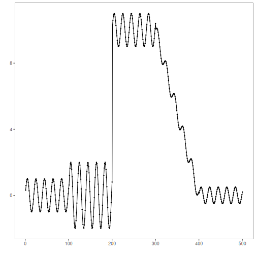
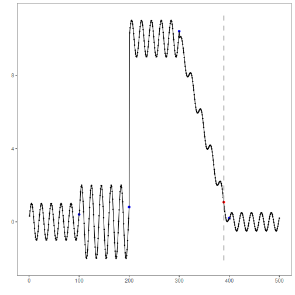

AMOC (At Most One Change) detects a single, most significant change point in a univariate time series. In this tutorial we will:

- Load a synthetic dataset with ground-truth change points
- Visualize the series
- Configure and run the AMOC detector (`hcp_amoc`)
- Inspect detections and evaluate against ground truth
- Plot the detections over the series


``` r
# Install Harbinger (if needed)
#install.packages("harbinger")
```


``` r
# Load required packages
library(daltoolbox)
library(harbinger) 
```


``` r
# Load example change-point datasets
data(examples_changepoints)
```


``` r
# Select a dataset ("complex" contains multiple regimes)
dataset <- examples_changepoints$complex
head(dataset)
```

```
##       serie event
## 1 0.3129618 FALSE
## 2 0.5944808 FALSE
## 3 0.8162731 FALSE
## 4 0.9560557 FALSE
## 5 0.9997847 FALSE
## 6 0.9430667 FALSE
```


``` r
# Plot the time series to visualize regime changes
har_plot(harbinger(), dataset$serie)
```




``` r
# Configure the AMOC change-point detector (single change)
model <- hcp_amoc()
```


``` r
# Fit the detector (no training required, keeps parameters on object)
model <- fit(model, dataset$serie)
```


``` r
# Run detection over the full series
detection <- detect(model, dataset$serie)
```


``` r
# Show detected change-point indices
print(detection |> dplyr::filter(event == TRUE))
```

```
##   idx event        type
## 1 389  TRUE changepoint
```


``` r
# Evaluate detections against the labeled events
evaluation <- evaluate(model, detection$event, dataset$event)
print(evaluation$confMatrix)
```

```
##           event      
## detection TRUE  FALSE
## TRUE      0     1    
## FALSE     4     495
```


``` r
# Plot detections and ground truth on top of the series
har_plot(model, dataset$serie, detection, dataset$event)
```



