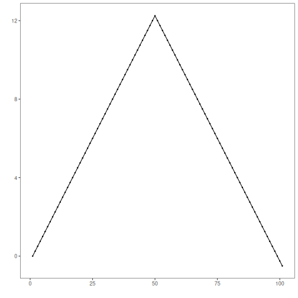
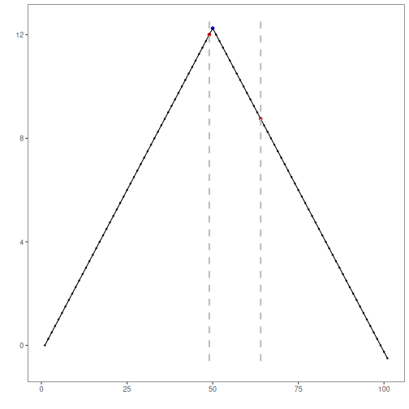

GFT: Generalized fluctuation tests assess stability of regression parameters over time using `strucchange::breakpoints()`, returning estimated break dates under information criteria.

Generalized Fluctuation Tests (GFT) assess structural changes by examining stability of regression fits across time. In this tutorial we:

- Load and visualize a simple change-point dataset
- Configure and run the GFT-based detector (`hcp_gft`)
- Inspect detections, evaluate, and plot results


``` r
# Install Harbinger (if needed)
#install.packages("harbinger")
```


``` r
# Load required packages
library(daltoolbox)
library(harbinger) 
```


``` r
# Load example change-point datasets
data(examples_changepoints)
```


``` r
# Select the simple dataset
dataset <- examples_changepoints$simple
head(dataset)
```

```
##   serie event
## 1  0.00 FALSE
## 2  0.25 FALSE
## 3  0.50 FALSE
## 4  0.75 FALSE
## 5  1.00 FALSE
## 6  1.25 FALSE
```


``` r
# Plot the raw time series
har_plot(harbinger(), dataset$serie)
```




``` r
# Configure the GFT detector
model <- hcp_gft()
```


``` r
# Fit the detector (no training required)
model <- fit(model, dataset$serie)
```


``` r
# Run detection
detection <- detect(model, dataset$serie)
```


``` r
# Show detected change points
print(detection |> dplyr::filter(event == TRUE))
```

```
##   idx event        type
## 1  49  TRUE changepoint
## 2  64  TRUE changepoint
```


``` r
# Evaluate detections against labels
evaluation <- evaluate(model, detection$event, dataset$event)
print(evaluation$confMatrix)
```

```
##           event      
## detection TRUE  FALSE
## TRUE      0     2    
## FALSE     1     98
```


``` r
# Plot detections vs. ground truth
har_plot(model, dataset$serie, detection, dataset$event)
```



References 
- Zeileis, A., Leisch, F., Kleiber, C., Hornik, K. (2002). strucchange: An R package for testing for structural change in linear regression models. Journal of Statistical Software, 7(2). doi:10.18637/jss.v007.i02
- Zeileis, A., Kleiber, C., Krämer, W., Hornik, K. (2003). Testing and dating of structural changes in practice. Computational Statistics & Data Analysis, 44(1), 109–123.
