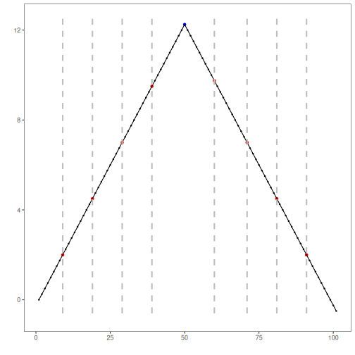

PELT: PELT performs optimal partitioning of the time series under a penalized cost function while pruning candidate change locations to achieve near-linear time under suitable penalties. In Harbinger this wraps the `changepoint` package implementation and returns detected change indices along with evaluation helpers.

PELT (Pruned Exact Linear Time) finds multiple change points efficiently by pruning candidates under a penalized cost. In this tutorial we:

- Load and visualize a simple change-point dataset
- Configure and run the PELT detector (`hcp_pelt`)
- Inspect detections, evaluate, and plot results


``` r
# Install Harbinger (if needed)
#install.packages("harbinger")
```


``` r
# Load required packages
library(daltoolbox)
library(harbinger) 
```


``` r
# Load example change-point datasets
data(examples_changepoints)
```


``` r
# Select the simple dataset
dataset <- examples_changepoints$simple
head(dataset)
```

```
##   serie event
## 1  0.00 FALSE
## 2  0.25 FALSE
## 3  0.50 FALSE
## 4  0.75 FALSE
## 5  1.00 FALSE
## 6  1.25 FALSE
```


``` r
# Plot the raw time series
har_plot(harbinger(), dataset$serie)
```


``` r
# Configure the PELT detector
model <- hcp_pelt()
```


``` r
# Fit the detector (no training required)
model <- fit(model, dataset$serie)
```


``` r
# Run detection
detection <- detect(model, dataset$serie)
```


``` r
# Show detected change points
print(detection |> dplyr::filter(event == TRUE))
```

```
##   idx event        type
## 1   9  TRUE changepoint
## 2  19  TRUE changepoint
## 3  29  TRUE changepoint
## 4  39  TRUE changepoint
## 5  60  TRUE changepoint
## 6  71  TRUE changepoint
## 7  81  TRUE changepoint
## 8  91  TRUE changepoint
```


``` r
# Evaluate detections against labels
evaluation <- evaluate(model, detection$event, dataset$event)
print(evaluation$confMatrix)
```

```
##           event      
## detection TRUE  FALSE
## TRUE      0     8    
## FALSE     1     92
```


``` r
# Plot detections vs. ground truth
har_plot(model, dataset$serie, detection, dataset$event)
```



References 
- Killick, R., Fearnhead, P., Eckley, I. A. (2012). Optimal detection of changepoints with a linear computational cost. Journal of the American Statistical Association, 107(500), 1590–1598.
