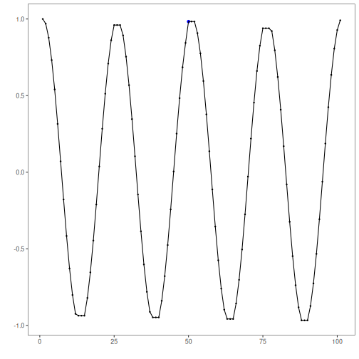
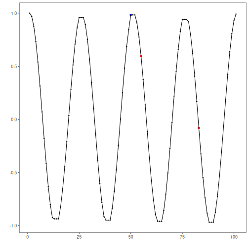

## Custom Transformation

## Objective

The goal of this example is to show how to create a custom transformation that can be applied before the detection workflow starts.

The point of the example is to motivate why one may want to change the series before choosing a detector at all. In many event-detection tasks, the raw signal contains small impulsive spikes or local noise that make downstream interpretation harder.

## Why this method matters

The median filter is a classic transformation for attenuating isolated spikes while preserving broader level changes and trend structure better than a simple mean smoother in some situations. That makes it a good teaching example when the reader needs intuition about preprocessing before detection.

This custom notebook matters because:

- it shows that customization in Harbinger is not limited to detectors;
- it introduces the idea that signal conditioning can improve interpretability;
- it gives a concrete example of a transformation that is easy to understand visually.

## Method at a glance

The transformation applies `stats::runmed()` to the numeric series and then feeds the filtered output into a regular Harbinger detector. The custom part is only the signal transformation; the rest of the workflow stays unchanged.

The transformation implemented here is a median filter. It is useful for reducing isolated spikes before an anomaly detector is applied. The integration contract is small because a simple transformation only needs a constructor and a `transform()` method when no fitted state is required.


``` r
# installation
# install.packages(c("harbinger", "daltoolbox"))

library(daltoolbox)
library(harbinger)
```


``` r
har_fil_median_custom <- function(k = 5) {
  if (k %% 2 == 0) {
    k <- k + 1
  }

  obj <- daltoolbox::dal_transform()
  obj$k <- k
  class(obj) <- append("har_fil_median_custom", class(obj))
  obj
}

transform.har_fil_median_custom <- function(obj, data, ...) {
  result <- stats::runmed(as.numeric(data), k = obj$k, endrule = "keep")
  result[is.na(result)] <- as.numeric(data)[is.na(result)]
  result
}
```

We first visualize the raw series, then apply the custom filter to attenuate local spikes.


``` r
data(examples_anomalies)
dataset <- examples_anomalies$simple

har_plot(harbinger(), dataset$serie, event = dataset$event)
```


``` r
filter_custom <- har_fil_median_custom(k = 5)
serie_filtered <- transform(filter_custom, dataset$serie)

har_plot(harbinger(), serie_filtered, event = dataset$event)
```



Once the transformation is defined, it can be inserted before a regular detector. Here we use `hanr_arima()` because it remains stable after smoothing and makes the downstream comparison easier to interpret.


``` r
model <- hanr_arima()
model <- fit(model, as.numeric(serie_filtered))
detection <- detect(model, as.numeric(serie_filtered))

har_plot(model, as.numeric(serie_filtered), detection, dataset$event)
```



This example shows the usual role of a custom transformation in Harbinger: change the signal representation first, and then feed the transformed series into the downstream detection workflow.

## References

- Tukey, J. W. (1977). Exploratory Data Analysis. Addison-Wesley.

