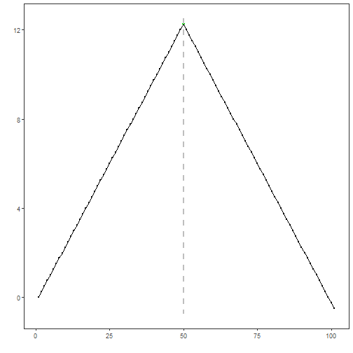

## Custom Change-Point Detector

## Objective

The goal of this example is to show how to integrate a custom change-point detector based on joinpoint regression.

This notebook is not only about the integration contract. It is also meant to motivate a very interpretable idea of change-point detection: sometimes the important event in a series is the point where one trend stops and another begins.

## Why this method matters

Many change-point methods are framed as optimization or segmentation problems. That is useful, but it can feel abstract for readers who think first in terms of regression lines and slope changes. Joinpoint regression gives a more visual intuition: fit piecewise linear behavior and estimate where the line changes direction or slope.

This is a strong custom example because:

- it connects change-point detection with a familiar regression interpretation;
- it shows how external model objects can be wrapped inside Harbinger;
- it motivates structural breaks as changes in trend, not only as generic break indices.

## Method at a glance

The detector first fits a linear model and then refines it with `segmented::segmented()`, which estimates one or more joinpoints. The estimated breakpoint positions are converted into Harbinger's logical event vector and then reused in the regular plotting and evaluation workflow.

Joinpoint or segmented regression is a good custom extension example because it combines a standard regression fit with an explicit estimate of the structural break location. Here we use the `segmented` package and wrap it inside the usual Harbinger interface.


### Prepare the Example

This setup anchors the notebook in the specific series used to examine `04-change-point-custom_change_point`. The semantic point is the one stated above: the detector first fits a linear model and then refines it with `segmented::segmented()`, which estimates one or more joinpoints, so the raw signal needs to be visible before any fitting step hides that structure behind model output.


``` r
# installation
# install.packages(c("harbinger", "daltoolbox", "segmented"))

library(daltoolbox)
library(harbinger)
```


### Define the Support Structures

The code below defines the smallest Harbinger contract needed to express the idea behind this example. Read it in semantic terms: the goal is to encode that the detector first fits a linear model and then refines it with `segmented::segmented()`, which estimates one or more joinpoints while still returning objects that Harbinger can plot and evaluate like any native method.


``` r
hcp_joinpoint_custom <- function(npsi = 1) {
  obj <- harbinger()
  obj$npsi <- npsi
  class(obj) <- append("hcp_joinpoint_custom", class(obj))
  obj
}

fit.hcp_joinpoint_custom <- function(obj, data, ...) {
  x <- seq_along(data)
  base_model <- stats::lm(data ~ x)
  obj$model <- segmented::segmented(base_model, seg.Z = ~ x, npsi = obj$npsi)
  obj
}

detect.hcp_joinpoint_custom <- function(obj, serie, ...) {
  obj <- obj$har_store_refs(obj, serie)

  if (is.null(obj$model)) {
    obj <- fit(obj, obj$serie)
  }

  cp <- rep(FALSE, length(obj$serie))
  psi <- round(obj$model$psi[, "Est."])
  psi <- psi[psi >= 1 & psi <= length(cp)]
  cp[psi] <- TRUE

  obj$har_restore_refs(obj, change_points = cp)
}
```

We now fit and use the custom joinpoint detector on a simple change-point series.


### Configure the Method

The choices below turn the central modeling idea into concrete parameters. They matter because the detector first fits a linear model and then refines it with `segmented::segmented()`, which estimates one or more joinpoints, so each argument controls how strongly the method will emphasize that pattern when it later produces change-point candidates.


``` r
data(examples_changepoints)
dataset <- examples_changepoints$simple

model <- hcp_joinpoint_custom(npsi = 1)
model <- fit(model, dataset$serie)
```

```
## Warning in summary.lm(object, ...): essentially perfect fit: summary may be unreliable
```

``` r
detection <- detect(model, dataset$serie)
```


### Evaluate What Was Found

The evaluation asks whether the change-point candidates produced by `04-change-point-custom_change_point` match the labeled structure on this dataset. Read the scores as evidence about the method's assumptions in practice, not as detached summary numbers.


``` r
evaluation <- evaluate(model, detection$event, dataset$event)
evaluation$confMatrix
```

```
##           event      
## detection TRUE  FALSE
## TRUE      1     0    
## FALSE     0     100
```


### Interpret the Result Visually

This first visual pass establishes what the method should react to in the raw series. Keep the method summary in mind here, because the detector first fits a linear model and then refines it with `segmented::segmented()`, which estimates one or more joinpoints and the plot tells you whether that structure is clean, weak, local, repeated, or mixed with other effects.


``` r
har_plot(model, dataset$serie, detection, dataset$event)
```



This example highlights the usual role of a custom change-point extension in Harbinger: fit a structural model, convert the break estimate to the common detection table, and then reuse the regular evaluation and plotting workflow.

## References

- Muggeo, V. M. R. (2003). Estimating regression models with unknown break-points. Statistics in Medicine, 22(19), 3055-3071.
