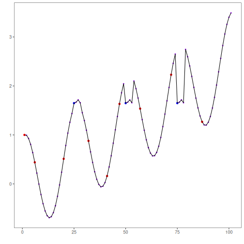

## Custom Motif Detector

## Objective

The goal of this example is to show how to integrate a custom motif detector that is genuinely different from the built-in Matrix Profile methods.

This notebook is meant to motivate a different intuition for motifs: instead of looking for repeated subsequences through nearest-neighbor profile search, we can think of motifs as families of subsequences that are similar enough to be grouped together.

## Why this method matters

When readers first encounter motif discovery, Matrix Profile is efficient and elegant, but not always the easiest conceptual entry point. Clustering gives a more familiar picture: cut the series into many windows, compare those windows, and group the recurring shapes.

Dynamic Time Warping is especially useful here because repeated patterns in time series are often slightly stretched or compressed in time. Two windows may represent the same pattern even if one unfolds a bit faster than the other. DTW was designed exactly for this type of elastic alignment.

This makes the example worthwhile because:

- it introduces a motif definition based on recurrence by clustering;
- it explains why elastic similarity matters in time series;
- it shows a custom detector that adds a genuinely new idea to the package instead of rewrapping an existing one.

## Method at a glance

The custom detector builds sliding windows, clusters them with `dtwclust::tsclust()` using DTW distance, and treats sufficiently populated clusters as motif families. Representative non-overlapping windows from those clusters are then marked in Harbinger's common detection table.

Instead of relying on `tsmp::find_motif()`, this detector defines motifs as recurrent subsequences discovered by clustering sliding windows under Dynamic Time Warping (DTW). The idea is simple: windows that align well under DTW and appear repeatedly in the same cluster are treated as candidate motifs.

This makes the example useful from two perspectives:

- it shows a real customization path instead of rewrapping an existing Harbinger detector;
- it introduces a motif definition based on subsequence clustering rather than nearest-neighbor Matrix Profile search.


``` r
# installation
# install.packages(c("harbinger", "daltoolbox", "dtwclust"))

library(daltoolbox)
library(harbinger)
```


``` r
hmo_dtw_cluster_custom <- function(w = 20, centers = 3, min_cluster_size = 3) {
  obj <- harbinger()
  obj$w <- w
  obj$centers <- centers
  obj$min_cluster_size <- min_cluster_size
  class(obj) <- append("hmo_dtw_cluster_custom", class(obj))
  obj
}

fit.hmo_dtw_cluster_custom <- function(obj, data, ...) {
  windows <- tspredit::ts_data(data, obj$w)
  subsequences <- lapply(seq_len(nrow(windows)), function(i) as.numeric(windows[i, ]))

  obj$model <- dtwclust::tsclust(
    series = subsequences,
    type = "partitional",
    k = obj$centers,
    distance = "dtw_basic",
    centroid = "dba",
    seed = 1L,
    trace = FALSE
  )
  obj
}

detect.hmo_dtw_cluster_custom <- function(obj, serie, ...) {
  n <- length(serie)
  non_na <- which(!is.na(serie))
  serie_clean <- stats::na.omit(serie)

  if (length(serie_clean) < obj$w) {
    stop("Window size must be smaller than the series length.", call. = FALSE)
  }

  if (is.null(obj$model)) {
    obj <- fit(obj, serie_clean)
  }

  cluster_id <- obj$model@cluster
  cluster_sizes <- table(cluster_id)
  selected_clusters <- names(cluster_sizes[cluster_sizes >= obj$min_cluster_size])

  out <- data.frame(event = rep(FALSE, length(serie_clean)), seq = rep(NA, length(serie_clean)))
  if (length(selected_clusters) > 0) {
    seq_counter <- 1
    for (cluster_name in selected_clusters) {
      positions <- which(cluster_id == as.integer(cluster_name))

      # Keep non-overlapping representatives so one motif family does not flood the plot
      selected_positions <- integer(0)
      last_position <- -Inf
      for (pos in positions) {
        if ((pos - last_position) >= obj$w) {
          selected_positions <- c(selected_positions, pos)
          last_position <- pos
        }
      }

      out$event[selected_positions] <- TRUE
      out$seq[selected_positions] <- as.character(seq_counter)
      seq_counter <- seq_counter + 1
    }
  }

  detection <- data.frame(idx = 1:n, event = FALSE, type = "", seq = NA, seqlen = NA)
  detection$event[non_na] <- out$event
  detection$type[detection$event] <- "motif"
  detection$seq[non_na] <- out$seq
  detection$seqlen[detection$event] <- obj$w
  detection
}
```

We can now use the custom detector on a motif example series.


``` r
data(examples_motifs)
dataset <- examples_motifs$simple

model <- hmo_dtw_cluster_custom(w = 15, centers = 3, min_cluster_size = 3)
model <- fit(model, dataset$serie)
detection <- detect(model, dataset$serie)
```


``` r
head(detection[detection$event, ])
```

```
##    idx event  type seq seqlen
## 1    1  TRUE motif   3     15
## 6    6  TRUE motif   1     15
## 20  20  TRUE motif   3     15
## 32  32  TRUE motif   1     15
## 41  41  TRUE motif   2     15
## 47  47  TRUE motif   3     15
```


``` r
har_plot(model, dataset$serie, detection, dataset$event)
```



This example is useful because it shows a real alternative motif strategy. Instead of using nearest-neighbor motifs from Matrix Profile, it groups subsequences by elastic similarity under DTW and interprets recurrent clusters as motif families. Harbinger still allows that customization, as long as the detector returns the common detection structure.

## References

- Berndt, D. J., Clifford, J. (1994). Using Dynamic Time Warping to Find Patterns in Time Series. AAAI Workshop on Knowledge Discovery in Databases.
- Sarda-Espinosa, A. (2019). Time-Series Clustering in R Using the dtwclust Package. The R Journal, 11(1), 22-43.
- Mueen, A., Keogh, E., Zhu, Q., Cash, S., Westover, M. B. (2009). Exact Discovery of Time Series Motifs. SIAM International Conference on Data Mining.

