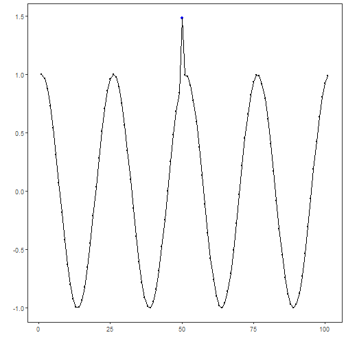

## Custom Anomaly Detector

## Objective

The goal of this example is to show how to add a custom anomaly detector that plugs into the same Harbinger workflow used by the built-in detectors.

More importantly, the example is meant to motivate a different anomaly-detection idea than the residual- or distance-based methods already present in the package. Here the detector focuses on unusual observations that stand out as isolated temporal outliers relative to the local structure of the series.

## Why this method matters

Some anomaly detectors try to explain the full dynamics of the series and then inspect the residuals. That is powerful, but it is not always the most intuitive starting point. A simpler viewpoint is: if a point is inconsistent with the nearby temporal pattern, it may already be an anomaly even before we build a full predictive model.

That is the role of `forecast::tsoutliers()`. It searches for observations that behave like additive outliers or temporary disturbances in a time-series decomposition context. This makes it a useful custom example because:

- it introduces a classical anomaly concept that many practitioners already recognize;
- it shows how to wrap an external detector with minimal Harbinger glue code;
- it gives the reader intuition about anomalies as local temporal disruptions, not only as large residuals from a forecasting model.

## Method at a glance

The custom detector converts the input into a time-series object and applies `forecast::tsoutliers()`. The returned outlier positions are then mapped to Harbinger's standard detection table. In other words, the external library decides which timestamps look suspicious, and Harbinger standardizes the result for plotting and evaluation.

The integration contract is intentionally small. We define a constructor based on `harbinger()`, store the configuration in the object, implement the `detect()` method, and then reuse the usual plotting and evaluation steps.

To make the example concrete, the custom detector wraps `forecast::tsoutliers()`, a classical routine for identifying additive outliers in univariate time series.


``` r
# installation
# install.packages(c("harbinger", "daltoolbox", "forecast"))

library(daltoolbox)
```

```
## 
## Attaching package: 'daltoolbox'
```

```
## The following object is masked from 'package:base':
## 
##     transform
```

``` r
library(harbinger)
```

```
## Registered S3 method overwritten by 'quantmod':
##   method            from
##   as.zoo.data.frame zoo
```


``` r
hanr_tsoutliers_custom <- function(frequency = 1) {
  obj <- harbinger()
  obj$frequency <- frequency
  class(obj) <- append("hanr_tsoutliers_custom", class(obj))
  obj
}

detect.hanr_tsoutliers_custom <- function(obj, serie, ...) {
  obj <- obj$har_store_refs(obj, serie)

  y_ts <- stats::ts(obj$serie, frequency = obj$frequency)
  out <- forecast::tsoutliers(y_ts)

  anomalies <- rep(FALSE, length(obj$serie))
  if (!is.null(out$index) && length(out$index) > 0) {
    anomalies[unique(out$index)] <- TRUE
  }

  obj$har_restore_refs(obj, anomalies = anomalies)
}
```

We now use the custom detector exactly as we would use any other anomaly detector in the package.


``` r
data(examples_anomalies)
dataset <- examples_anomalies$simple

model <- hanr_tsoutliers_custom()
detection <- detect(model, dataset$serie)
```


``` r
evaluation <- evaluate(model, detection$event, dataset$event)
evaluation$confMatrix
```

```
##           event      
## detection TRUE  FALSE
## TRUE      0     0    
## FALSE     1     100
```


``` r
har_plot(model, dataset$serie, detection, dataset$event)
```



This example shows that a custom anomaly detector does not need to reimplement the whole Harbinger workflow. It only needs to respect the expected constructor-plus-detection contract.

## References

- Hyndman, R. J., Athanasopoulos, G. (2021). Forecasting: Principles and Practice.
