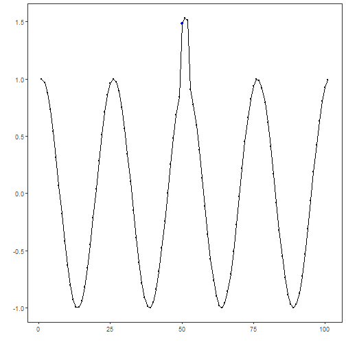
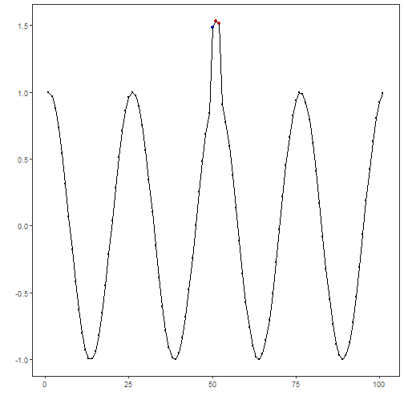

## Custom Sequence-Anomaly Detector

## Objective

The goal of this example is to show a customization that is especially important for collective or sequence anomalies: the detector should return the anomalous range itself, not only a single representative timestamp inside that range.

This notebook complements the custom range-aware evaluator. The two ideas belong together: if the target phenomenon is an anomalous interval, both detection and evaluation should operate on intervals.

## Why this method matters

Many anomaly workflows start by scoring each timestamp separately and then applying a post-processing rule that keeps only one point per contiguous group. That is often acceptable for isolated point anomalies, but it can be a poor representation for collective anomalies.

When the anomaly is a sequence, collapsing the whole segment to one point creates two problems:

- it hides the duration of the abnormal behavior;
- it makes it harder to use interval-aware metrics and to reason about overlap with the ground truth.

This custom example therefore focuses on a different post-processing philosophy: once an anomalous run is detected, keep the full run.

## Method at a glance

The detector computes a rolling median baseline and a rolling MAD scale. It then converts each observation into a robust local z-score. Consecutive points whose score exceeds a threshold are grouped into anomalous runs, and only runs with at least `min_run` points are kept.

The key customization is not only the scoring function, but the post-processing rule: instead of choosing the first or highest point in each group, the detector marks the whole contiguous interval as anomalous.


``` r
# installation
# install.packages(c("harbinger", "daltoolbox"))

library(daltoolbox)
library(harbinger)
```


``` r
hanr_sequence_mad_custom <- function(window_size = 11, z_threshold = 3, min_run = 3) {
  obj <- harbinger()
  obj$window_size <- window_size
  obj$z_threshold <- z_threshold
  obj$min_run <- min_run
  class(obj) <- append("hanr_sequence_mad_custom", class(obj))
  obj
}

detect.hanr_sequence_mad_custom <- function(obj, serie, ...) {
  obj <- obj$har_store_refs(obj, serie)

  y <- as.numeric(obj$serie)
  k <- obj$window_size
  if (k %% 2 == 0) {
    k <- k + 1
  }

  baseline <- zoo::rollmedian(y, k = k, fill = NA, align = "center")
  local_mad <- zoo::rollapply(
    y,
    width = k,
    FUN = function(v) stats::mad(v, constant = 1),
    fill = NA,
    align = "center"
  )

  # Use the nearest observed values on the borders so the whole series can be scored
  baseline <- zoo::na.locf(baseline, na.rm = FALSE)
  baseline <- zoo::na.locf(baseline, fromLast = TRUE, na.rm = FALSE)
  local_mad <- zoo::na.locf(local_mad, na.rm = FALSE)
  local_mad <- zoo::na.locf(local_mad, fromLast = TRUE, na.rm = FALSE)
  local_mad[local_mad == 0 | is.na(local_mad)] <- 1e-8

  score <- abs(y - baseline) / local_mad
  raw_flags <- score > obj$z_threshold

  # Build contiguous runs of TRUE values and keep only sufficiently long runs
  idx_true <- which(raw_flags)
  runs <- if (length(idx_true) == 0) list(integer(0)) else split(idx_true, cumsum(c(1, diff(idx_true) != 1)))
  range_flags <- rep(FALSE, length(y))
  for (run in runs) {
    if (length(run) >= obj$min_run) {
      range_flags[run] <- TRUE
    }
  }

  detection <- obj$har_restore_refs(obj, anomalies = range_flags, res = score)
  attr(detection, "threshold") <- obj$z_threshold
  detection
}
```

To compare interval-aware evaluation in the same notebook, we define a small range-based evaluator that scores overlap between detected ranges and true ranges.


``` r
har_eval_range_custom <- function(alpha = 0.5) {
  obj <- daltoolbox::dal_base()
  obj$alpha <- alpha
  class(obj) <- append("har_eval_range_custom", class(obj))
  obj
}

to_ranges <- function(flags) {
  flags <- as.logical(flags)
  flags[is.na(flags)] <- FALSE
  idx <- which(flags)
  if (length(idx) == 0) {
    return(data.frame(start = integer(0), end = integer(0), length = integer(0)))
  }
  groups <- split(idx, cumsum(c(1, diff(idx) != 1)))
  starts <- vapply(groups, min, integer(1))
  ends <- vapply(groups, max, integer(1))
  data.frame(start = starts, end = ends, length = ends - starts + 1)
}

range_overlap <- function(a_start, a_end, b_start, b_end) {
  max(0, min(a_end, b_end) - max(a_start, b_start) + 1)
}

evaluate.har_eval_range_custom <- function(obj, detection, event, ...) {
  det_ranges <- to_ranges(detection)
  evt_ranges <- to_ranges(event)

  if (nrow(det_ranges) == 0 || nrow(evt_ranges) == 0) {
    return(list(precision = 0, recall = 0, F1 = 0, alpha = obj$alpha))
  }

  recall_scores <- numeric(nrow(evt_ranges))
  for (i in seq_len(nrow(evt_ranges))) {
    overlaps <- mapply(
      range_overlap,
      evt_ranges$start[i], evt_ranges$end[i],
      det_ranges$start, det_ranges$end
    )
    best_overlap <- max(overlaps)
    existence_reward <- as.numeric(best_overlap > 0)
    overlap_reward <- best_overlap / evt_ranges$length[i]
    recall_scores[i] <- obj$alpha * existence_reward + (1 - obj$alpha) * overlap_reward
  }

  precision_scores <- numeric(nrow(det_ranges))
  for (i in seq_len(nrow(det_ranges))) {
    overlaps <- mapply(
      range_overlap,
      det_ranges$start[i], det_ranges$end[i],
      evt_ranges$start, evt_ranges$end
    )
    precision_scores[i] <- max(overlaps) / det_ranges$length[i]
  }

  precision <- mean(precision_scores)
  recall <- mean(recall_scores)
  F1 <- if ((precision + recall) == 0) 0 else 2 * precision * recall / (precision + recall)

  list(precision = precision, recall = recall, F1 = F1, alpha = obj$alpha)
}
```

We use the `sequence` example because it naturally motivates collective anomaly detection.


``` r
data(examples_anomalies)
dataset <- examples_anomalies$sequence

har_plot(harbinger(), dataset$serie, event = dataset$event)
```




``` r
model <- hanr_sequence_mad_custom(window_size = 9, z_threshold = 2.5, min_run = 2)
detection <- detect(model, dataset$serie)
head(detection[detection$event, ])
```

```
##    idx event    type
## 51  51  TRUE anomaly
## 52  52  TRUE anomaly
```


``` r
# Plot the detected anomalous interval against the labeled sequence anomaly
har_plot(model, dataset$serie, detection, dataset$event)
```




``` r
# Compare pointwise and range-aware evaluation
evaluate(har_eval(), detection$event, dataset$event)$confMatrix
```

```
##           event      
## detection TRUE  FALSE
## TRUE      0     2    
## FALSE     1     98
```

``` r
evaluate(har_eval_range_custom(alpha = 0.5), detection$event, dataset$event)
```

```
## $precision
## [1] 0
## 
## $recall
## [1] 0
## 
## $F1
## [1] 0
## 
## $alpha
## [1] 0.5
```

This example makes the modeling choice explicit: sequence anomalies are better represented as ranges. Once the detector returns the whole anomalous interval, the downstream plots and the range-aware evaluator become much more informative.

## References

- Chandola, V., Banerjee, A., Kumar, V. (2009). Anomaly Detection: A Survey. ACM Computing Surveys, 41(3), 15.
- Sørbø, S., Ruocco, M. (2024). Navigating the metric maze: a taxonomy of evaluation metrics for anomaly detection in time series. Data Mining and Knowledge Discovery, 38, 1027-1068. https://doi.org/10.1007/s10618-023-00988-8
