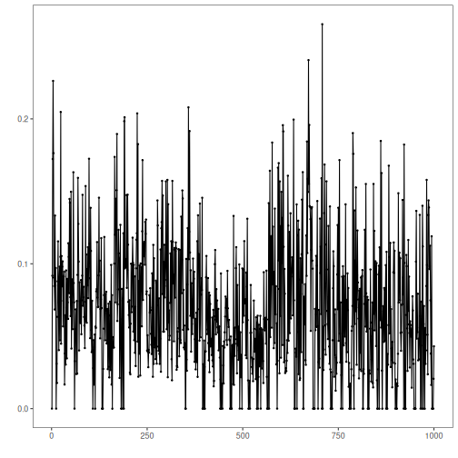
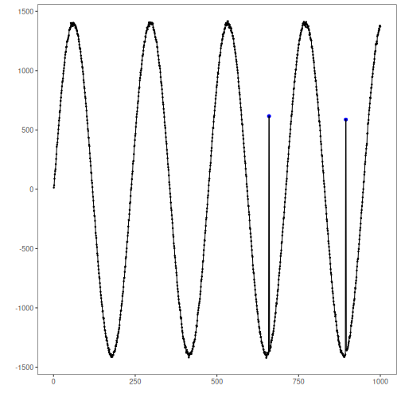
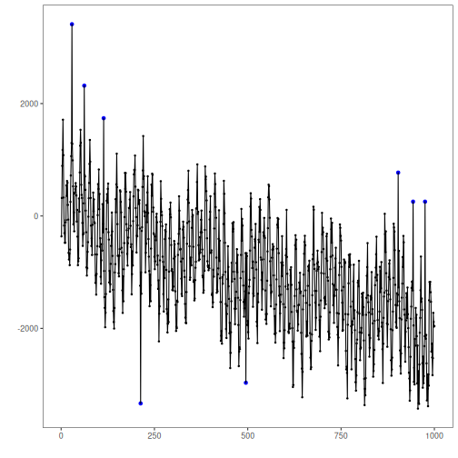
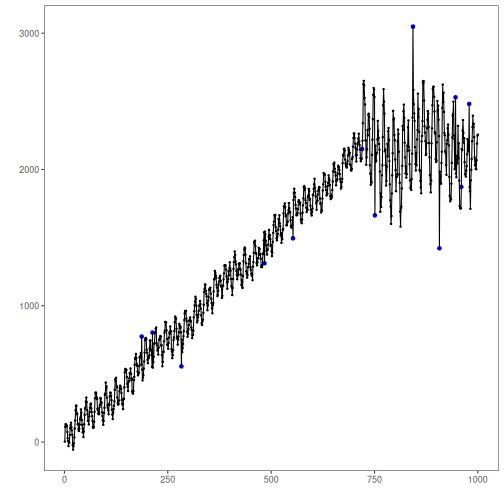

## Objective

This notebook introduces the Yahoo Webscope S5 benchmark datasets available in Harbinger. For each dataset object, the goal is to load the full collection with `loadfulldata()`, count the available series, identify the data as univariate or multivariate, and plot the first available signal with `har_plot()`.

## Method at a glance

This is a dataset-orientation notebook. It does not fit a detector. Instead, it shows how to inspect the dataset structure before choosing a modeling strategy. To keep the figures didactic, each plot is capped at the first 1000 observations of the selected series.

## What you will do

- load the packaged mini object and replace it with the full dataset
- count how many series are available in each benchmark object
- identify whether the collection is univariate or multivariate
- plot a short preview of the first available signal and its event labels


### Helper Functions


``` r
library(harbinger)

dataset_summary <- function(x) {
  first_series <- x[[1]]
  meta_cols <- c("idx", "event", "type", "seq", "seqlen")
  signal_cols <- setdiff(names(first_series), meta_cols)
  dataset_type <- if ("value" %in% names(first_series) || length(signal_cols) == 1) {
    "univariate"
  } else {
    "multivariate"
  }
  plot_column <- if ("value" %in% names(first_series)) "value" else signal_cols[1]

  list(
    n_series = length(x),
    dataset_type = dataset_type,
    signal_cols = signal_cols,
    plot_column = plot_column,
    preview_size = min(1000, nrow(first_series)),
    first_series = first_series
  )
}

show_dataset <- function(x, name) {
  info <- dataset_summary(x)
  cat("Dataset:", name, "\n")
  cat("Number of series:", info$n_series, "\n")
  cat("Dataset type:", info$dataset_type, "\n")
  cat("Signals in the first series:", paste(info$signal_cols, collapse = ", "), "\n")
  cat("Column plotted with har_plot():", info$plot_column, "\n")
  cat("Plot preview length:", info$preview_size, "observations\n")
  invisible(info)
}

plot_dataset_preview <- function(info) {
  preview <- info$first_series[seq_len(info$preview_size), , drop = FALSE]
  har_plot(
    harbinger(),
    preview[[info$plot_column]],
    event = preview$event
  )
}
```

### A1Benchmark

`A1Benchmark` contains real-world labeled univariate series from Yahoo Webscope S5.


``` r
data(A1Benchmark)
A1Benchmark <- loadfulldata(A1Benchmark)
a1_info <- show_dataset(A1Benchmark, "A1Benchmark")
```

```
## Dataset: A1Benchmark 
## Number of series: 67 
## Dataset type: univariate 
## Signals in the first series: value 
## Column plotted with har_plot(): value 
## Plot preview length: 1000 observations
```


``` r
plot_dataset_preview(a1_info)
```



### A2Benchmark

`A2Benchmark` contains synthetic labeled univariate series designed for anomaly-detection benchmarking.


``` r
data(A2Benchmark)
A2Benchmark <- loadfulldata(A2Benchmark)
a2_info <- show_dataset(A2Benchmark, "A2Benchmark")
```

```
## Dataset: A2Benchmark 
## Number of series: 100 
## Dataset type: univariate 
## Signals in the first series: value 
## Column plotted with har_plot(): value 
## Plot preview length: 1000 observations
```


``` r
plot_dataset_preview(a2_info)
```



### A3Benchmark

`A3Benchmark` contains synthetic Yahoo series with labeled anomalous observations.


``` r
data(A3Benchmark)
A3Benchmark <- loadfulldata(A3Benchmark)
a3_info <- show_dataset(A3Benchmark, "A3Benchmark")
```

```
## Dataset: A3Benchmark 
## Number of series: 100 
## Dataset type: univariate 
## Signals in the first series: value 
## Column plotted with har_plot(): value 
## Plot preview length: 1000 observations
```


``` r
plot_dataset_preview(a3_info)
```



### A4Benchmark

`A4Benchmark` combines synthetic anomalies and structural changes in the Yahoo benchmark family.


``` r
data(A4Benchmark)
A4Benchmark <- loadfulldata(A4Benchmark)
a4_info <- show_dataset(A4Benchmark, "A4Benchmark")
```

```
## Dataset: A4Benchmark 
## Number of series: 100 
## Dataset type: univariate 
## Signals in the first series: value 
## Column plotted with har_plot(): value 
## Plot preview length: 1000 observations
```


``` r
plot_dataset_preview(a4_info)
```



## References

- Yahoo Webscope S5 benchmark documentation and downstream studies on labeled anomaly detection.
- Ogasawara, E., Salles, R., Porto, F., Pacitti, E. Event Detection in Time Series. Springer, 2025. doi:10.1007/978-3-031-75941-3
