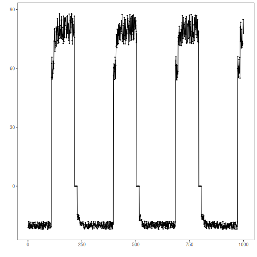
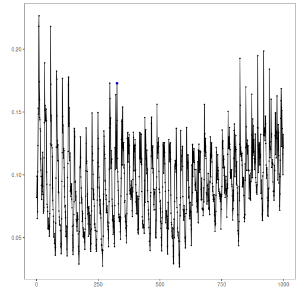
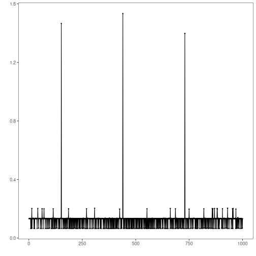
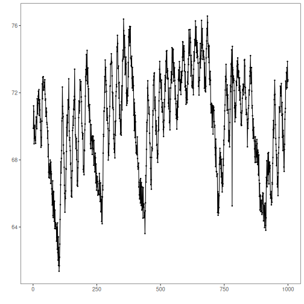
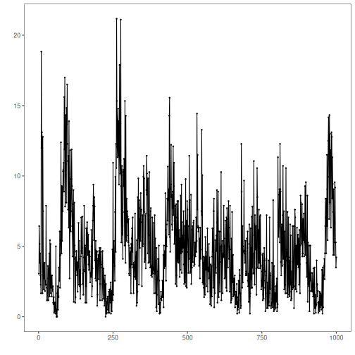
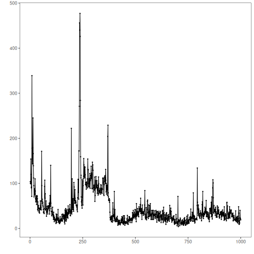

## Objective

This notebook introduces the Numenta Anomaly Benchmark datasets exposed by Harbinger. For each NAB dataset object, it demonstrates how to load the full collection with `loadfulldata()`, count the available series, inspect the structure, and plot the first available signal with `har_plot()`.

## Method at a glance

The focus is on dataset inspection. NAB is often used as a benchmark family, so this notebook helps the reader understand the shape of each object before choosing a detection workflow. To avoid overly long figures, each plot uses at most the first 1000 observations of the first series.

## What you will do

- load each NAB object with `data()` and `loadfulldata()`
- count how many series are available in the full dataset
- verify that the first series is univariate
- plot a short preview of the first signal and its labels


### Define the Support Structures

The helper code below standardizes how each collection is counted, typed, and previewed. In a dataset notebook this is not scaffolding for its own sake; it is the mechanism that makes different collections comparable before any detector is discussed.


``` r
library(harbinger)

dataset_summary <- function(x) {
  first_series <- x[[1]]
  meta_cols <- c("idx", "event", "type", "seq", "seqlen")
  signal_cols <- setdiff(names(first_series), meta_cols)
  dataset_type <- if ("value" %in% names(first_series) || length(signal_cols) == 1) "univariate" else "multivariate"
  plot_column <- if ("value" %in% names(first_series)) "value" else signal_cols[1]

  list(
    n_series = length(x),
    dataset_type = dataset_type,
    signal_cols = signal_cols,
    plot_column = plot_column,
    preview_size = min(1000, nrow(first_series)),
    first_series = first_series
  )
}

show_dataset <- function(x, name) {
  info <- dataset_summary(x)
  cat("Dataset:", name, "\n")
  cat("Number of series:", info$n_series, "\n")
  cat("Dataset type:", info$dataset_type, "\n")
  cat("Signals in the first series:", paste(info$signal_cols, collapse = ", "), "\n")
  cat("Column plotted with har_plot():", info$plot_column, "\n")
  cat("Plot preview length:", info$preview_size, "observations\n")
  invisible(info)
}

plot_dataset_preview <- function(info) {
  preview <- info$first_series[seq_len(info$preview_size), , drop = FALSE]
  har_plot(
    harbinger(),
    preview[[info$plot_column]],
    event = preview$event
  )
}
```

### nab_artificialWithAnomaly
### nab_artificialWithAnomaly


This subsection previews nab_artificialWithAnomaly with the same summary routine defined above. The goal is to understand what kind of signal, dimensionality, and labeling this specific collection brings to the benchmark before any method is chosen.


``` r
data(nab_artificialWithAnomaly)
nab_artificialWithAnomaly <- loadfulldata(nab_artificialWithAnomaly)
nab_artificial_info <- show_dataset(nab_artificialWithAnomaly, "nab_artificialWithAnomaly")
```

```
## Dataset: nab_artificialWithAnomaly 
## Number of series: 5 
## Dataset type: univariate 
## Signals in the first series: value 
## Column plotted with har_plot(): value 
## Plot preview length: 1000 observations
```


``` r
plot_dataset_preview(nab_artificial_info)
```



### nab_realAdExchange
### nab_realAdExchange


This subsection previews nab_realAdExchange with the same summary routine defined above. The goal is to understand what kind of signal, dimensionality, and labeling this specific collection brings to the benchmark before any method is chosen.


``` r
data(nab_realAdExchange)
nab_realAdExchange <- loadfulldata(nab_realAdExchange)
nab_adexchange_info <- show_dataset(nab_realAdExchange, "nab_realAdExchange")
```

```
## Dataset: nab_realAdExchange 
## Number of series: 6 
## Dataset type: univariate 
## Signals in the first series: value 
## Column plotted with har_plot(): value 
## Plot preview length: 1000 observations
```


``` r
plot_dataset_preview(nab_adexchange_info)
```



### nab_realAWSCloudwatch
### nab_realAWSCloudwatch


This subsection previews nab_realAWSCloudwatch with the same summary routine defined above. The goal is to understand what kind of signal, dimensionality, and labeling this specific collection brings to the benchmark before any method is chosen.


``` r
data(nab_realAWSCloudwatch)
nab_realAWSCloudwatch <- loadfulldata(nab_realAWSCloudwatch)
nab_aws_info <- show_dataset(nab_realAWSCloudwatch, "nab_realAWSCloudwatch")
```

```
## Dataset: nab_realAWSCloudwatch 
## Number of series: 6 
## Dataset type: univariate 
## Signals in the first series: value 
## Column plotted with har_plot(): value 
## Plot preview length: 1000 observations
```


``` r
plot_dataset_preview(nab_aws_info)
```



### nab_realKnownCause
### nab_realKnownCause


This subsection previews nab_realKnownCause with the same summary routine defined above. The goal is to understand what kind of signal, dimensionality, and labeling this specific collection brings to the benchmark before any method is chosen.


``` r
data(nab_realKnownCause)
nab_realKnownCause <- loadfulldata(nab_realKnownCause)
nab_known_info <- show_dataset(nab_realKnownCause, "nab_realKnownCause")
```

```
## Dataset: nab_realKnownCause 
## Number of series: 7 
## Dataset type: univariate 
## Signals in the first series: value 
## Column plotted with har_plot(): value 
## Plot preview length: 1000 observations
```


``` r
plot_dataset_preview(nab_known_info)
```



### nab_realTraffic
### nab_realTraffic


This subsection previews nab_realTraffic with the same summary routine defined above. The goal is to understand what kind of signal, dimensionality, and labeling this specific collection brings to the benchmark before any method is chosen.


``` r
data(nab_realTraffic)
nab_realTraffic <- loadfulldata(nab_realTraffic)
nab_traffic_info <- show_dataset(nab_realTraffic, "nab_realTraffic")
```

```
## Dataset: nab_realTraffic 
## Number of series: 7 
## Dataset type: univariate 
## Signals in the first series: value 
## Column plotted with har_plot(): value 
## Plot preview length: 1000 observations
```


``` r
plot_dataset_preview(nab_traffic_info)
```



### nab_realTweets
### nab_realTweets


This subsection previews nab_realTweets with the same summary routine defined above. The goal is to understand what kind of signal, dimensionality, and labeling this specific collection brings to the benchmark before any method is chosen.


``` r
data(nab_realTweets)
nab_realTweets <- loadfulldata(nab_realTweets)
nab_tweets_info <- show_dataset(nab_realTweets, "nab_realTweets")
```

```
## Dataset: nab_realTweets 
## Number of series: 10 
## Dataset type: univariate 
## Signals in the first series: value 
## Column plotted with har_plot(): value 
## Plot preview length: 1000 observations
```


``` r
plot_dataset_preview(nab_tweets_info)
```



## References

- Lavin, A., Ahmad, S. (2015). Evaluating real-time anomaly detection algorithms: the Numenta Anomaly Benchmark.
- Ogasawara, E., Salles, R., Porto, F., Pacitti, E. Event Detection in Time Series. Springer, 2025. doi:10.1007/978-3-031-75941-3
