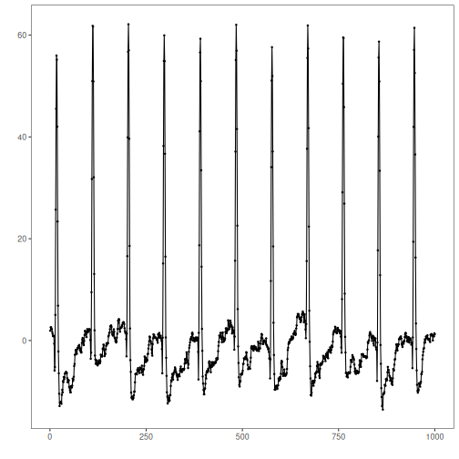
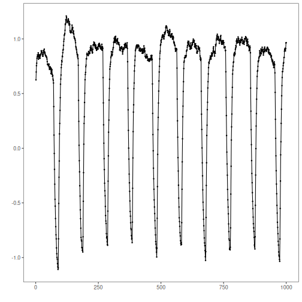
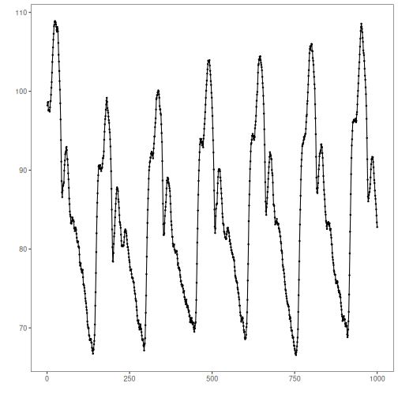
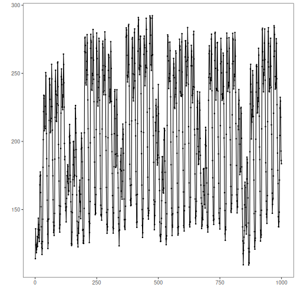

## Objective

This notebook demonstrates how to inspect the UCR Anomaly Archive datasets distributed by Harbinger. Each example loads the full dataset with `loadfulldata()`, counts the available series, identifies the structure, and plots the first signal with `har_plot()`.

## Method at a glance

The emphasis is on understanding the data layout before applying an event-detection method. The same inspection pattern is repeated for each UCR dataset object. To keep the figures didactic, only the first 1000 observations of the preview series are plotted.

## What you will do

- load each UCR dataset object and expand it to the full collection
- count the number of series available
- inspect the first series and confirm the signal column
- plot a short preview of the first signal and its labels

## How to read this walkthrough

The code blocks below follow the same learning rhythm used throughout the collection: prepare the environment, choose the dataset, configure the method, run the analysis, and then inspect the result. Readers who are still learning time-series mining can use that order to understand not only *what* each command does, but also *why* it appears at that stage of the workflow.

As you go through the notebook, read the inline comments inside each chunk as the operational explanation and use the surrounding prose as the conceptual guide.

## Walkthrough


### Define the Support Structures

Before applying the workflow itself, we define the helper functions or custom objects that make the example possible. This is one of the most important didactic moments in extension-oriented notebooks because it shows the contract that Harbinger expects and where the reader can adapt the behavior later.


``` r
library(harbinger)

dataset_summary <- function(x) {
  first_series <- x[[1]]
  meta_cols <- c("idx", "event", "type", "seq", "seqlen")
  signal_cols <- setdiff(names(first_series), meta_cols)
  dataset_type <- if ("value" %in% names(first_series) || length(signal_cols) == 1) "univariate" else "multivariate"
  plot_column <- if ("value" %in% names(first_series)) "value" else signal_cols[1]

  list(
    n_series = length(x),
    dataset_type = dataset_type,
    signal_cols = signal_cols,
    plot_column = plot_column,
    preview_size = min(1000, nrow(first_series)),
    first_series = first_series
  )
}

show_dataset <- function(x, name) {
  info <- dataset_summary(x)
  cat("Dataset:", name, "\n")
  cat("Number of series:", info$n_series, "\n")
  cat("Dataset type:", info$dataset_type, "\n")
  cat("Signals in the first series:", paste(info$signal_cols, collapse = ", "), "\n")
  cat("Column plotted with har_plot():", info$plot_column, "\n")
  cat("Plot preview length:", info$preview_size, "observations\n")
  invisible(info)
}

plot_dataset_preview <- function(info) {
  preview <- info$first_series[seq_len(info$preview_size), , drop = FALSE]
  har_plot(
    harbinger(),
    preview[[info$plot_column]],
    event = preview$event
  )
}
```

### ucr_ecg


In this subsection, we load the relevant data object, confirm its structure, and prepare a concise preview so the reader can understand what kind of signal will be explored.


``` r
data(ucr_ecg)
ucr_ecg <- loadfulldata(ucr_ecg)
ucr_ecg_info <- show_dataset(ucr_ecg, "ucr_ecg")
```

```
## Dataset: ucr_ecg 
## Number of series: 10 
## Dataset type: univariate 
## Signals in the first series: value 
## Column plotted with har_plot(): value 
## Plot preview length: 1000 observations
```


``` r
plot_dataset_preview(ucr_ecg_info)
```



### ucr_nasa


In this subsection, we load the relevant data object, confirm its structure, and prepare a concise preview so the reader can understand what kind of signal will be explored.


``` r
data(ucr_nasa)
ucr_nasa <- loadfulldata(ucr_nasa)
ucr_nasa_info <- show_dataset(ucr_nasa, "ucr_nasa")
```

```
## Dataset: ucr_nasa 
## Number of series: 11 
## Dataset type: univariate 
## Signals in the first series: value 
## Column plotted with har_plot(): value 
## Plot preview length: 1000 observations
```


``` r
plot_dataset_preview(ucr_nasa_info)
```



### ucr_int_bleeding


In this subsection, we load the relevant data object, confirm its structure, and prepare a concise preview so the reader can understand what kind of signal will be explored.


``` r
data(ucr_int_bleeding)
ucr_int_bleeding <- loadfulldata(ucr_int_bleeding)
ucr_bleeding_info <- show_dataset(ucr_int_bleeding, "ucr_int_bleeding")
```

```
## Dataset: ucr_int_bleeding 
## Number of series: 10 
## Dataset type: univariate 
## Signals in the first series: value 
## Column plotted with har_plot(): value 
## Plot preview length: 1000 observations
```


``` r
plot_dataset_preview(ucr_bleeding_info)
```



### ucr_power_demand


In this subsection, we load the relevant data object, confirm its structure, and prepare a concise preview so the reader can understand what kind of signal will be explored.


``` r
data(ucr_power_demand)
ucr_power_demand <- loadfulldata(ucr_power_demand)
ucr_power_info <- show_dataset(ucr_power_demand, "ucr_power_demand")
```

```
## Dataset: ucr_power_demand 
## Number of series: 11 
## Dataset type: univariate 
## Signals in the first series: value 
## Column plotted with har_plot(): value 
## Plot preview length: 1000 observations
```


``` r
plot_dataset_preview(ucr_power_info)
```



## References

- UCR Time Series Anomaly Archive.
- Ogasawara, E., Salles, R., Porto, F., Pacitti, E. Event Detection in Time Series. Springer, 2025. doi:10.1007/978-3-031-75941-3

