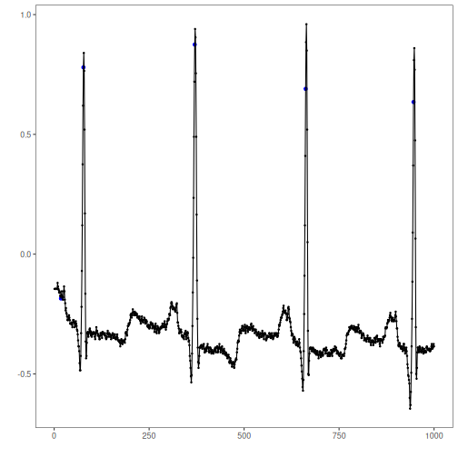
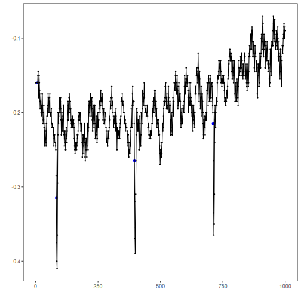
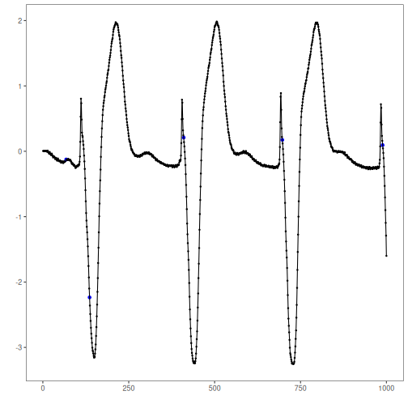
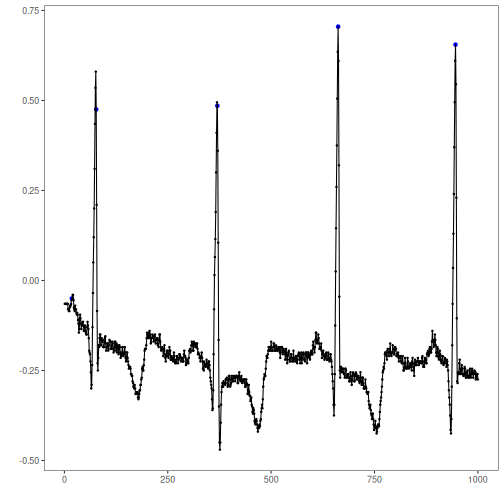

## Objective

This notebook shows how to inspect the MIT-BIH Arrhythmia datasets included in Harbinger. For each ECG lead object, it loads the full dataset with `loadfulldata()`, reports how many series are available, confirms the structure, and plots the first available signal with `har_plot()`.

## Method at a glance

The MIT-BIH objects are separate dataset collections by lead. This notebook helps the reader see how those objects are organized before building anomaly or event-detection experiments on the ECG signals. To keep the ECG plots readable, each preview is restricted to at most the first 1000 observations.

## What you will do

- load the full MIT-BIH collections for each lead
- count how many series are available in each object
- inspect the signal columns and sequence metadata in the first series
- plot a shorter preview of the first signal together with the labeled events

## How to read this walkthrough

The code blocks below follow the same learning rhythm used throughout the collection: prepare the environment, choose the dataset, configure the method, run the analysis, and then inspect the result. Readers who are still learning time-series mining can use that order to understand not only *what* each command does, but also *why* it appears at that stage of the workflow.

As you go through the notebook, read the inline comments inside each chunk as the operational explanation and use the surrounding prose as the conceptual guide.

## Walkthrough


``` r
library(harbinger)

dataset_summary <- function(x) {
  first_series <- x[[1]]
  meta_cols <- c("idx", "event", "type", "seq", "seqlen")
  signal_cols <- setdiff(names(first_series), meta_cols)
  dataset_type <- if ("value" %in% names(first_series) || length(signal_cols) == 1) "univariate" else "multivariate"
  plot_column <- if ("value" %in% names(first_series)) "value" else signal_cols[1]

  list(
    n_series = length(x),
    dataset_type = dataset_type,
    signal_cols = signal_cols,
    plot_column = plot_column,
    preview_size = min(1000, nrow(first_series)),
    first_series = first_series
  )
}

show_dataset <- function(x, name) {
  info <- dataset_summary(x)
  cat("Dataset:", name, "\n")
  cat("Number of series:", info$n_series, "\n")
  cat("Dataset type:", info$dataset_type, "\n")
  cat("Signals in the first series:", paste(info$signal_cols, collapse = ", "), "\n")
  cat("Column plotted with har_plot():", info$plot_column, "\n")
  cat("Plot preview length:", info$preview_size, "observations\n")
  invisible(info)
}

plot_dataset_preview <- function(info) {
  preview <- info$first_series[seq_len(info$preview_size), , drop = FALSE]
  har_plot(
    harbinger(),
    preview[[info$plot_column]],
    event = preview$event
  )
}
```

### mit_bih_MLII


``` r
data(mit_bih_MLII)
mit_bih_MLII <- loadfulldata(mit_bih_MLII)
mit_mlii_info <- show_dataset(mit_bih_MLII, "mit_bih_MLII")
```

```
## Dataset: mit_bih_MLII 
## Number of series: 5 
## Dataset type: univariate 
## Signals in the first series: value 
## Column plotted with har_plot(): value 
## Plot preview length: 1000 observations
```


``` r
plot_dataset_preview(mit_mlii_info)
```



### mit_bih_V1


``` r
data(mit_bih_V1)
mit_bih_V1 <- loadfulldata(mit_bih_V1)
mit_v1_info <- show_dataset(mit_bih_V1, "mit_bih_V1")
```

```
## Dataset: mit_bih_V1 
## Number of series: 5 
## Dataset type: univariate 
## Signals in the first series: value 
## Column plotted with har_plot(): value 
## Plot preview length: 1000 observations
```


``` r
plot_dataset_preview(mit_v1_info)
```



### mit_bih_V2


``` r
data(mit_bih_V2)
mit_bih_V2 <- loadfulldata(mit_bih_V2)
mit_v2_info <- show_dataset(mit_bih_V2, "mit_bih_V2")
```

```
## Dataset: mit_bih_V2 
## Number of series: 4 
## Dataset type: univariate 
## Signals in the first series: value 
## Column plotted with har_plot(): value 
## Plot preview length: 1000 observations
```


``` r
plot_dataset_preview(mit_v2_info)
```



### mit_bih_V5


``` r
data(mit_bih_V5)
mit_bih_V5 <- loadfulldata(mit_bih_V5)
mit_v5_info <- show_dataset(mit_bih_V5, "mit_bih_V5")
```

```
## Dataset: mit_bih_V5 
## Number of series: 5 
## Dataset type: univariate 
## Signals in the first series: value 
## Column plotted with har_plot(): value 
## Plot preview length: 1000 observations
```


``` r
plot_dataset_preview(mit_v5_info)
```



## References

- Moody, G. B., Mark, R. G. (2001). The impact of the MIT-BIH Arrhythmia Database.
- Ogasawara, E., Salles, R., Porto, F., Pacitti, E. Event Detection in Time Series. Springer, 2025. doi:10.1007/978-3-031-75941-3


