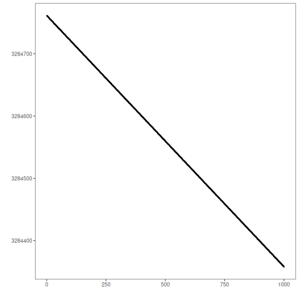
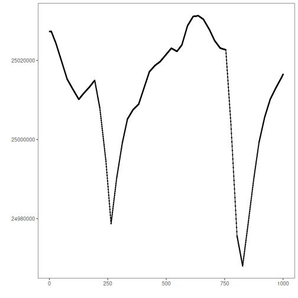
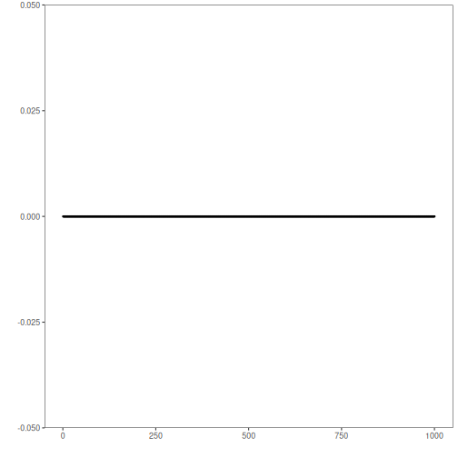

## Objective

This notebook introduces the multivariate 3W oil-well datasets bundled through Harbinger. For each dataset object, it loads the full collection with `loadfulldata()`, reports how many series are available, confirms that the collection is multivariate, and plots the first sensor column from the first series with `har_plot()`.

## Method at a glance

This is a data-inspection notebook aimed at multivariate industrial series. The key point is to show how to identify the sensor columns and choose a first variable for visual inspection. To keep the plots readable, each preview uses at most the first 1000 observations.

## What you will do

- load each 3W dataset object and expand it to the full collection
- count the number of multivariate series available
- inspect the first-series sensor columns
- plot a short preview of the first sensor column together with its labels


### Helper Functions


``` r
library(harbinger)

dataset_summary <- function(x) {
  first_series <- x[[1]]
  meta_cols <- c("idx", "event", "type", "seq", "seqlen")
  signal_cols <- setdiff(names(first_series), meta_cols)
  dataset_type <- if ("value" %in% names(first_series) || length(signal_cols) == 1) "univariate" else "multivariate"
  plot_column <- if ("value" %in% names(first_series)) "value" else signal_cols[1]

  list(
    n_series = length(x),
    dataset_type = dataset_type,
    signal_cols = signal_cols,
    plot_column = plot_column,
    preview_size = min(1000, nrow(first_series)),
    first_series = first_series
  )
}

show_dataset <- function(x, name) {
  info <- dataset_summary(x)
  cat("Dataset:", name, "\n")
  cat("Number of series:", info$n_series, "\n")
  cat("Dataset type:", info$dataset_type, "\n")
  cat("Signals in the first series:", paste(info$signal_cols, collapse = ", "), "\n")
  cat("Column plotted with har_plot():", info$plot_column, "\n")
  cat("Plot preview length:", info$preview_size, "observations\n")
  invisible(info)
}

plot_dataset_preview <- function(info) {
  preview <- info$first_series[seq_len(info$preview_size), , drop = FALSE]
  har_plot(
    harbinger(),
    preview[[info$plot_column]],
    event = preview$event
  )
}
```

### oil_3w_Type_1


``` r
data(oil_3w_Type_1)
oil_3w_Type_1 <- loadfulldata(oil_3w_Type_1)
oil_type_1_info <- show_dataset(oil_3w_Type_1, "oil_3w_Type_1")
```

```
## Dataset: oil_3w_Type_1 
## Number of series: 5 
## Dataset type: multivariate 
## Signals in the first series: p_pdg, p_tpt, t_tpt, p_mon_ckp, t_jus_ckp, p_jus_ckgl, qgl 
## Column plotted with har_plot(): p_pdg 
## Plot preview length: 1000 observations
```


``` r
plot_dataset_preview(oil_type_1_info)
```


### oil_3w_Type_2


``` r
data(oil_3w_Type_2)
oil_3w_Type_2 <- loadfulldata(oil_3w_Type_2)
oil_type_2_info <- show_dataset(oil_3w_Type_2, "oil_3w_Type_2")
```

```
## Dataset: oil_3w_Type_2 
## Number of series: 6 
## Dataset type: multivariate 
## Signals in the first series: p_pdg, p_tpt, t_tpt, p_mon_ckp, t_jus_ckp, p_jus_ckgl, qgl 
## Column plotted with har_plot(): p_pdg 
## Plot preview length: 1000 observations
```


``` r
plot_dataset_preview(oil_type_2_info)
```


### oil_3w_Type_4


``` r
data(oil_3w_Type_4)
oil_3w_Type_4 <- loadfulldata(oil_3w_Type_4)
oil_type_4_info <- show_dataset(oil_3w_Type_4, "oil_3w_Type_4")
```

```
## Dataset: oil_3w_Type_4 
## Number of series: 3 
## Dataset type: multivariate 
## Signals in the first series: p_jus_ckgl, p_mon_ckp, p_pdg, p_tpt, qgl, t_jus_ckp, t_pdg, t_tpt 
## Column plotted with har_plot(): p_jus_ckgl 
## Plot preview length: 1000 observations
```


``` r
plot_dataset_preview(oil_type_4_info)
```



### oil_3w_Type_5


``` r
data(oil_3w_Type_5)
oil_3w_Type_5 <- loadfulldata(oil_3w_Type_5)
oil_type_5_info <- show_dataset(oil_3w_Type_5, "oil_3w_Type_5")
```

```
## Dataset: oil_3w_Type_5 
## Number of series: 12 
## Dataset type: multivariate 
## Signals in the first series: p_pdg, p_tpt, t_tpt, p_mon_ckp, t_jus_ckp, p_jus_ckgl, qgl 
## Column plotted with har_plot(): p_pdg 
## Plot preview length: 1000 observations
```


``` r
plot_dataset_preview(oil_type_5_info)
```



### oil_3w_Type_6


``` r
data(oil_3w_Type_6)
oil_3w_Type_6 <- loadfulldata(oil_3w_Type_6)
oil_type_6_info <- show_dataset(oil_3w_Type_6, "oil_3w_Type_6")
```

```
## Dataset: oil_3w_Type_6 
## Number of series: 6 
## Dataset type: multivariate 
## Signals in the first series: P_PDG, P_TPT, T_TPT, P_MON_CKP, T_JUS_CKP, P_JUS_CKGL, QGL 
## Column plotted with har_plot(): P_PDG 
## Plot preview length: 1000 observations
```


``` r
plot_dataset_preview(oil_type_6_info)
```



### oil_3w_Type_7


``` r
data(oil_3w_Type_7)
oil_3w_Type_7 <- loadfulldata(oil_3w_Type_7)
oil_type_7_info <- show_dataset(oil_3w_Type_7, "oil_3w_Type_7")
```

```
## Dataset: oil_3w_Type_7 
## Number of series: 4 
## Dataset type: multivariate 
## Signals in the first series: P_PDG, P_TPT, T_TPT, P_MON_CKP, T_JUS_CKP, P_JUS_CKGL, QGL 
## Column plotted with har_plot(): P_PDG 
## Plot preview length: 1000 observations
```


``` r
plot_dataset_preview(oil_type_7_info)
```


### oil_3w_Type_8


``` r
data(oil_3w_Type_8)
oil_3w_Type_8 <- loadfulldata(oil_3w_Type_8)
oil_type_8_info <- show_dataset(oil_3w_Type_8, "oil_3w_Type_8")
```

```
## Dataset: oil_3w_Type_8 
## Number of series: 3 
## Dataset type: multivariate 
## Signals in the first series: p_pdg, p_tpt, t_tpt, p_mon_ckp, p_jus_ckgl, qgl 
## Column plotted with har_plot(): p_pdg 
## Plot preview length: 1000 observations
```


``` r
plot_dataset_preview(oil_type_8_info)
```


## References

- 3W dataset documentation from the UCI Machine Learning Repository.
- Ogasawara, E., Salles, R., Porto, F., Pacitti, E. Event Detection in Time Series. Springer, 2025. doi:10.1007/978-3-031-75941-3
