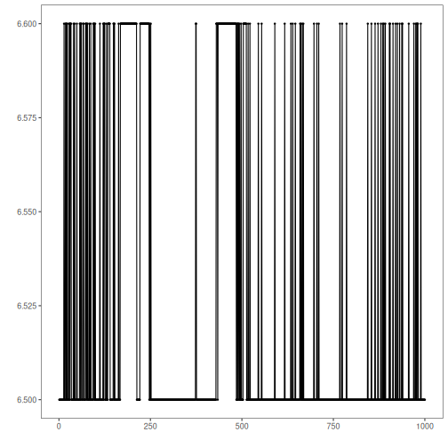

## Objective

This notebook shows how to load the full `gecco` dataset with `loadfulldata()`, inspect how many series are available, verify whether the collection is univariate or multivariate, and plot the first signal with `har_plot()`.

## Method at a glance

The purpose here is exploratory orientation. Before modeling, the reader can confirm how the dataset object is organized and which column should be used as the first signal in a quick inspection. To keep the visualization readable, the plot shows at most the first 1000 observations of the first series.

## What you will do

- load the bundled `gecco` object and replace it with the full dataset
- count the available series in the collection
- inspect the signal columns present in the first series
- plot a didactic preview of the first available signal with its event labels

## How to read this walkthrough

The code blocks below follow the same learning rhythm used throughout the collection: prepare the environment, choose the dataset, configure the method, run the analysis, and then inspect the result. Readers who are still learning time-series mining can use that order to understand not only *what* each command does, but also *why* it appears at that stage of the workflow.

As you go through the notebook, read the inline comments inside each chunk as the operational explanation and use the surrounding prose as the conceptual guide.

## Walkthrough


### Define the Support Structures

Before applying the workflow itself, we define the helper functions or custom objects that make the example possible. This is one of the most important didactic moments in extension-oriented notebooks because it shows the contract that Harbinger expects and where the reader can adapt the behavior later.


``` r
library(harbinger)

dataset_summary <- function(x) {
  first_series <- x[[1]]
  meta_cols <- c("idx", "event", "type", "seq", "seqlen")
  signal_cols <- setdiff(names(first_series), meta_cols)
  dataset_type <- if ("value" %in% names(first_series) || length(signal_cols) == 1) "univariate" else "multivariate"
  plot_column <- if ("value" %in% names(first_series)) "value" else signal_cols[1]

  list(
    n_series = length(x),
    dataset_type = dataset_type,
    signal_cols = signal_cols,
    plot_column = plot_column,
    preview_size = min(1000, nrow(first_series)),
    first_series = first_series
  )
}

show_dataset <- function(x, name) {
  info <- dataset_summary(x)
  cat("Dataset:", name, "\n")
  cat("Number of series:", info$n_series, "\n")
  cat("Dataset type:", info$dataset_type, "\n")
  cat("Signals in the first series:", paste(info$signal_cols, collapse = ", "), "\n")
  cat("Column plotted with har_plot():", info$plot_column, "\n")
  cat("Plot preview length:", info$preview_size, "observations\n")
  invisible(info)
}

plot_dataset_preview <- function(info) {
  preview <- info$first_series[seq_len(info$preview_size), , drop = FALSE]
  har_plot(
    harbinger(),
    preview[[info$plot_column]],
    event = preview$event
  )
}
```


### Prepare the Example

We begin by organizing the environment, loading the packages, and selecting the dataset used in the notebook. This part is intentionally more direct: the goal is to make the starting point explicit before the method-specific reasoning begins.


``` r
data(gecco)
gecco <- loadfulldata(gecco)
gecco_info <- show_dataset(gecco, "gecco")
```

```
## Dataset: gecco 
## Number of series: 10 
## Dataset type: univariate 
## Signals in the first series: value 
## Column plotted with har_plot(): value 
## Plot preview length: 1000 observations
```


### Interpret the Result Visually

The final plots are not just illustrations. They help the reader connect the method's internal output with the original series, making it easier to see why a point, range, motif, or symbolic pattern was emphasized and whether that emphasis is coherent with the stated objective of the example.


``` r
plot_dataset_preview(gecco_info)
```



## References

- GECCO Challenge 2018 material for water-quality event detection.
- Ogasawara, E., Salles, R., Porto, F., Pacitti, E. Event Detection in Time Series. Springer, 2025. doi:10.1007/978-3-031-75941-3

