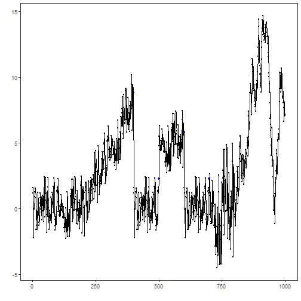
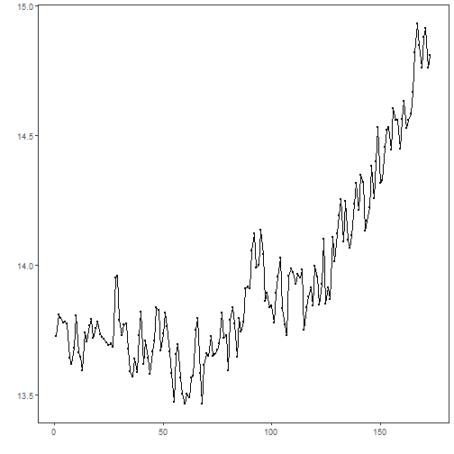
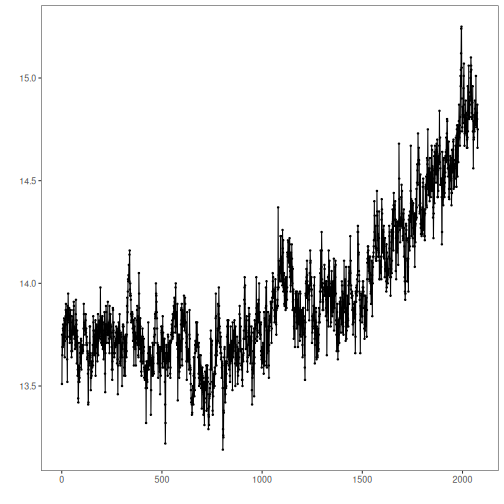
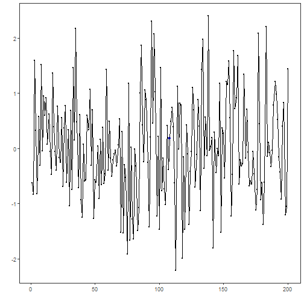
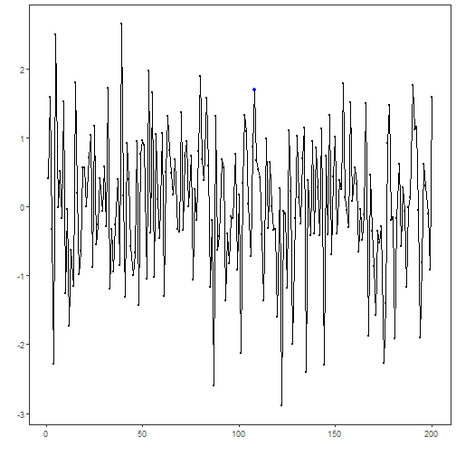
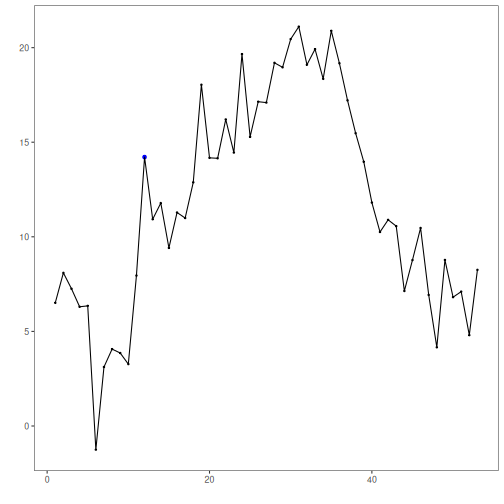
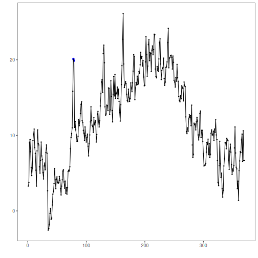

## Objective

The goal of this notebook is to present a complete Harbinger workflow: loading an example dataset, configuring the method used in the notebook, running the analysis, and interpreting the resulting outputs and plots.

## Method at a glance

This notebook provides quick end‑to‑end demonstrations of the default `harbinger()` pipeline across diverse datasets (nonstationarity, global temperature monthly/yearly, multivariate, and weather). For each dataset we: fit the default pipeline, run detection, and plot detections over the series. The goal is to illustrate Harbinger’s unified interface for anomalies, change points, and motifs, and how it builds on DAL Toolbox models.

## What you will do

- understand the purpose of the example and when the technique is useful
- follow the workflow from data loading to model fitting and detection
- inspect the evaluation outputs and the diagnostic plots produced by Harbinger

## How to read this walkthrough

The code blocks below follow the same learning rhythm used throughout the collection: prepare the environment, choose the dataset, configure the method, run the analysis, and then inspect the result. Readers who are still learning time-series mining can use that order to understand not only *what* each command does, but also *why* it appears at that stage of the workflow.

As you go through the notebook, read the inline comments inside each chunk as the operational explanation and use the surrounding prose as the conceptual guide.

## Walkthrough


### Prepare the Example

We begin by organizing the environment, loading the packages, and selecting the dataset used in the notebook. This part is intentionally more direct: the goal is to make the starting point explicit before the method-specific reasoning begins.


``` r
# Install Harbinger (only once, if needed)
#install.packages("harbinger")
```


``` r
# Load required packages
library(daltoolbox)
library(harbinger) 
```


### Configure the Method

The next step is to instantiate the method and, when necessary, fit it to the selected series. This is where the notebook makes its analytical choice explicit: the parameters chosen here determine what kind of pattern the detector or transformer will become sensitive to and how the later outputs should be interpreted.


``` r
# Load example datasets bundled with harbinger
data(examples_harbinger)
model <- harbinger()
```


``` r
# Example: nonstationarity time series
dataset <- examples_harbinger$nonstationarity
model <- fit(model, dataset$serie)
detection <- detect(model, dataset$serie)
har_plot(model, dataset$serie, detection, dataset$event)
```




``` r
# Example: global temperature (yearly)
dataset <- examples_harbinger$global_temperature_yearly
model <- fit(model, dataset$serie)
detection <- detect(model, dataset$serie)
har_plot(model, dataset$serie, detection, dataset$event)
```




``` r
# Example: global temperature (monthly)
dataset <- examples_harbinger$global_temperature_monthly
model <- fit(model, dataset$serie)
detection <- detect(model, dataset$serie)
har_plot(model, dataset$serie, detection, dataset$event)
```




``` r
# Example: multidimensional time series
dataset <- examples_harbinger$multidimensional
model <- fit(model, dataset$serie)
detection <- detect(model, dataset$serie)
har_plot(model, dataset$serie, detection, dataset$event)
```



``` r
model <- fit(model, dataset$x)
detection <- detect(model, dataset$x)
har_plot(model, dataset$x, detection, dataset$event)
```




``` r
# Example: Seattle weekly temperature time series
dataset <- examples_harbinger$seattle_week
model <- fit(model, dataset$serie)
detection <- detect(model, dataset$serie)
har_plot(model, dataset$serie, detection, dataset$event)
```




``` r
# Example: Seattle daily temperature time series
dataset <- examples_harbinger$seattle_daily
model <- fit(model, dataset$serie)
detection <- detect(model, dataset$serie)
har_plot(model, dataset$serie, detection, dataset$event)
```



## References

- Ogasawara, E., Salles, R., Porto, F., Pacitti, E. Event Detection in Time Series. Springer, 2025. doi:10.1007/978-3-031-75941-3
- DAL Toolbox documentation: https://cefet-rj-dal.github.io/daltoolbox/
