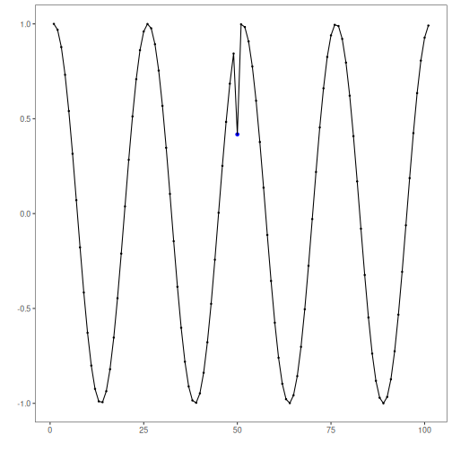
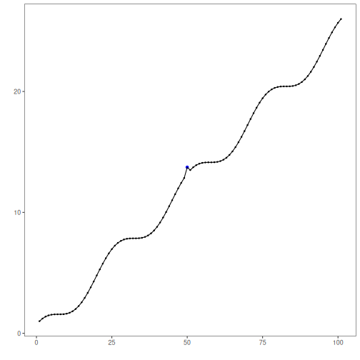
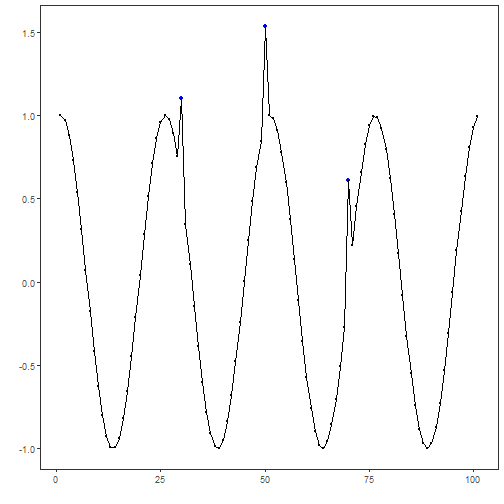
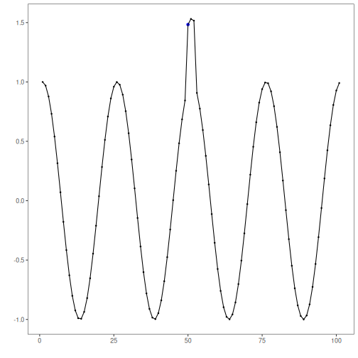
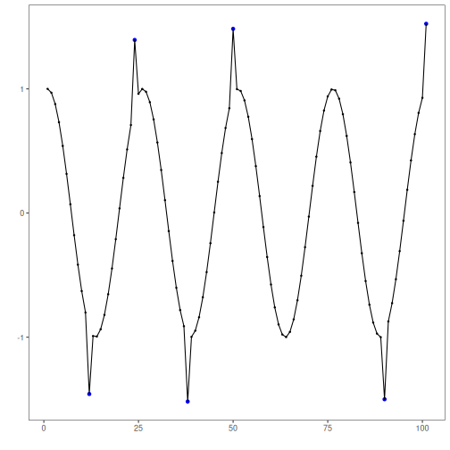
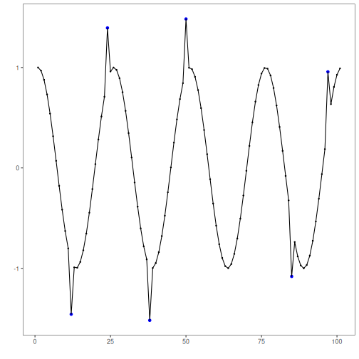
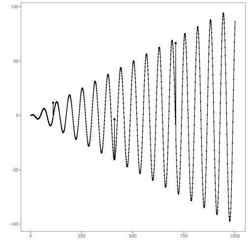
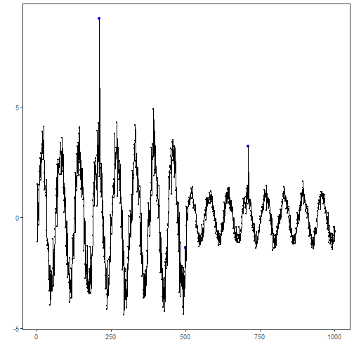
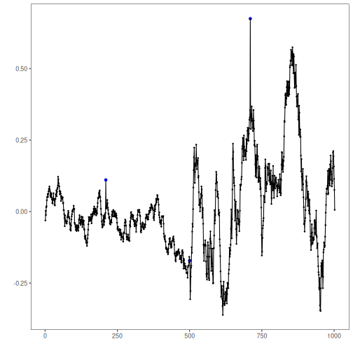

## Objective

The goal of this notebook is to present a complete Harbinger workflow: loading an example dataset, configuring the method used in the notebook, running the analysis, and interpreting the resulting outputs and plots.

## Method at a glance

This notebook tours common time-series anomaly patterns (point/isolated, contextual, collective/sequence, regime variance shifts) using Harbinger’s base pipeline. For each dataset, we fit a detector, run detection, and visualize predictions against ground truth. The goal is to illustrate how different patterns appear in residual magnitude and plots, and how Harbinger’s unified interface helps compare detectors consistently.

## What you will do

- understand the purpose of the example and when the technique is useful
- follow the workflow from data loading to model fitting and detection
- inspect the evaluation outputs and the diagnostic plots produced by Harbinger

## How to read this walkthrough

The code blocks below follow the same learning rhythm used throughout the collection: prepare the environment, choose the dataset, configure the method, run the analysis, and then inspect the result. Readers who are still learning time-series mining can use that order to understand not only *what* each command does, but also *why* it appears at that stage of the workflow.

As you go through the notebook, read the inline comments inside each chunk as the operational explanation and use the surrounding prose as the conceptual guide.

## Walkthrough


### Prepare the Example

We begin by organizing the environment, loading the packages, and selecting the dataset used in the notebook. This part is intentionally more direct: the goal is to make the starting point explicit before the method-specific reasoning begins.


``` r
# Install Harbinger (if needed)
#install.packages("harbinger")
```


``` r
# Load required packages
library(daltoolbox)
library(harbinger) 
```


### Configure the Method

The next step is to instantiate the method and, when necessary, fit it to the selected series. This is where the notebook makes its analytical choice explicit: the parameters chosen here determine what kind of pattern the detector or transformer will become sensitive to and how the later outputs should be interpreted.


``` r
# Load example anomaly datasets and create a base object
data(examples_anomalies)
model <- harbinger()
```


``` r
# Simple anomalies: isolated spikes
dataset <- examples_anomalies$simple
model <- fit(model, dataset$serie)
detection <- detect(model, dataset$serie)
har_plot(model, dataset$serie, detection, dataset$event)
```


``` r
# Contextual anomalies: depend on local context
dataset <- examples_anomalies$contextual
model <- fit(model, dataset$serie)
detection <- detect(model, dataset$serie)
har_plot(model, dataset$serie, detection, dataset$event)
```




``` r
# Trend with anomalies
dataset <- examples_anomalies$trend
model <- fit(model, dataset$serie)
detection <- detect(model, dataset$serie)
har_plot(model, dataset$serie, detection, dataset$event)
```




``` r
# Multiple anomalies
dataset <- examples_anomalies$multiple
model <- fit(model, dataset$serie)
detection <- detect(model, dataset$serie)
har_plot(model, dataset$serie, detection, dataset$event)
```




``` r
# Anomalous repeating sequences
dataset <- examples_anomalies$sequence
model <- fit(model, dataset$serie)
detection <- detect(model, dataset$serie)
har_plot(model, dataset$serie, detection, dataset$event)
```




``` r
# Train/Test split
dataset <- examples_anomalies$tt
model <- fit(model, dataset$serie)
detection <- detect(model, dataset$serie)
har_plot(model, dataset$serie, detection, dataset$event)
```




``` r
# Train/Test warped
dataset <- examples_anomalies$tt_warped
model <- fit(model, dataset$serie)
detection <- detect(model, dataset$serie)
har_plot(model, dataset$serie, detection, dataset$event)
```




``` r
# Increasing amplitude over time
dataset <- examples_anomalies$increasing_amplitude
model <- fit(model, dataset$serie)
detection <- detect(model, dataset$serie)
har_plot(model, dataset$serie, detection, dataset$event)
```




``` r
# Decreasing amplitude over time
dataset <- examples_anomalies$decreasing_amplitude
model <- fit(model, dataset$serie)
detection <- detect(model, dataset$serie)
har_plot(model, dataset$serie, detection, dataset$event)
```




``` r
# Volatile variance
dataset <- examples_anomalies$volatile
model <- fit(model, dataset$serie)
detection <- detect(model, dataset$serie)
har_plot(model, dataset$serie, detection, dataset$event)
```



## References

- Ogasawara, E., Salles, R., Porto, F., Pacitti, E. Event Detection in Time Series. Springer, 2025. doi:10.1007/978-3-031-75941-3
- Chandola, V., Banerjee, A., Kumar, V. (2009). Anomaly detection: A survey. ACM Computing Surveys, 41(3), 1–58.
