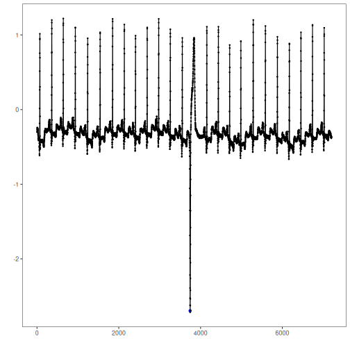
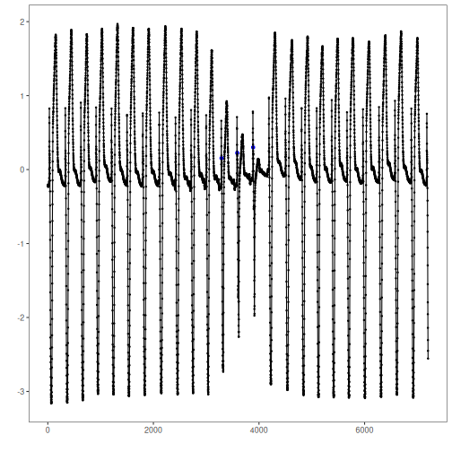

## Objective

The goal of this notebook is to present a complete Harbinger workflow: loading an example dataset, configuring the method used in the notebook, running the analysis, and interpreting the resulting outputs and plots.

## Method at a glance

This notebook showcases motif discovery (repeated subsequences) using Harbinger's unified interface and base plotting. Across synthetic and ECG datasets, we fit a detector, run discovery, and plot results. The aim is to build intuition for how motifs (and related discords) appear in time series and how Matrix Profile/SAX-based methods surface them.

## What you will do

- understand the purpose of the example and when the technique is useful
- follow the workflow from data loading to model fitting and detection
- inspect the evaluation outputs and the diagnostic plots produced by Harbinger


### Prepare the Example

This setup anchors the notebook in the specific series used to examine `harbinger()`. The semantic point is the one stated above: this notebook showcases motif discovery (repeated subsequences) using Harbinger's unified interface and base plotting, so the raw signal needs to be visible before any fitting step hides that structure behind model output.


``` r
# Install Harbinger (if needed)
#install.packages("harbinger")
```


``` r
# Load required packages
library(daltoolbox)
library(harbinger) 
```


### Configure the Method

The choices below turn the central modeling idea into concrete parameters. They matter because this notebook showcases motif discovery (repeated subsequences) using Harbinger's unified interface and base plotting, so each argument controls how strongly the method will emphasize that pattern when it later produces workflow outputs.


``` r
# Load motif example datasets and create a base object
data(examples_motifs)
model <- harbinger()
```


``` r
# Simple synthetic motif dataset
dataset <- examples_motifs$simple
model <- fit(model, dataset$serie)
detection <- detect(model, dataset$serie)
har_plot(model, dataset$serie, detection, dataset$event)
```


``` r
# ECG sample: MIT-BIH record 100
dataset <- examples_motifs$mitdb100
model <- fit(model, dataset$serie)
detection <- detect(model, dataset$serie)
har_plot(model, dataset$serie, detection, dataset$event)
```




``` r
# ECG sample: MIT-BIH record 102
dataset <- examples_motifs$mitdb102
model <- fit(model, dataset$serie)
detection <- detect(model, dataset$serie)
har_plot(model, dataset$serie, detection, dataset$event)
```



## References

- Yeh, C.-C. M., et al. (2016). Matrix Profile I/II: All-pairs similarity joins and scalable time series motif/discord discovery. IEEE ICDM.
- Tavenard, R., et al. (2020). tsmp: The Matrix Profile in R. The R Journal. doi:10.32614/RJ-2020-021
- Lin, J., Keogh, E., Lonardi, S., Chiu, B. (2007). A symbolic representation of time series, with implications for streaming algorithms. DMKD, 15, 107-144.
