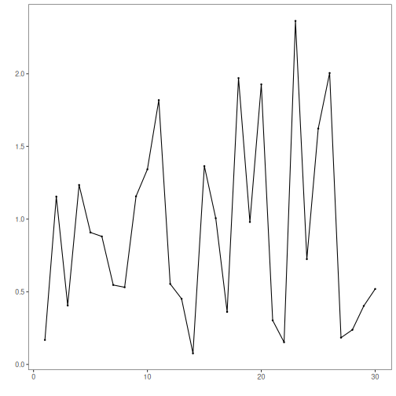
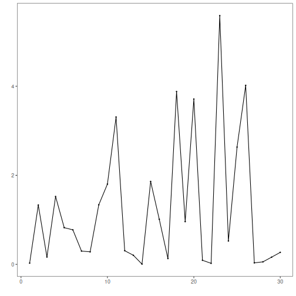
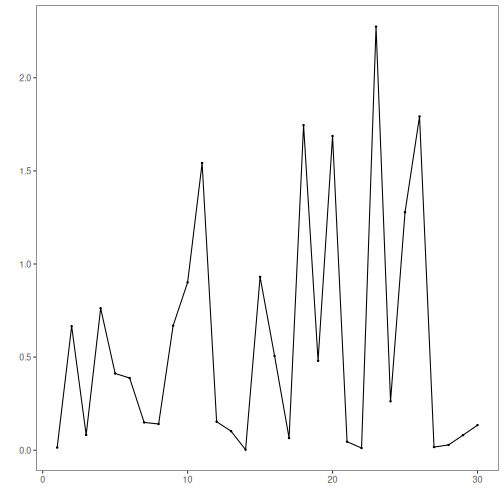

## Objective

The goal of this notebook is to compare Harbinger deviation measures in isolation, so the reader can understand how different residual summaries reshape the score before any filter criterion is applied.

## Method at a glance

This notebook demonstrates Harbinger utility deviation measures for summarizing residual magnitudes (`L1`, `L2`, and `Huber`) and plotting results for quick inspection.

- `L1` emphasizes robustness to outliers.
- `L2` emphasizes larger deviations more strongly.
- `Huber` interpolates between the two: quadratic near zero and linear in the tails.

These aggregations feed subsequent filter criteria in the detection pipeline.

## What you will do

- compare how different deviation measures rescale the same residual series
- understand what each deviation measure privileges in practice
- connect those score shapes to later thresholding decisions


### Prepare the Example

This setup anchors the notebook in a synthetic residual series used to examine `harutils()`. The purpose is not to detect anomalies yet, but to understand how each deviation measure transforms the same underlying residuals before any filter criterion acts on them.


``` r
source(url("https://raw.githubusercontent.com/cefet-rj-dal/harbinger/main/examples/seed.R"))
```

```
## Warning in readLines(file, warn = FALSE): cannot open URL
## 'https://raw.githubusercontent.com/cefet-rj-dal/harbinger/main/examples/seed.R': HTTP status was '404 Not Found'
```

```
## Error in `readLines()`:
## ! cannot open the connection to 'https://raw.githubusercontent.com/cefet-rj-dal/harbinger/main/examples/seed.R'
```

``` r
# Install Harbinger (if needed)
#install.packages("harbinger")
```


``` r
# Load required packages
library(daltoolbox)
library(harbinger) 
```


``` r
# Instantiate utilities
hutils <- harutils()
```


``` r
# Generate synthetic residuals
set_example_seed(123L)
```

```
## Error in `set_example_seed()`:
## ! could not find function "set_example_seed"
```

``` r
values <- rnorm(30, mean = 0, sd = 1)
```


### Interpret the Result Visually

The three plots below should be read comparatively. They all start from the same residual vector; only the deviation measure changes. The practical question is how strongly each measure inflates large residuals relative to moderate ones.


``` r
# L1 deviation.
# Objective: summarize residual magnitude in a simple and robust way.
# Property: linear growth treats all increases proportionally, so it is less
# dominated by a few very large residual peaks.
v1 <- hutils$har_deviation_l1(values)
har_plot(harbinger(), v1)
```




``` r
# L2 deviation.
# Objective: emphasize large residuals more strongly than moderate ones.
# Property: quadratic growth makes extreme values dominate the score more
# aggressively, which can help isolate sharp peaks but also increases
# sensitivity to large outliers.
v2 <- hutils$har_deviation_l2(values)
har_plot(harbinger(), v2)
```




``` r
# Huber deviation.
# Objective: preserve sensitivity to moderate residual growth while reducing
# the dominance of very large peaks.
# Property: Huber behaves quadratically near zero and linearly in the tails,
# making it a compromise between L2 sensitivity and L1 robustness.
vh <- hutils$har_deviation_huber(values)
har_plot(harbinger(), vh)
```



## References

- Tukey, J. W. (1977). Exploratory Data Analysis. Addison-Wesley. (IQR/boxplot heuristics underpin some thresholding rules)
- Shewhart, W. A. (1931). Economic Control of Quality of Manufactured Product. D. Van Nostrand. (three-sigma rule)
- Huber, P. J. (1964). Robust Estimation of a Location Parameter. Annals of Mathematical Statistics, 35(1), 73-101.
