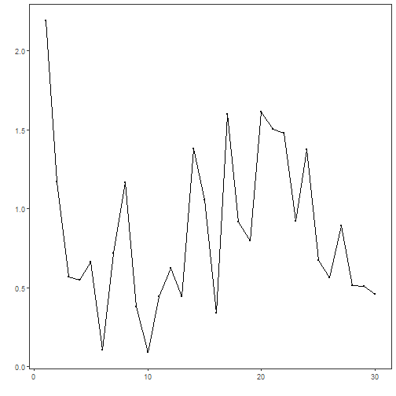

## Objective

The goal of this notebook is to present a complete Harbinger workflow: loading an example dataset, configuring the method used in the notebook, running the analysis, and interpreting the resulting outputs and plots.

## Method at a glance

This notebook demonstrates Harbinger utility distance functions for summarizing residual magnitudes (L1 and L2) and plotting results for quick inspection. L1 emphasizes robustness to outliers; L2 emphasizes larger deviations. These aggregations feed subsequent thresholding/outlier rules in the detection pipeline.

## What you will do

- understand the purpose of the example and when the technique is useful
- follow the workflow from data loading to model fitting and detection
- inspect the evaluation outputs and the diagnostic plots produced by Harbinger


### Prepare the Example

This setup anchors the notebook in the specific series used to examine `harutils()`. The semantic point is the one stated above: this notebook demonstrates Harbinger utility distance functions for summarizing residual magnitudes (L1 and L2) and plotting results for quick inspection, so the raw signal needs to be visible before any fitting step hides that structure behind model output.


``` r
# Install Harbinger (if needed)
#install.packages("harbinger")
```


``` r
# Load required packages
library(daltoolbox)
library(harbinger) 
```


``` r
# Instantiate utilities
hutils <- harutils()
```


``` r
# Generate synthetic residuals
values <- rnorm(30, mean = 0, sd = 1)
```


### Interpret the Result Visually

This first visual pass establishes what the method should react to in the raw series. Keep the method summary in mind here, because this notebook demonstrates Harbinger utility distance functions for summarizing residual magnitudes (L1 and L2) and plotting results for quick inspection and the plot tells you whether that structure is clean, weak, local, repeated, or mixed with other effects.


``` r
# L1 aggregation of residual magnitude
v1 <- hutils$har_distance_l1(values)
har_plot(harbinger(), v1)
```




``` r
# L2 aggregation of residual magnitude
v2 <- hutils$har_distance_l2(values)
har_plot(harbinger(), v2)
```


## References

- Tukey, J. W. (1977). Exploratory Data Analysis. Addison-Wesley. (IQR/boxplot heuristics underpin some thresholding rules)
- Shewhart, W. A. (1931). Economic Control of Quality of Manufactured Product. D. Van Nostrand. (three-sigma rule)
