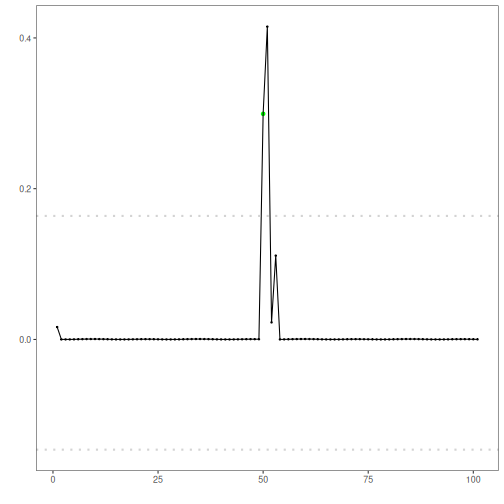
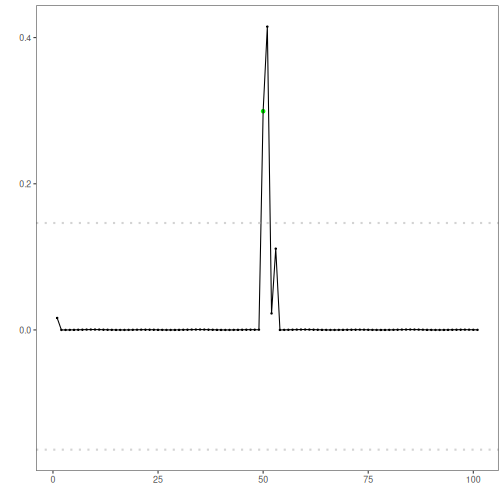
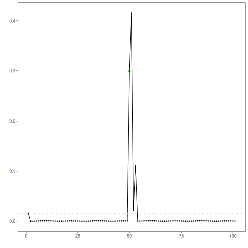
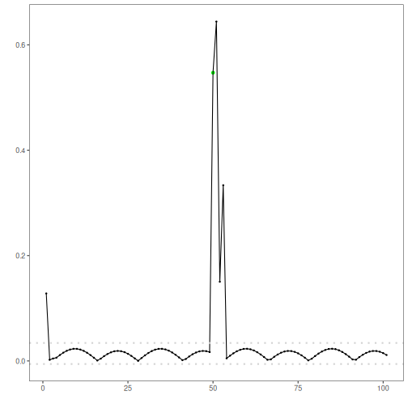
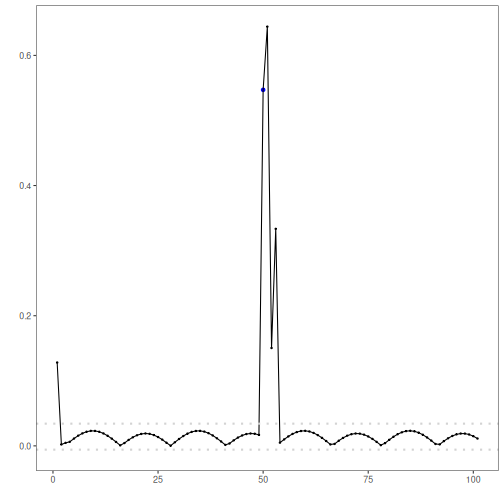

## Objective

The goal of this notebook is to show, in a controlled and explicit way, how Harbinger utility functions define anomaly candidates from residual magnitudes and how contiguous candidates are reduced or preserved by candidate-selection rules.

## Method at a glance

This notebook covers the three semantic stages exposed by `harutils()`:

- deviation measures, which summarize residual magnitude
- filter criteria, which convert residual magnitudes into anomaly candidates
- candidate selection, which resolves contiguous candidate runs into point anomalies or sequence-aware detections

The notebook tests the classic Gaussian, boxplot/IQR, ratio, and Grubbs filters, then contrasts two contiguous-run reducers (`firstgroup` and `highgroup`) with the new reference-distribution selector that evaluates each candidate against the distribution estimated from the 30 observations preceding the start of the candidate run.

## What you will do

- inspect direct utility outputs before fitting a detector
- compare filter criteria on the same residual signal
- test how candidate-selection rules behave when candidates appear in contiguous runs
- connect those utility choices to the final detector output and residual plot


### Prepare the Example

This setup anchors the notebook in a simple anomaly series and in two synthetic residual vectors. The purpose is to separate two questions that are often mixed together: how a filter criterion creates anomaly candidates, and how a candidate-selection rule interprets a contiguous run of candidates after that first cut.


``` r
# Install Harbinger (if needed)
#install.packages("harbinger")
```


``` r
# Load required packages
library(daltoolbox)
library(harbinger) 
```


``` r
# Instantiate utilities
hutils <- harutils()
```


``` r
# Synthetic residual vectors used to test the new utility functions directly
set.seed(123)
res_grubbs <- c(rnorm(40, mean = 0, sd = 0.15), 1.8, -1.7)
res_sequence <- c(rnorm(30, mean = 0, sd = 0.20), 1.7, 1.9, 1.8, 0.1)
```


### Interpret the Result Visually

This first visual pass establishes what the detector should react to in the raw series. The later utility examples operate on residual magnitudes, so this raw plot is only the starting point for understanding whether the final candidates arise from isolated spikes or from short contiguous segments.


``` r
# Load a simple anomaly dataset and plot it
data(examples_anomalies)
dataset <- examples_anomalies$simple
har_plot(harbinger(), dataset$serie)
```


### Test Utility Functions Directly

The next two chunks isolate the new behavior introduced in the utility layer.

The first chunk tests `har_filter_grubbs()`. This is a global filter criterion: it scans the full residual vector, iteratively removes the most extreme observation when the Grubbs statistic is significant, and returns candidate indexes plus an interpretable threshold for plotting.


``` r
# Direct test of the Grubbs filter criterion on a synthetic residual vector
gidx <- hutils$har_filter_grubbs(res_grubbs)
print(gidx)
```

```
## [1] 41 42
## attr(,"threshold")
## [1] -1.7  1.8
## attr(,"score")
##  [1]       NA       NA       NA       NA       NA       NA       NA       NA       NA       NA       NA       NA       NA
## [14]       NA       NA       NA       NA       NA       NA       NA       NA       NA       NA       NA       NA       NA
## [27]       NA       NA       NA       NA       NA       NA       NA       NA       NA       NA       NA       NA       NA
## [40]       NA 4.386634 5.589984
```

``` r
print(attr(gidx, "threshold"))
```

```
## [1] -1.7  1.8
```

``` r
print(attr(gidx, "score")[gidx])
```

```
## [1] 4.386634 5.589984
```

The second chunk tests `har_candidate_selection_referencedistribution()`. Here the candidate run is assumed to begin at index 31. The method estimates a Gaussian reference distribution from the 30 observations before that run, then checks each candidate in the run individually. If a point falls outside the accepted region of that estimated distribution, it remains marked. This allows a sequence to emerge naturally when several adjacent candidates are individually incompatible with the same pre-run baseline.


``` r
# Direct test of reference-distribution candidate selection
candidate_idx <- 31:33
flags_refdist <- hutils$har_candidate_selection_referencedistribution(
  candidate_idx,
  res_sequence,
  history_size = 30,
  distribution = "gaussian",
  sigma_level = 3
)
```

```
## Error in `hutils$har_candidate_selection_referencedistribution()`:
## ! argument "values" is missing, with no default
```

``` r
print(which(flags_refdist))
```

```
## Error:
## ! object 'flags_refdist' not found
```


### Configure the Method

The choices below connect those utility functions to a detector. Each block keeps the regression model simple and changes only the utility stage that is being studied, so the difference in the residual plot comes from the utility choice rather than from a model change.


``` r
# Baseline: ARIMA with default deviation measure (L2) and filter criterion (Gaussian 3-sigma)
model <- hanr_arima()
model <- fit(model, dataset$serie)
detection <- detect(model, dataset$serie)
har_plot(model, attr(detection, "res"), detection, dataset$event, yline = attr(detection, "threshold"))
```




``` r
# Use the boxplot/IQR filter criterion instead of Gaussian
model <- hanr_arima()
model$har_outliers <- hutils$har_filter_boxplot
model <- fit(model, dataset$serie)
detection <- detect(model, dataset$serie)
har_plot(model, attr(detection, "res"), detection, dataset$event, yline = attr(detection, "threshold"))
```


``` r
# Use the ratio-based filter criterion to emphasize relative deviation
model <- hanr_arima()
model$har_outliers <- hutils$har_filter_ratio
model <- fit(model, dataset$serie)
detection <- detect(model, dataset$serie)
har_plot(model, attr(detection, "res"), detection, dataset$event, yline = attr(detection, "threshold"))
```




``` r
# Use the Grubbs filter criterion to iteratively isolate the most extreme residuals
model <- hanr_arima()
model$har_outliers <- hutils$har_filter_grubbs
model <- fit(model, dataset$serie)
detection <- detect(model, dataset$serie)
threshold_grubbs <- attr(detection, "threshold")
threshold_grubbs <- threshold_grubbs[is.finite(threshold_grubbs)]
har_plot(model, attr(detection, "res"), detection, dataset$event, yline = threshold_grubbs)
```




``` r
# Change the deviation measure to L1 (absolute deviation)
model <- hanr_arima()
model$har_distance <- hutils$har_deviation_l1
model <- fit(model, dataset$serie)
detection <- detect(model, dataset$serie)
har_plot(model, attr(detection, "res"), detection, dataset$event, yline = attr(detection, "threshold"))
```


``` r
# L1 deviation measure + boxplot/IQR filter criterion
model <- hanr_arima()
model$har_distance <- hutils$har_deviation_l1
model$har_outliers <- hutils$har_filter_boxplot
model <- fit(model, dataset$serie)
detection <- detect(model, dataset$serie)
har_plot(model, attr(detection, "res"), detection, dataset$event, yline = attr(detection, "threshold"))
```




``` r
# L1 deviation measure + ratio-based filter criterion
model <- hanr_arima()
model$har_distance <- hutils$har_deviation_l1
model$har_outliers <- hutils$har_filter_ratio
model <- fit(model, dataset$serie)
detection <- detect(model, dataset$serie)
har_plot(model, attr(detection, "res"), detection, dataset$event, yline = attr(detection, "threshold"))
```


``` r
# Candidate selection: keep only the highest-magnitude index in contiguous runs
model <- hanr_arima()
model$har_distance <- hutils$har_deviation_l1
model$har_outliers <- hutils$har_filter_boxplot
model$har_outliers_check <- hutils$har_candidate_selection_highgroup
model <- fit(model, dataset$serie)
detection <- detect(model, dataset$serie)
har_plot(model, attr(detection, "res"), detection, dataset$event, yline = attr(detection, "threshold"))
```


``` r
# Candidate selection: evaluate each candidate against the distribution
# estimated from the 30 observations that precede the candidate run
model <- hanr_arima()
model$har_distance <- hutils$har_deviation_l1
model$har_outliers <- hutils$har_filter_boxplot
model$har_outliers_check <- hutils$har_candidate_selection_referencedistribution
model <- fit(model, dataset$serie)
detection <- detect(model, dataset$serie)
har_plot(model, attr(detection, "res"), detection, dataset$event, yline = attr(detection, "threshold"))
```



## References

- Tukey, J. W. (1977). Exploratory Data Analysis. Addison-Wesley. (boxplot/IQR outlier rule)
- Shewhart, W. A. (1931). Economic Control of Quality of Manufactured Product. D. Van Nostrand. (three-sigma rule)
- Grubbs, F. E. (1969). Procedures for Detecting Outlying Observations in Samples. Technometrics, 11(1), 1-21.
