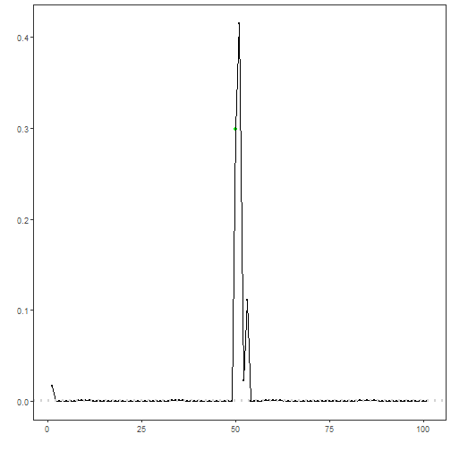
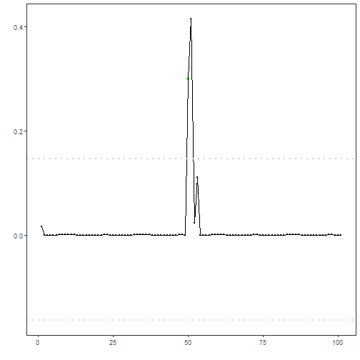
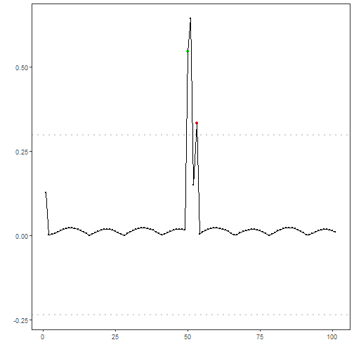
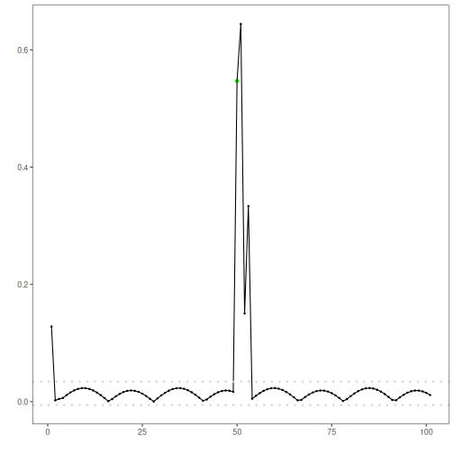
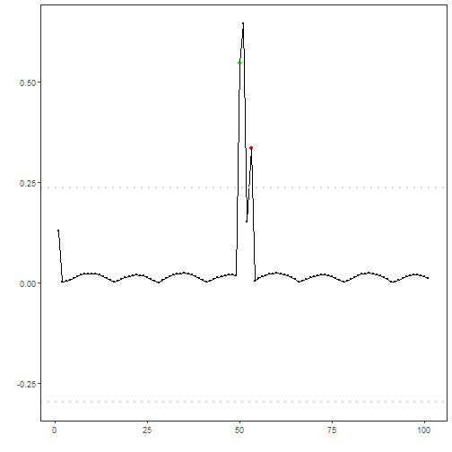
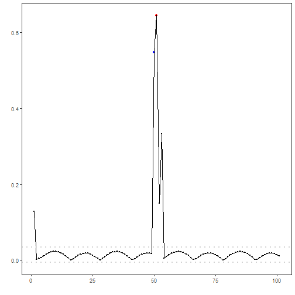

## Objective

The goal of this notebook is to present a complete Harbinger workflow: loading an example dataset, configuring the method used in the notebook, running the analysis, and interpreting the resulting outputs and plots.

## Method at a glance

This notebook shows how Harbinger’s utility functions for distance aggregation, thresholding, and grouping affect anomaly flags and decision thresholds. We compare Gaussian 3‑sigma vs. boxplot/IQR vs. ratio rules, and grouping strategies for contiguous detections.

## What you will do

- understand the purpose of the example and when the technique is useful
- follow the workflow from data loading to model fitting and detection
- inspect the evaluation outputs and the diagnostic plots produced by Harbinger

## How to read this walkthrough

The code blocks below follow the same learning rhythm used throughout the collection: prepare the environment, choose the dataset, configure the method, run the analysis, and then inspect the result. Readers who are still learning time-series mining can use that order to understand not only *what* each command does, but also *why* it appears at that stage of the workflow.

As you go through the notebook, read the inline comments inside each chunk as the operational explanation and use the surrounding prose as the conceptual guide.

## Walkthrough


### Prepare the Example

We begin by organizing the environment, loading the packages, and selecting the dataset used in the notebook. This part is intentionally more direct: the goal is to make the starting point explicit before the method-specific reasoning begins.


``` r
# Install Harbinger (if needed)
#install.packages("harbinger")
```


``` r
# Load required packages
library(daltoolbox)
library(harbinger) 
```


``` r
# Instantiate utilities
hutils <- harutils()
```


### Interpret the Result Visually

The final plots are not just illustrations. They help the reader connect the method's internal output with the original series, making it easier to see why a point, range, motif, or symbolic pattern was emphasized and whether that emphasis is coherent with the stated objective of the example.


``` r
# Load a simple anomaly dataset and plot it
data(examples_anomalies)
dataset <- examples_anomalies$simple
har_plot(harbinger(), dataset$serie)
```


### Configure the Method

The next step is to instantiate the method and, when necessary, fit it to the selected series. This is where the notebook makes its analytical choice explicit: the parameters chosen here determine what kind of pattern the detector or transformer will become sensitive to and how the later outputs should be interpreted.


``` r
# Baseline: ARIMA with default distance (L2) and threshold (Gaussian 3-sigma)
model <- hanr_arima()
model <- fit(model, dataset$serie)
detection <- detect(model, dataset$serie)
har_plot(model, attr(detection, "res"), detection, dataset$event, yline = attr(detection, "threshold"))
```


``` r
# Use Boxplot/IQR threshold instead of Gaussian
model <- hanr_arima()
model$har_outliers <- hutils$har_outliers_boxplot
model <- fit(model, dataset$serie)
detection <- detect(model, dataset$serie)
har_plot(model, attr(detection, "res"), detection, dataset$event, yline = attr(detection, "threshold"))
```




``` r
# Use ratio thresholding emphasizing relative deviation
model <- hanr_arima()
model$har_outliers <- hutils$har_outliers_ratio
model <- fit(model, dataset$serie)
detection <- detect(model, dataset$serie)
har_plot(model, attr(detection, "res"), detection, dataset$event, yline = attr(detection, "threshold"))
```




``` r
# Change distance to L1 (absolute deviation)
model <- hanr_arima()
model$har_distance <- hutils$har_distance_l1
model <- fit(model, dataset$serie)
detection <- detect(model, dataset$serie)
har_plot(model, attr(detection, "res"), detection, dataset$event, yline = attr(detection, "threshold"))
```




``` r
# L1 distance + Boxplot/IQR threshold
model <- hanr_arima()
model$har_distance <- hutils$har_distance_l1
model$har_outliers <- hutils$har_outliers_boxplot
model <- fit(model, dataset$serie)
detection <- detect(model, dataset$serie)
har_plot(model, attr(detection, "res"), detection, dataset$event, yline = attr(detection, "threshold"))
```




``` r
# L1 distance + ratio threshold
model <- hanr_arima()
model$har_distance <- hutils$har_distance_l1
model$har_outliers <- hutils$har_outliers_ratio
model <- fit(model, dataset$serie)
detection <- detect(model, dataset$serie)
har_plot(model, attr(detection, "res"), detection, dataset$event, yline = attr(detection, "threshold"))
```




``` r
# Keep only the highest-magnitude index in contiguous runs
model <- hanr_arima()
model$har_distance <- hutils$har_distance_l1
model$har_outliers <- hutils$har_outliers_boxplot
model$har_outliers_check <- hutils$har_outliers_checks_highgroup
model <- fit(model, dataset$serie)
detection <- detect(model, dataset$serie)
har_plot(model, attr(detection, "res"), detection, dataset$event, yline = attr(detection, "threshold"))
```



## References

- Tukey, J. W. (1977). Exploratory Data Analysis. Addison‑Wesley. (boxplot/IQR outlier rule)
- Shewhart, W. A. (1931). Economic Control of Quality of Manufactured Product. D. Van Nostrand. (three‑sigma rule)
