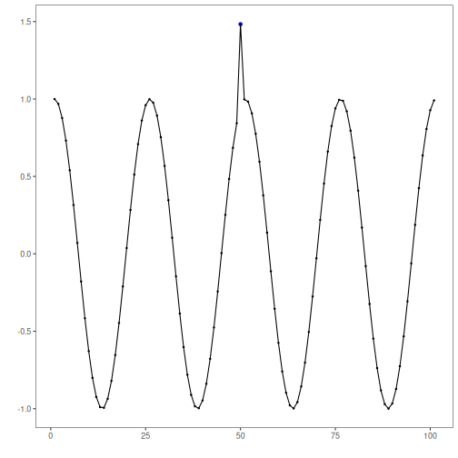
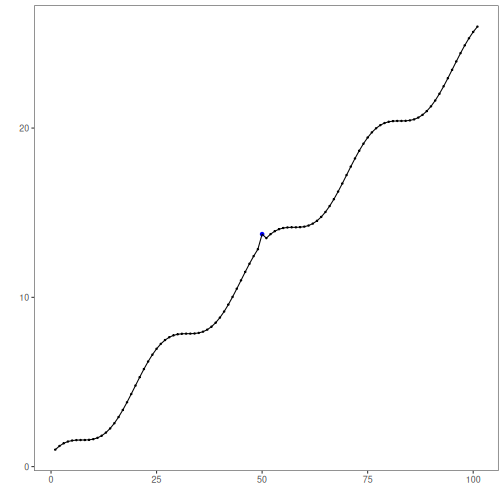
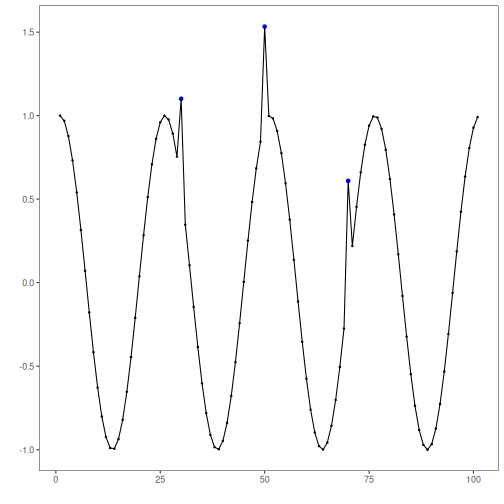
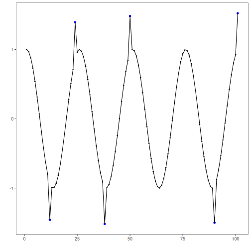
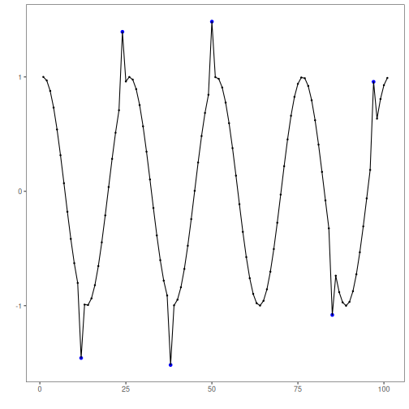
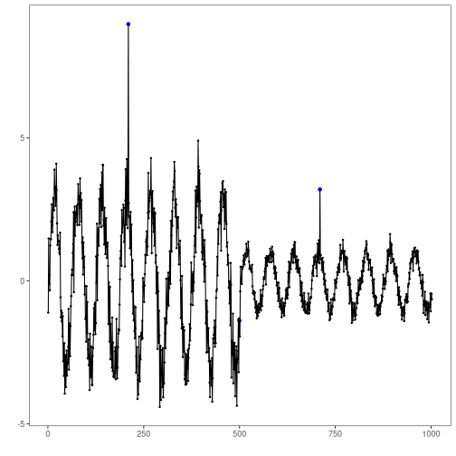
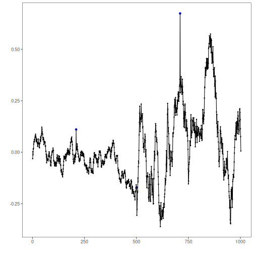

This notebook demonstrates different anomaly patterns available in the example datasets and how to visualize detections with Harbinger’s default plot. We will iterate over multiple series and apply the base workflow: fit, detect, plot.


``` r
# Install Harbinger (if needed)
#install.packages("harbinger")
```


``` r
# Load required packages
library(daltoolbox)
library(harbinger) 
```


``` r
# Load example anomaly datasets and create a base object
data(examples_anomalies)
model <- harbinger()
```


``` r
# Simple anomalies: isolated spikes
dataset <- examples_anomalies$simple
model <- fit(model, dataset$serie)
detection <- detect(model, dataset$serie)
har_plot(model, dataset$serie, detection, dataset$event)
```




``` r
# Contextual anomalies: depend on local context
dataset <- examples_anomalies$contextual
model <- fit(model, dataset$serie)
detection <- detect(model, dataset$serie)
har_plot(model, dataset$serie, detection, dataset$event)
```


``` r
# Trend with anomalies
dataset <- examples_anomalies$trend
model <- fit(model, dataset$serie)
detection <- detect(model, dataset$serie)
har_plot(model, dataset$serie, detection, dataset$event)
```




``` r
# Multiple anomalies
dataset <- examples_anomalies$multiple
model <- fit(model, dataset$serie)
detection <- detect(model, dataset$serie)
har_plot(model, dataset$serie, detection, dataset$event)
```




``` r
# Anomalous repeating sequences
dataset <- examples_anomalies$sequence
model <- fit(model, dataset$serie)
detection <- detect(model, dataset$serie)
har_plot(model, dataset$serie, detection, dataset$event)
```


``` r
# Train/Test split
dataset <- examples_anomalies$tt
model <- fit(model, dataset$serie)
detection <- detect(model, dataset$serie)
har_plot(model, dataset$serie, detection, dataset$event)
```




``` r
# Train/Test warped
dataset <- examples_anomalies$tt_warped
model <- fit(model, dataset$serie)
detection <- detect(model, dataset$serie)
har_plot(model, dataset$serie, detection, dataset$event)
```




``` r
# Increasing amplitude over time
dataset <- examples_anomalies$increasing_amplitude
model <- fit(model, dataset$serie)
detection <- detect(model, dataset$serie)
har_plot(model, dataset$serie, detection, dataset$event)
```


``` r
# Decreasing amplitude over time
dataset <- examples_anomalies$decreasing_amplitude
model <- fit(model, dataset$serie)
detection <- detect(model, dataset$serie)
har_plot(model, dataset$serie, detection, dataset$event)
```




``` r
# Volatile variance
dataset <- examples_anomalies$volatile
model <- fit(model, dataset$serie)
detection <- detect(model, dataset$serie)
har_plot(model, dataset$serie, detection, dataset$event)
```



