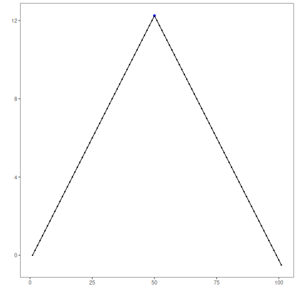
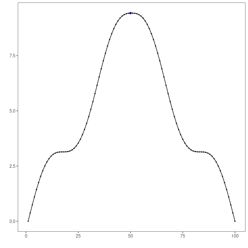
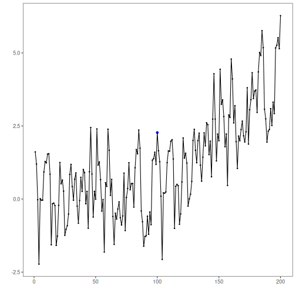
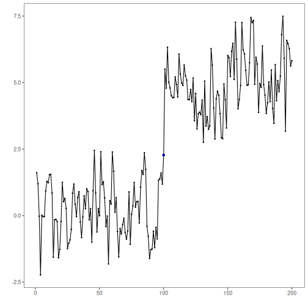
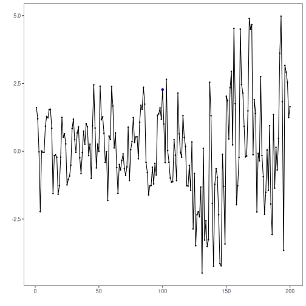
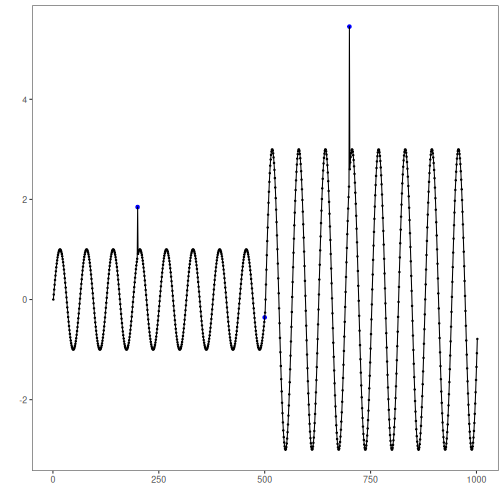
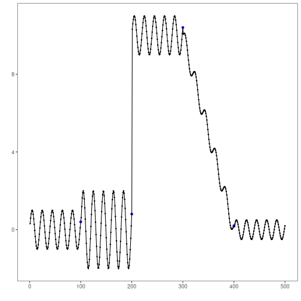

This notebook demonstrates several change-point patterns in the example datasets and how to visualize detections. We iterate across series and apply: fit, detect, plot.


``` r
# Install Harbinger (if needed)
#install.packages("harbinger")
```


``` r
# Load required packages
library(daltoolbox)
library(harbinger) 
```


``` r
# Load change-point example datasets and create a base object
data(examples_changepoints)
model <- harbinger()
```


``` r
# Simple change point
dataset <- examples_changepoints$simple
model <- fit(model, dataset$serie)
detection <- detect(model, dataset$serie)
har_plot(model, dataset$serie, detection, dataset$event)
```




``` r
# Sinusoidal pattern with regime shift
dataset <- examples_changepoints$sinusoidal
model <- fit(model, dataset$serie)
detection <- detect(model, dataset$serie)
har_plot(model, dataset$serie, detection, dataset$event)
```




``` r
# Incremental trend changes
dataset <- examples_changepoints$incremental
model <- fit(model, dataset$serie)
detection <- detect(model, dataset$serie)
har_plot(model, dataset$serie, detection, dataset$event)
```




``` r
# Abrupt level shift
dataset <- examples_changepoints$abrupt
model <- fit(model, dataset$serie)
detection <- detect(model, dataset$serie)
har_plot(model, dataset$serie, detection, dataset$event)
```

```
## Don't know how to automatically pick scale for object of type <ts>. Defaulting to continuous.
```




``` r
# Volatility (variance) change
dataset <- examples_changepoints$volatility
model <- fit(model, dataset$serie)
detection <- detect(model, dataset$serie)
har_plot(model, dataset$serie, detection, dataset$event)
```

```
## Don't know how to automatically pick scale for object of type <ts>. Defaulting to continuous.
```




``` r
# Increasing amplitude
dataset <- examples_changepoints$increasing_amplitude
model <- fit(model, dataset$serie)
detection <- detect(model, dataset$serie)
har_plot(model, dataset$serie, detection, dataset$event)
```




``` r
# Complex multi-regime series
dataset <- examples_changepoints$complex
model <- fit(model, dataset$serie)
detection <- detect(model, dataset$serie)
har_plot(model, dataset$serie, detection, dataset$event)
```



