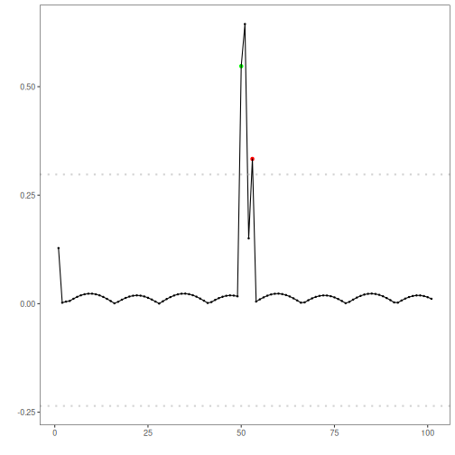
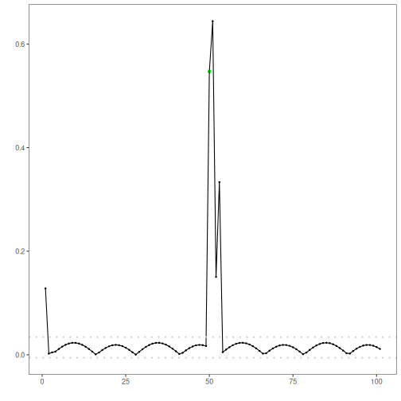

Overview and objectives: This notebook shows how Harbinger’s utility functions for distance aggregation, thresholding, and grouping affect anomaly flags and decision thresholds. We compare Gaussian 3‑sigma vs. boxplot/IQR vs. ratio rules, and grouping strategies for contiguous detections.


``` r
# Install Harbinger (if needed)
#install.packages("harbinger")
```


``` r
# Load required packages
library(daltoolbox)
library(harbinger) 
```


``` r
# Instantiate utilities
hutils <- harutils()
```


``` r
# Load a simple anomaly dataset and plot it
data(examples_anomalies)
dataset <- examples_anomalies$simple
har_plot(harbinger(), dataset$serie)
```


``` r
# Baseline: ARIMA with default distance (L2) and threshold (Gaussian 3-sigma)
model <- hanr_arima()
model <- fit(model, dataset$serie)
detection <- detect(model, dataset$serie)
har_plot(model, attr(detection, "res"), detection, dataset$event, yline = attr(detection, "threshold"))
```


``` r
# Use Boxplot/IQR threshold instead of Gaussian
model <- hanr_arima()
model$har_outliers <- hutils$har_outliers_boxplot
model <- fit(model, dataset$serie)
detection <- detect(model, dataset$serie)
har_plot(model, attr(detection, "res"), detection, dataset$event, yline = attr(detection, "threshold"))
```


``` r
# Use ratio thresholding emphasizing relative deviation
model <- hanr_arima()
model$har_outliers <- hutils$har_outliers_ratio
model <- fit(model, dataset$serie)
detection <- detect(model, dataset$serie)
har_plot(model, attr(detection, "res"), detection, dataset$event, yline = attr(detection, "threshold"))
```


``` r
# Change distance to L1 (absolute deviation)
model <- hanr_arima()
model$har_distance <- hutils$har_distance_l1
model <- fit(model, dataset$serie)
detection <- detect(model, dataset$serie)
har_plot(model, attr(detection, "res"), detection, dataset$event, yline = attr(detection, "threshold"))
```




``` r
# L1 distance + Boxplot/IQR threshold
model <- hanr_arima()
model$har_distance <- hutils$har_distance_l1
model$har_outliers <- hutils$har_outliers_boxplot
model <- fit(model, dataset$serie)
detection <- detect(model, dataset$serie)
har_plot(model, attr(detection, "res"), detection, dataset$event, yline = attr(detection, "threshold"))
```




``` r
# L1 distance + ratio threshold
model <- hanr_arima()
model$har_distance <- hutils$har_distance_l1
model$har_outliers <- hutils$har_outliers_ratio
model <- fit(model, dataset$serie)
detection <- detect(model, dataset$serie)
har_plot(model, attr(detection, "res"), detection, dataset$event, yline = attr(detection, "threshold"))
```


``` r
# Keep only the highest-magnitude index in contiguous runs
model <- hanr_arima()
model$har_distance <- hutils$har_distance_l1
model$har_outliers <- hutils$har_outliers_boxplot
model$har_outliers_check <- hutils$har_outliers_checks_highgroup
model <- fit(model, dataset$serie)
detection <- detect(model, dataset$serie)
har_plot(model, attr(detection, "res"), detection, dataset$event, yline = attr(detection, "threshold"))
```


References
- Tukey, J. W. (1977). Exploratory Data Analysis. Addison‑Wesley. (boxplot/IQR outlier rule)
- Shewhart, W. A. (1931). Economic Control of Quality of Manufactured Product. D. Van Nostrand. (three‑sigma rule)
