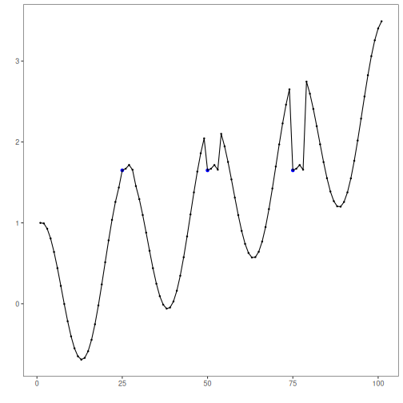
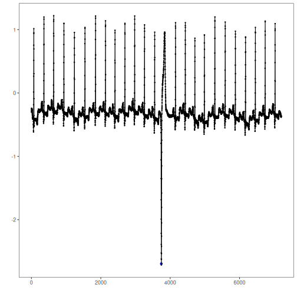
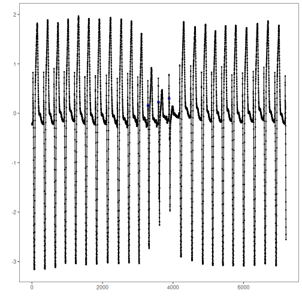

This notebook demonstrates motif discovery datasets and visualization using Harbinger’s base plotting. We will iterate over multiple series and apply the base workflow: fit, detect, plot.


``` r
# Install Harbinger (if needed)
#install.packages("harbinger")
```


``` r
# Load required packages
library(daltoolbox)
library(harbinger) 
```


``` r
# Load motif example datasets and create a base object
data(examples_motifs)
model <- harbinger()
```


``` r
# Simple synthetic motif dataset
dataset <- examples_motifs$simple
model <- fit(model, dataset$serie)
detection <- detect(model, dataset$serie)
har_plot(model, dataset$serie, detection, dataset$event)
```




``` r
# ECG sample: MIT-BIH record 100
dataset <- examples_motifs$mitdb100
model <- fit(model, dataset$serie)
detection <- detect(model, dataset$serie)
har_plot(model, dataset$serie, detection, dataset$event)
```




``` r
# ECG sample: MIT-BIH record 102
dataset <- examples_motifs$mitdb102
model <- fit(model, dataset$serie)
detection <- detect(model, dataset$serie)
har_plot(model, dataset$serie, detection, dataset$event)
```



