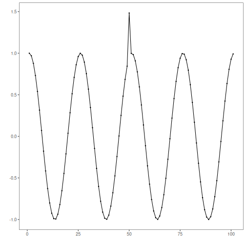

## Objective

The goal of this notebook is to present a complete Harbinger workflow: loading an example dataset, configuring the method used in the notebook, running the analysis, and interpreting the resulting outputs and plots.

## Method at a glance

This notebook demonstrates hard evaluation of event detection results using confusion matrix–based metrics (accuracy, precision, recall, F1). It shows how to compute metrics with `har_eval()` from detections and ground truth, and how to visualize results alongside the series.

## What you will do

- understand the purpose of the example and when the technique is useful
- follow the workflow from data loading to model fitting and detection
- inspect the evaluation outputs and the diagnostic plots produced by Harbinger

## Walkthrough


``` r
# Install Harbinger (if needed)
#install.packages("harbinger")
```


``` r
# Load required packages
library(daltoolbox)
library(harbinger) 
```


``` r
# Load example anomaly datasets
data(examples_anomalies)
```


``` r
# Select a simple anomaly dataset
dataset <- examples_anomalies$simple
head(dataset)
```

```
##       serie event
## 1 1.0000000 FALSE
## 2 0.9689124 FALSE
## 3 0.8775826 FALSE
## 4 0.7316889 FALSE
## 5 0.5403023 FALSE
## 6 0.3153224 FALSE
```


``` r
# Plot the raw time series
har_plot(harbinger(), dataset$serie)
```




``` r
# Configure a simple MLP regressor-based anomaly detector
model <- hanr_ml(ts_mlp(ts_norm_gminmax(), input_size = 5, size = 3, decay = 0))
```


``` r
# Fit the detector
model <- fit(model, dataset$serie)
```


``` r
# Run detection
detection <- detect(model, dataset$serie)
```


``` r
# Inspect detected anomaly indices
print(detection |> dplyr::filter(event == TRUE))
```

```
##   idx event    type
## 1  50  TRUE anomaly
```


``` r
# Evaluate using hard metrics
evaluation <- evaluate(har_eval(), detection$event, dataset$event)
print(evaluation$confMatrix)
```

```
##           event      
## detection TRUE  FALSE
## TRUE      1     0    
## FALSE     0     100
```

## References

- Salles, R., Lima, J., Reis, M., Coutinho, R., Pacitti, E., Masseglia, F., Akbarinia, R., Chen, C., Garibaldi, J., Porto, F., Ogasawara, E. (2024). SoftED: Metrics for soft evaluation of time series event detection. Computers and Industrial Engineering. doi:10.1016/j.cie.2024.110728
