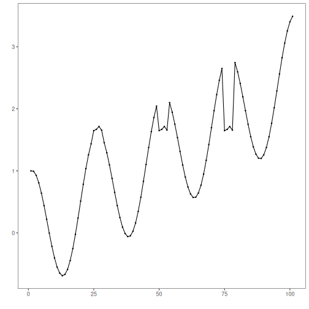
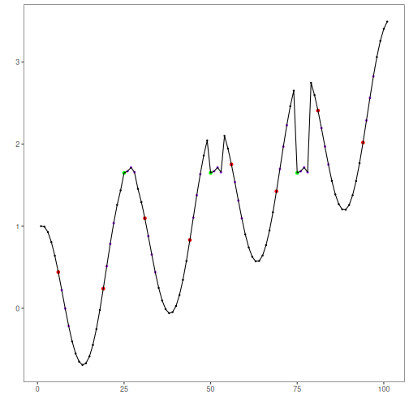

## Objective

This notebook demonstrates motif discovery using Matrix Profile with the STOMP algorithm via `hmo_mp("stomp", ...)`. It identifies repeated subsequences (motifs) efficiently in long series. Steps: load packages/data, visualize, configure subsequence length and number of motifs, fit, detect, evaluate, and plot.

## Method at a glance

STOMP motif discovery: Matrix Profile methods compute, for each subsequence, the distance to its nearest neighbor subsequence. STOMP is an efficient exact algorithm for long series. Harbinger provides Matrix Profile via `tsmp` and wraps it in `hmo_mp()`.

## What you will do

- understand the purpose of the example and when the technique is useful
- follow the workflow from data loading to model fitting and detection
- inspect the evaluation outputs and the diagnostic plots produced by Harbinger

## How to read this walkthrough

The code blocks below follow the same learning rhythm used throughout the collection: prepare the environment, choose the dataset, configure the method, run the analysis, and then inspect the result. Readers who are still learning time-series mining can use that order to understand not only *what* each command does, but also *why* it appears at that stage of the workflow.

As you go through the notebook, read the inline comments inside each chunk as the operational explanation and use the surrounding prose as the conceptual guide.

## Walkthrough


``` r
# Install Harbinger (only once, if needed)
#install.packages("harbinger")
```


``` r
# Load required packages
library(daltoolbox)
library(harbinger) 
```


``` r
# Load example datasets bundled with harbinger
data(examples_motifs)
```


``` r
# Select a simple example time series
dataset <- examples_motifs$simple
head(dataset)
```

```
##       serie event
## 1 1.0000000 FALSE
## 2 0.9939124 FALSE
## 3 0.9275826 FALSE
## 4 0.8066889 FALSE
## 5 0.6403023 FALSE
## 6 0.4403224 FALSE
```


``` r
# Plot the time series
har_plot(harbinger(), dataset$serie)
```




``` r
# Define Matrix Profile (STOMP) motif model
# - second arg: subsequence length (window)
# - third arg: number of motifs to retrieve
  model <- hmo_mp("stomp", 4, 3)
```


``` r
# Fit the model
  model <- fit(model, dataset$serie)
```


``` r
# Detect motifs
  detection <- detect(model, dataset$serie)
```

```
## Finished in 0.01 secs
```


``` r
# Show only timestamps flagged as events
  print(detection |> dplyr::filter(event==TRUE))
```

```
##    idx event  type seq seqlen
## 1    6  TRUE motif   3      4
## 2   19  TRUE motif   2      4
## 3   25  TRUE motif   1      4
## 4   31  TRUE motif   3      4
## 5   44  TRUE motif   2      4
## 6   50  TRUE motif   1      4
## 7   56  TRUE motif   3      4
## 8   69  TRUE motif   2      4
## 9   75  TRUE motif   1      4
## 10  81  TRUE motif   3      4
## 11  94  TRUE motif   2      4
```


``` r
# Evaluate detections against ground-truth labels
  evaluation <- evaluate(model, detection$event, dataset$event)
  print(evaluation$confMatrix)
```

```
##           event      
## detection TRUE  FALSE
## TRUE      3     8    
## FALSE     0     90
```


``` r
# Plot detections over the series
  har_plot(model, dataset$serie, detection, dataset$event)
```



## References

- Yeh, C.-C. M., et al. (2016). Matrix Profile I/II: All-pairs similarity joins and scalable time series motif/discord discovery. IEEE ICDM.
- Tavenard, R., et al. (2020). tsmp: The Matrix Profile in R. The R Journal. doi:10.32614/RJ-2020-021


