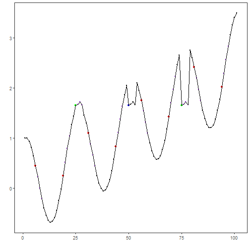

## Objective

This notebook demonstrates motif discovery using Matrix Profile with SCRIMP via `hmo_mp("scrimp", ...)`. SCRIMP is an incremental algorithm for computing the matrix profile. Steps: load packages/data, visualize, set subsequence length and count, fit, detect, evaluate, and plot.

## Method at a glance

SCRIMP motif discovery: Matrix Profile methods compute nearest-neighbor distances for subsequences. SCRIMP incrementally approximates the profile and refines it efficiently. Provided via `tsmp` and wrapped by `hmo_mp()`.

## What you will do

- understand the purpose of the example and when the technique is useful
- follow the workflow from data loading to model fitting and detection
- inspect the evaluation outputs and the diagnostic plots produced by Harbinger


### Prepare the Example

This setup anchors the notebook in the specific series used to examine `hmo_mp("scrimp", ...)`. The semantic point is the one stated above: sCRIMP motif discovery: Matrix Profile methods compute nearest-neighbor distances for subsequences, so the raw signal needs to be visible before any fitting step hides that structure behind model output.


``` r
# Install Harbinger (only once, if needed)
#install.packages("harbinger")
```


``` r
# Load required packages
library(daltoolbox)
library(harbinger) 
```


``` r
# Load example datasets bundled with harbinger
data(examples_motifs)
```


``` r
# Select a simple example time series
dataset <- examples_motifs$simple
head(dataset)
```

```
##       serie event
## 1 1.0000000 FALSE
## 2 0.9939124 FALSE
## 3 0.9275826 FALSE
## 4 0.8066889 FALSE
## 5 0.6403023 FALSE
## 6 0.4403224 FALSE
```


### Interpret the Result Visually

This first visual pass establishes what the method should react to in the raw series. Keep the method summary in mind here, because sCRIMP motif discovery: Matrix Profile methods compute nearest-neighbor distances for subsequences and the plot tells you whether that structure is clean, weak, local, repeated, or mixed with other effects.


``` r
# Plot the time series
har_plot(harbinger(), dataset$serie)
```


### Configure the Method

The choices below turn the central modeling idea into concrete parameters. They matter because sCRIMP motif discovery: Matrix Profile methods compute nearest-neighbor distances for subsequences, so each argument controls how strongly the method will emphasize that pattern when it later produces motif candidates.


``` r
# Define Matrix Profile (SCRIMP) motif model
# - second arg: subsequence length (window)
# - third arg: number of motifs to retrieve
  model <- hmo_mp("scrimp", 4, 3)
```


``` r
# Fit the model
  model <- fit(model, dataset$serie)
```


### Run the Core Analysis

This is the moment where the notebook tests its central assumption on actual data. After applying `hmo_mp("scrimp", ...)`, the important question is whether the resulting motif candidates really correspond to the pattern implied by the method description above, rather than to arbitrary numerical variation.


``` r
# Detect motifs
  detection <- detect(model, dataset$serie)
```

```
## 
PRE-SCRIMP [=================>--------]  68% at 176 it/s, elapsed:  0s, eta:  0s
PRE-SCRIMP [=================>--------]  69% at 178 it/s, elapsed:  0s, eta:  0s
PRE-SCRIMP [=================>--------]  70% at 180 it/s, elapsed:  0s, eta:  0s
PRE-SCRIMP [=================>--------]  71% at 182 it/s, elapsed:  0s, eta:  0s
PRE-SCRIMP [==================>-------]  72% at 184 it/s, elapsed:  0s, eta:  0s
PRE-SCRIMP [==================>-------]  73% at 186 it/s, elapsed:  0s, eta:  0s
PRE-SCRIMP [==================>-------]  74% at 188 it/s, elapsed:  0s, eta:  0s
PRE-SCRIMP [===================>------]  75% at 190 it/s, elapsed:  0s, eta:  0s
PRE-SCRIMP [===================>------]  76% at 192 it/s, elapsed:  0s, eta:  0s
PRE-SCRIMP [===================>------]  77% at 194 it/s, elapsed:  0s, eta:  0s
PRE-SCRIMP [===================>------]  78% at 195 it/s, elapsed:  0s, eta:  0s
PRE-SCRIMP [====================>-----]  79% at 197 it/s, elapsed:  0s, eta:  0s
PRE-SCRIMP [====================>-----]  80% at 199 it/s, elapsed:  0s, eta:  0s
PRE-SCRIMP [====================>-----]  81% at 201 it/s, elapsed:  0s, eta:  0s
PRE-SCRIMP [====================>-----]  82% at 203 it/s, elapsed:  0s, eta:  0s
PRE-SCRIMP [=====================>----]  84% at 205 it/s, elapsed:  0s, eta:  0s
PRE-SCRIMP [=====================>----]  85% at 207 it/s, elapsed:  0s, eta:  0s
PRE-SCRIMP [=====================>----]  86% at 208 it/s, elapsed:  0s, eta:  0s
PRE-SCRIMP [======================>---]  87% at 210 it/s, elapsed:  0s, eta:  0s
PRE-SCRIMP [======================>---]  88% at 212 it/s, elapsed:  0s, eta:  0s
PRE-SCRIMP [======================>---]  89% at 214 it/s, elapsed:  0s, eta:  0s
PRE-SCRIMP [======================>---]  90% at 216 it/s, elapsed:  0s, eta:  0s
PRE-SCRIMP [=======================>--]  91% at 217 it/s, elapsed:  0s, eta:  0s
PRE-SCRIMP [=======================>--]  92% at 219 it/s, elapsed:  0s, eta:  0s
PRE-SCRIMP [=======================>--]  93% at 221 it/s, elapsed:  0s, eta:  0s
PRE-SCRIMP [=======================>--]  94% at 223 it/s, elapsed:  0s, eta:  0s
PRE-SCRIMP [========================>-]  95% at 224 it/s, elapsed:  0s, eta:  0s
PRE-SCRIMP [========================>-]  96% at 226 it/s, elapsed:  0s, eta:  0s
PRE-SCRIMP [========================>-]  97% at 228 it/s, elapsed:  0s, eta:  0s
PRE-SCRIMP [========================>-]  98% at 230 it/s, elapsed:  0s, eta:  0s
PRE-SCRIMP [=========================>]  99% at 231 it/s, elapsed:  0s, eta:  0s
PRE-SCRIMP [==========================] 100% at 233 it/s, elapsed:  0s, eta:  0s
## 
SCRIMP [==================>-----------]  64% at 197 it/s, elapsed:  0s, eta:  0s
SCRIMP [===================>----------]  65% at 199 it/s, elapsed:  0s, eta:  0s
SCRIMP [===================>----------]  66% at 202 it/s, elapsed:  0s, eta:  0s
SCRIMP [===================>----------]  67% at 204 it/s, elapsed:  0s, eta:  0s
SCRIMP [====================>---------]  68% at 207 it/s, elapsed:  0s, eta:  0s
SCRIMP [====================>---------]  69% at 209 it/s, elapsed:  0s, eta:  0s
SCRIMP [====================>---------]  71% at 211 it/s, elapsed:  0s, eta:  0s
SCRIMP [====================>---------]  72% at 214 it/s, elapsed:  0s, eta:  0s
SCRIMP [=====================>--------]  73% at 216 it/s, elapsed:  0s, eta:  0s
SCRIMP [=====================>--------]  74% at 218 it/s, elapsed:  0s, eta:  0s
SCRIMP [=====================>--------]  75% at 221 it/s, elapsed:  0s, eta:  0s
SCRIMP [======================>-------]  76% at 223 it/s, elapsed:  0s, eta:  0s
SCRIMP [======================>-------]  77% at 225 it/s, elapsed:  0s, eta:  0s
SCRIMP [======================>-------]  78% at 228 it/s, elapsed:  0s, eta:  0s
SCRIMP [=======================>------]  79% at 230 it/s, elapsed:  0s, eta:  0s
SCRIMP [=======================>------]  80% at 232 it/s, elapsed:  0s, eta:  0s
SCRIMP [=======================>------]  81% at 234 it/s, elapsed:  0s, eta:  0s
SCRIMP [========================>-----]  82% at 237 it/s, elapsed:  0s, eta:  0s
SCRIMP [========================>-----]  83% at 239 it/s, elapsed:  0s, eta:  0s
SCRIMP [========================>-----]  84% at 241 it/s, elapsed:  0s, eta:  0s
SCRIMP [=========================>----]  85% at 243 it/s, elapsed:  0s, eta:  0s
SCRIMP [=========================>----]  86% at 245 it/s, elapsed:  0s, eta:  0s
SCRIMP [=========================>----]  87% at 247 it/s, elapsed:  0s, eta:  0s
SCRIMP [==========================>---]  88% at 250 it/s, elapsed:  0s, eta:  0s
SCRIMP [==========================>---]  89% at 252 it/s, elapsed:  0s, eta:  0s
SCRIMP [==========================>---]  91% at 254 it/s, elapsed:  0s, eta:  0s
SCRIMP [==========================>---]  92% at 256 it/s, elapsed:  0s, eta:  0s
SCRIMP [===========================>--]  93% at 258 it/s, elapsed:  0s, eta:  0s
SCRIMP [===========================>--]  94% at 260 it/s, elapsed:  0s, eta:  0s
SCRIMP [===========================>--]  95% at 262 it/s, elapsed:  0s, eta:  0s
SCRIMP [============================>-]  96% at 264 it/s, elapsed:  0s, eta:  0s
SCRIMP [============================>-]  97% at 266 it/s, elapsed:  0s, eta:  0s
SCRIMP [============================>-]  98% at 268 it/s, elapsed:  0s, eta:  0s
SCRIMP [=============================>]  99% at 270 it/s, elapsed:  0s, eta:  0s
SCRIMP [==============================] 100% at 272 it/s, elapsed:  0s, eta:  0s
## Finished in 0.77 secs
```


``` r
# Show only timestamps flagged as events
  print(detection |> dplyr::filter(event==TRUE))
```

```
##    idx event  type seq seqlen
## 1    6  TRUE motif   3      4
## 2   19  TRUE motif   2      4
## 3   25  TRUE motif   1      4
## 4   31  TRUE motif   3      4
## 5   44  TRUE motif   2      4
## 6   56  TRUE motif   3      4
## 7   69  TRUE motif   2      4
## 8   75  TRUE motif   1      4
## 9   81  TRUE motif   3      4
## 10  94  TRUE motif   2      4
```


### Evaluate What Was Found

The evaluation asks whether the motif candidates produced by `hmo_mp("scrimp", ...)` match the labeled structure on this dataset. Read the scores as evidence about the method's assumptions in practice, not as detached summary numbers.


``` r
# Evaluate detections against ground-truth labels
  evaluation <- evaluate(model, detection$event, dataset$event)
  print(evaluation$confMatrix)
```

```
##           event      
## detection TRUE  FALSE
## TRUE      2     8    
## FALSE     1     90
```


### Interpret the Result Visually

This visual check puts the model output back on top of the original signal. What matters now is whether the highlighted motif candidates line up with the structure suggested by the method, which is the real semantic test of whether the example is teaching the right lesson.


``` r
# Plot detections over the series
  har_plot(model, dataset$serie, detection, dataset$event)
```



## References

- Yeh, C.-C. M., et al. (2016). Matrix Profile I/II: All-pairs similarity joins and scalable time series motif/discord discovery. IEEE ICDM.
- Tavenard, R., et al. (2020). tsmp: The Matrix Profile in R. The R Journal. doi:10.32614/RJ-2020-021
