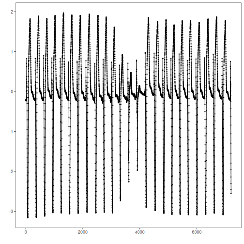
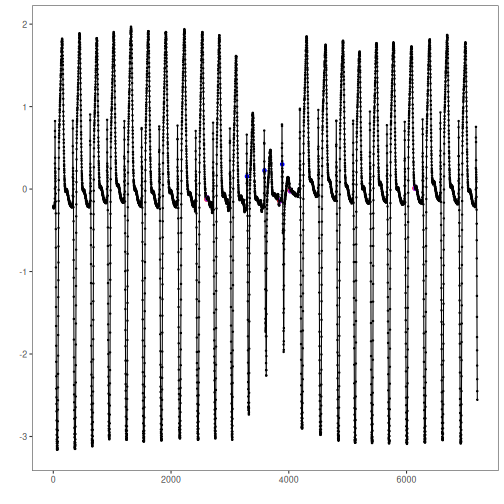

## Objective

This notebook demonstrates discord (anomaly) discovery using Matrix Profile with the STOMP algorithm via `hdis_mp(mode = "stomp", ...)`. Discords are subsequences maximally dissimilar to the rest. Steps: load packages/data, visualize, define the discord model (subsequence length and count), fit, detect, evaluate, and plot.

## Method at a glance

STOMP motif discovery: Matrix Profile-based discord discovery identifies rare subsequences whose nearest-neighbor distance is large. STOMP approximates the profile via random order calculations for scalability.

## What you will do

- understand the purpose of the example and when the technique is useful
- follow the workflow from data loading to model fitting and detection
- inspect the evaluation outputs and the diagnostic plots produced by Harbinger


### Prepare the Example

This setup anchors the notebook in the specific series used to examine `08-discord-hdis_mp_stamp`. The semantic point is the one stated above: sTOMP motif discovery: Matrix Profile-based discord discovery identifies rare subsequences whose nearest-neighbor distance is large, so the raw signal needs to be visible before any fitting step hides that structure behind model output.


``` r
# Install Harbinger (only once, if needed)
#install.packages("harbinger")
```


``` r
# Load required packages
library(daltoolbox)
library(harbinger) 
```


``` r
# Load example datasets bundled with harbinger
data(examples_motifs)
```


``` r
# Select an ECG time series with annotated anomalies
dataset <- examples_motifs$mitdb102
head(dataset)
```

```
##         serie event symbol
## 102992 -0.215 FALSE      N
## 102993 -0.210 FALSE      N
## 102994 -0.215 FALSE      N
## 102995 -0.230 FALSE      N
## 102996 -0.220 FALSE      N
## 102997 -0.200 FALSE      N
```


### Interpret the Result Visually

This first visual pass establishes what the method should react to in the raw series. Keep the method summary in mind here, because sTOMP motif discovery: Matrix Profile-based discord discovery identifies rare subsequences whose nearest-neighbor distance is large and the plot tells you whether that structure is clean, weak, local, repeated, or mixed with other effects.


``` r
# Plot the time series
har_plot(harbinger(), dataset$serie)
```




### Configure the Method

The choices below turn the central modeling idea into concrete parameters. They matter because sTOMP motif discovery: Matrix Profile-based discord discovery identifies rare subsequences whose nearest-neighbor distance is large, so each argument controls how strongly the method will emphasize that pattern when it later produces discord candidates.


``` r
# Define Matrix Profile discord model (STOMP)
# - w: subsequence length (window)
# - qtd: number of discords to retrieve
model <- hdis_mp(mode = "stomp", w = 25, qtd = 10)
```


``` r
# Fit the model
  model <- fit(model, dataset$serie)
```


### Run the Core Analysis

This is the moment where the notebook tests its central assumption on actual data. After applying `08-discord-hdis_mp_stamp`, the important question is whether the resulting discord candidates really correspond to the pattern implied by the method description above, rather than to arbitrary numerical variation.


``` r
# Detect discords
  suppressMessages(detection <- detect(model, dataset$serie))
```


``` r
# Show only timestamps flagged as events
  print(detection |> dplyr::filter(event==TRUE))
```

```
##    idx event  type seq seqlen
## 1 2602  TRUE motif   1     25
## 2 3844  TRUE motif   1     25
## 3 4017  TRUE motif   1     25
## 4 6135  TRUE motif   1     25
```


### Evaluate What Was Found

The evaluation asks whether the discord candidates produced by `08-discord-hdis_mp_stamp` match the labeled structure on this dataset. Read the scores as evidence about the method's assumptions in practice, not as detached summary numbers.


``` r
# Evaluate detections against ground-truth labels
  evaluation <- evaluate(model, detection$event, dataset$event)
  print(evaluation$confMatrix)
```

```
##           event      
## detection TRUE  FALSE
## TRUE      0     4    
## FALSE     3     7195
```


### Interpret the Result Visually

This visual check puts the model output back on top of the original signal. What matters now is whether the highlighted discord candidates line up with the structure suggested by the method, which is the real semantic test of whether the example is teaching the right lesson.


``` r
# Plot detections over the series
  har_plot(model, dataset$serie, detection, dataset$event)
```



## References

- Yeh, C.-C. M., et al. (2016). Matrix Profile I/II: All-pairs similarity joins and scalable time series motif/discord discovery. IEEE ICDM.
- Tavenard, R., et al. (2020). tsmp: The Matrix Profile in R. The R Journal. doi:10.32614/RJ-2020-021
