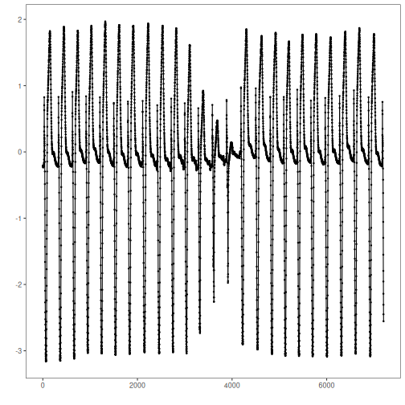
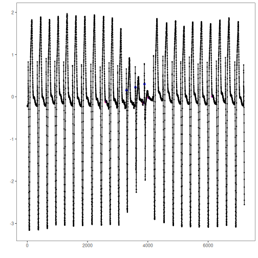

STOMP motif discovery: Matrix Profile-based discord discovery identifies rare subsequences whose nearest-neighbor distance is large. STOMP approximates the profile via random order calculations for scalability.

Objectives: This Rmd demonstrates discord (anomaly) discovery using Matrix Profile with the STOMP algorithm via `hdis_mp(mode = "stomp", ...)`. Discords are subsequences maximally dissimilar to the rest. Steps: load packages/data, visualize, define the discord model (subsequence length and count), fit, detect, evaluate, and plot.


``` r
# Install Harbinger (only once, if needed)
#install.packages("harbinger")
```


``` r
# Load required packages
library(daltoolbox)
library(harbinger) 
```


``` r
# Load example datasets bundled with harbinger
data(examples_motifs)
```


``` r
# Select an ECG time series with annotated anomalies
dataset <- examples_motifs$mitdb102
head(dataset)
```

```
##         serie event symbol
## 102992 -0.215 FALSE      N
## 102993 -0.210 FALSE      N
## 102994 -0.215 FALSE      N
## 102995 -0.230 FALSE      N
## 102996 -0.220 FALSE      N
## 102997 -0.200 FALSE      N
```


``` r
# Plot the time series
har_plot(harbinger(), dataset$serie)
```




``` r
# Define Matrix Profile discord model (STOMP)
# - w: subsequence length (window)
# - qtd: number of discords to retrieve
model <- hdis_mp(mode = "stomp", w = 25, qtd = 10)
```


``` r
# Fit the model
  model <- fit(model, dataset$serie)
```


``` r
# Detect discords
  suppressMessages(detection <- detect(model, dataset$serie))
```


``` r
# Show only timestamps flagged as events
  print(detection |> dplyr::filter(event==TRUE))
```

```
##    idx event  type seq seqlen
## 1 2602  TRUE motif   1     25
## 2 3844  TRUE motif   1     25
## 3 4017  TRUE motif   1     25
## 4 6135  TRUE motif   1     25
```


``` r
# Evaluate detections against ground-truth labels
  evaluation <- evaluate(model, detection$event, dataset$event)
  print(evaluation$confMatrix)
```

```
##           event      
## detection TRUE  FALSE
## TRUE      0     4    
## FALSE     3     7195
```


``` r
# Plot detections over the series
  har_plot(model, dataset$serie, detection, dataset$event)
```



References 
- Yeh, C.-C. M., et al. (2016). Matrix Profile I/II: All-pairs similarity joins and scalable time series motif/discord discovery. IEEE ICDM.
- Tavenard, R., et al. (2020). tsmp: The Matrix Profile in R. The R Journal. doi:10.32614/RJ-2020-021
