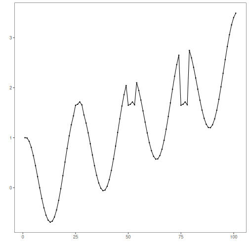
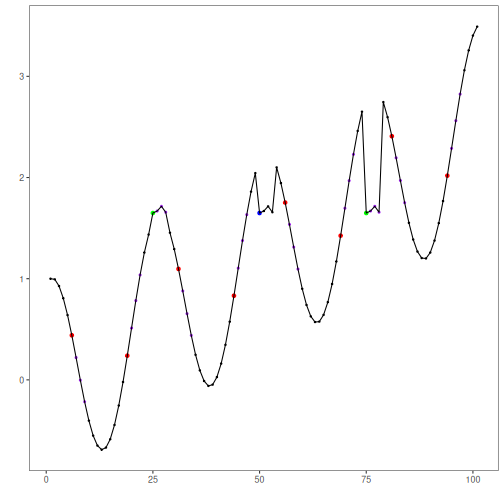

# Overview

This Rmd demonstrates motif discovery using Matrix Profile with the STAMP algorithm via `hmo_mp("stamp", ...)`. It finds repeated subsequences (motifs) in a time series. Steps: load packages/data, visualize the series, define the motif model (subsequence length and number of motifs), fit, detect, evaluate, and plot.


``` r
# Install Harbinger (only once, if needed)
#install.packages("harbinger")
```


``` r
# Load required packages
library(daltoolbox)
library(harbinger) 
```


``` r
# Load example datasets bundled with harbinger
data(examples_motifs)
```


``` r
# Select a simple example time series
dataset <- examples_motifs$simple
head(dataset)
```

```
##       serie event
## 1 1.0000000 FALSE
## 2 0.9939124 FALSE
## 3 0.9275826 FALSE
## 4 0.8066889 FALSE
## 5 0.6403023 FALSE
## 6 0.4403224 FALSE
```


``` r
# Plot the time series
har_plot(harbinger(), dataset$serie)
```




``` r
# Define Matrix Profile (STAMP) motif model
# - first arg: algorithm name
# - second arg: subsequence length (window)
# - third arg: number of motifs to retrieve
  model <- hmo_mp("stamp", 4, 3)
```


``` r
# Fit the model
  model <- fit(model, dataset$serie)
```


``` r
# Detect motifs
  detection <- detect(model, dataset$serie)
```

```
## Finished in 0.02 secs
```


``` r
# Show only timestamps flagged as events
  print(detection |> dplyr::filter(event==TRUE))
```

```
##    idx event  type seq seqlen
## 1    6  TRUE motif   3      4
## 2   19  TRUE motif   2      4
## 3   25  TRUE motif   1      4
## 4   31  TRUE motif   3      4
## 5   44  TRUE motif   2      4
## 6   56  TRUE motif   3      4
## 7   69  TRUE motif   2      4
## 8   75  TRUE motif   1      4
## 9   81  TRUE motif   3      4
## 10  94  TRUE motif   2      4
```


``` r
# Evaluate detections against ground-truth labels
  evaluation <- evaluate(model, detection$event, dataset$event)
  print(evaluation$confMatrix)
```

```
##           event      
## detection TRUE  FALSE
## TRUE      2     8    
## FALSE     1     90
```


``` r
# Plot detections over the series
  har_plot(model, dataset$serie, detection, dataset$event)
```


