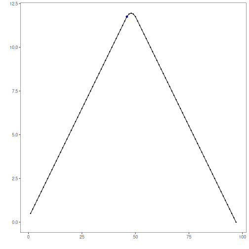
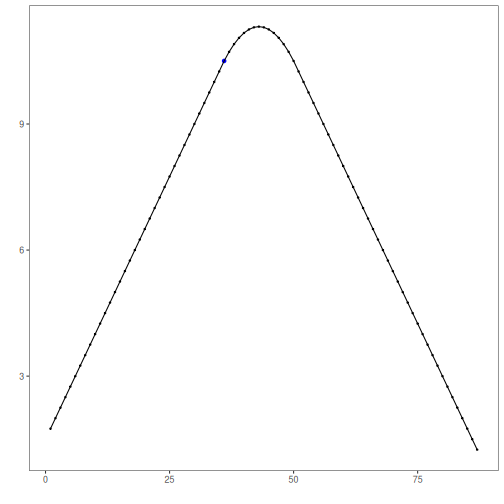

## Objective

This notebook explains how to use `mas()` as a simple moving-average transformation for time series. The goal is to help the reader understand what the smoother does, how the `order` parameter changes the result, and why smoothing can be useful before downstream tasks such as change-point detection.

## Method at a glance

`mas()` computes a simple moving average. Each output point is the average of a local window of consecutive observations. As a transformation, it reduces short-term noise and makes broader movement patterns easier to inspect.

## What you will do

- load an example time series
- inspect the original series
- compute moving-average smoothers with different window sizes
- compare the original and smoothed versions visually
- understand the trade-off between smoothness and temporal detail
- see why smoothing is often used before a modeling step

## Walkthrough


``` r
# Install Harbinger (if needed)
#install.packages("harbinger")
```


``` r
# Load required packages
library(harbinger)
```


``` r
# Load example change-point datasets
data(examples_changepoints)
```


``` r
# Select a simple change-point dataset
dataset <- examples_changepoints$simple
head(dataset)
```

```
##   serie event
## 1  0.00 FALSE
## 2  0.25 FALSE
## 3  0.50 FALSE
## 4  0.75 FALSE
## 5  1.00 FALSE
## 6  1.25 FALSE
```


``` r
# Plot the original time series
har_plot(harbinger(), dataset$serie, event = dataset$event)
```


``` r
# Compute smoothers with two different window sizes
ma_5 <- mas(dataset$serie, order = 5)
ma_15 <- mas(dataset$serie, order = 15)
```


``` r
# Inspect the first smoothed values
head(ma_5)
```

```
## Time Series:
## Start = 1 
## End = 6 
## Frequency = 1 
## [1] 0.50 0.75 1.00 1.25 1.50 1.75
```

``` r
head(ma_15)
```

```
## Time Series:
## Start = 1 
## End = 6 
## Frequency = 1 
## [1] 1.75 2.00 2.25 2.50 2.75 3.00
```


``` r
# Plot the 5-point moving average
har_plot(
  harbinger(),
  as.numeric(ma_5),
  event = dataset$event[5:length(dataset$event)]
)
```




``` r
# Plot the 15-point moving average
har_plot(
  harbinger(),
  as.numeric(ma_15),
  event = dataset$event[15:length(dataset$event)]
)
```



## References

- Shumway, R. H., Stoffer, D. S. Time Series Analysis and Its Applications. Springer.
