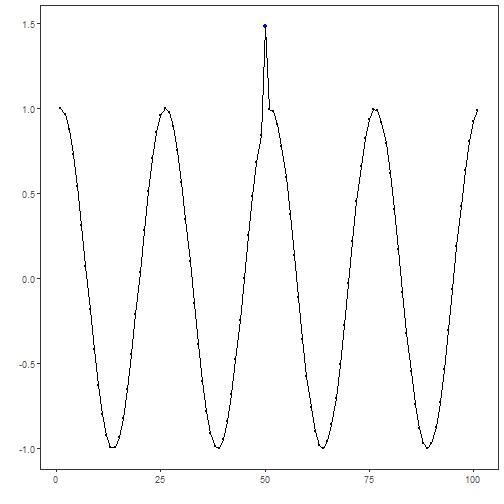

## Objective

This tutorial introduces the core Harbinger workflow on a small labeled anomaly series. The goal is to help the reader see the minimum sequence of actions: load data, create a model, detect events, inspect the output, and plot the result.

## Method at a glance

We use the default `harbinger()` model as a first contact with the package interface. The emphasis here is not on a specific detection technique, but on understanding the common workflow shared by many Harbinger objects.

## What you will do

- load a bundled example dataset
- inspect the structure of the series and event labels
- create the default Harbinger model
- run detection
- visualize the detected events

## Walkthrough


``` r
# Install Harbinger (if needed)
# install.packages("harbinger")
```


``` r
# Load the package
library(harbinger)
```

```
## Registered S3 method overwritten by 'quantmod':
##   method            from
##   as.zoo.data.frame zoo
```


``` r
# Load a small labeled anomaly dataset distributed with the package
data(examples_anomalies)
dataset <- examples_anomalies$simple
head(dataset)
```

```
##       serie event
## 1 1.0000000 FALSE
## 2 0.9689124 FALSE
## 3 0.8775826 FALSE
## 4 0.7316889 FALSE
## 5 0.5403023 FALSE
## 6 0.3153224 FALSE
```


``` r
# Plot the series with the known labeled events
har_plot(harbinger(), dataset$serie, event = dataset$event)
```




``` r
# Create the default Harbinger detector
model <- harbinger()
```


``` r
# Run detection on the series
detection <- detect(model, dataset$serie)
head(detection)
```

```
##   idx event type
## 1   1 FALSE     
## 2   2 FALSE     
## 3   3 FALSE     
## 4   4 FALSE     
## 5   5 FALSE     
## 6   6 FALSE
```


``` r
# Plot detections against the labeled events
har_plot(model, dataset$serie, detection, dataset$event)
```


## References

- Ogasawara, E., Salles, R., Porto, F., Pacitti, E. Event Detection in Time Series. Springer, 2025. doi:10.1007/978-3-031-75941-3
