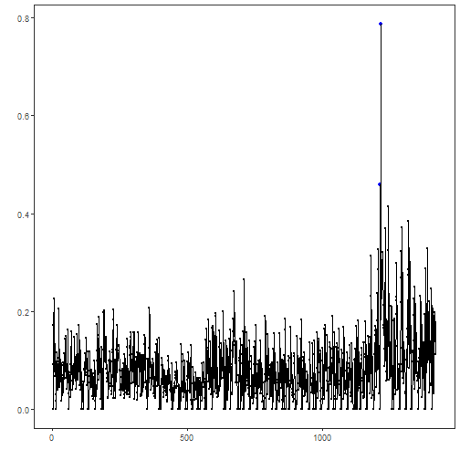

## Tutorial 02 - Knowing Your Data

Before choosing a detector, it is worth understanding what the dataset actually contains. This tutorial inspects a benchmark collection, checks how many series are available, determines whether the data are univariate or multivariate, and plots the first signal.

The main point is practical: a good method choice depends on the shape of the collection and not only on the package catalog.

The technique here is exploratory rather than predictive. Instead of fitting a model, the notebook studies dataset structure, because tasks such as anomaly detection, change-point detection, and motif discovery depend strongly on whether the signals are single-channel, multichannel, short, long, sparse, or densely labeled.


``` r
library(harbinger)
```

Define a small helper so the same checks can be reused with other collections.

``` r
dataset_summary <- function(x) {
  first_series <- x[[1]]
  meta_cols <- c("idx", "event", "type", "seq", "seqlen")
  signal_cols <- setdiff(names(first_series), meta_cols)
  dataset_type <- if ("value" %in% names(first_series) || length(signal_cols) == 1) {
    "univariate"
  } else {
    "multivariate"
  }
  plot_column <- if ("value" %in% names(first_series)) "value" else signal_cols[1]

  list(
    n_series = length(x),
    dataset_type = dataset_type,
    signal_cols = signal_cols,
    plot_column = plot_column,
    first_series = first_series
  )
}
```

Load a benchmark object, expand it to the full dataset, and inspect its structure.

``` r
data(A1Benchmark)
A1Benchmark <- loadfulldata(A1Benchmark)
info <- dataset_summary(A1Benchmark)

info$n_series
```

```
## [1] 67
```

``` r
info$dataset_type
```

```
## [1] "univariate"
```

``` r
info$signal_cols
```

```
## [1] "value"
```

Plot the first available signal together with its labels.

``` r
har_plot(
  harbinger(),
  info$first_series[[info$plot_column]],
  event = info$first_series$event
)
```



## References

- Yahoo Webscope S5 benchmark documentation and downstream studies on labeled anomaly detection.
- Ogasawara, E., Salles, R., Porto, F., Pacitti, E. Event Detection in Time Series. Springer, 2025. doi:10.1007/978-3-031-75941-3
