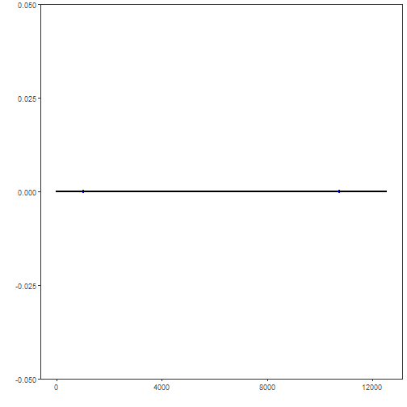

## Objective

This tutorial demonstrates how `har_plot()` helps inspect time series before and after detection. The goal is to show how plotting supports interpretation in both univariate and multivariate settings.

## Method at a glance

Visualization is part of the analysis workflow in Harbinger. A quick plot can reveal trends, level shifts, bursts, repeated patterns, and labeled events before a detector is even configured.

## What you will do

- plot a univariate anomaly series with labels
- plot a multivariate dataset by selecting one signal column
- compare how the same plotting interface works in both cases

## How to read this walkthrough

The code blocks below follow the same learning rhythm used throughout the collection: prepare the environment, choose the dataset, configure the method, run the analysis, and then inspect the result. Readers who are still learning time-series mining can use that order to understand not only *what* each command does, but also *why* it appears at that stage of the workflow.

As you go through the notebook, read the inline comments inside each chunk as the operational explanation and use the surrounding prose as the conceptual guide.

## Walkthrough


### Prepare the Example

We begin by organizing the environment, loading the packages, and selecting the dataset used in the notebook. This part is intentionally more direct: the goal is to make the starting point explicit before the method-specific reasoning begins.


``` r
library(harbinger)
```


### Interpret the Result Visually

The final plots are not just illustrations. They help the reader connect the method's internal output with the original series, making it easier to see why a point, range, motif, or symbolic pattern was emphasized and whether that emphasis is coherent with the stated objective of the example.


``` r
# Univariate example
data(examples_anomalies)
uni <- examples_anomalies$simple
har_plot(harbinger(), uni$serie, event = uni$event)
```


### Prepare the Example

We begin by organizing the environment, loading the packages, and selecting the dataset used in the notebook. This part is intentionally more direct: the goal is to make the starting point explicit before the method-specific reasoning begins.


``` r
# Multivariate example from the 3W benchmark
data(oil_3w_Type_1)
oil_3w_Type_1 <- loadfulldata(oil_3w_Type_1)
first_mv <- oil_3w_Type_1[[1]]
meta_cols <- c("idx", "event", "type", "seq", "seqlen")
signal_cols <- setdiff(names(first_mv), meta_cols)
signal_cols
```

```
## [1] "p_pdg"      "p_tpt"      "t_tpt"      "p_mon_ckp"  "t_jus_ckp"  "p_jus_ckgl" "qgl"
```


### Interpret the Result Visually

The final plots are not just illustrations. They help the reader connect the method's internal output with the original series, making it easier to see why a point, range, motif, or symbolic pattern was emphasized and whether that emphasis is coherent with the stated objective of the example.


``` r
# Plot only the first signal column of the multivariate series
har_plot(
  harbinger(),
  first_mv[[signal_cols[1]]],
  event = first_mv$event
)
```



## References

- Ogasawara, E., Salles, R., Porto, F., Pacitti, E. Event Detection in Time Series. Springer, 2025. doi:10.1007/978-3-031-75941-3

