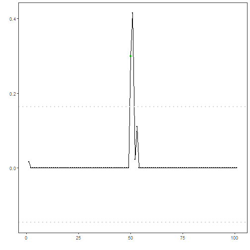

## Objective

This tutorial introduces a model-based anomaly detector using `hanr_arima()`. The goal is to show how Harbinger can detect unusual behavior by modeling expected dynamics and then analyzing residual deviations.

## Method at a glance

`hanr_arima()` fits an ARIMA model to the series, computes residual magnitudes, and flags unusually large residuals as anomalies. This moves from a simple distribution-based baseline to a temporal model that tries to explain normal behavior first.

## What you will do

- fit an ARIMA-based detector
- run anomaly detection on a labeled series
- inspect the evaluation output
- plot residual magnitudes and thresholds

## Walkthrough


``` r
library(daltoolbox)
library(harbinger)
```


``` r
data(examples_anomalies)
dataset <- examples_anomalies$simple
```


``` r
# Configure and fit the ARIMA-based detector
model <- hanr_arima()
model <- fit(model, dataset$serie)
```


``` r
# Detect anomalies from model residuals
detection <- detect(model, dataset$serie)
head(detection)
```

```
##   idx event type
## 1   1 FALSE     
## 2   2 FALSE     
## 3   3 FALSE     
## 4   4 FALSE     
## 5   5 FALSE     
## 6   6 FALSE
```


``` r
# Evaluate against the ground truth
evaluation <- evaluate(model, detection$event, dataset$event)
evaluation$confMatrix
```

```
##           event      
## detection TRUE  FALSE
## TRUE      1     0    
## FALSE     0     100
```


``` r
# Plot detections on the original series
har_plot(model, dataset$serie, detection, dataset$event)
```


``` r
# Plot the residual signal used by the detector
har_plot(
  model,
  attr(detection, "res"),
  detection,
  dataset$event,
  yline = attr(detection, "threshold")
)
```

```
## Warning: Using `size` aesthetic for lines was deprecated in ggplot2 3.4.0.
## ℹ Please use `linewidth` instead.
## ℹ The deprecated feature was likely used in the harbinger package.
##   Please report the issue at
##   <https://github.com/cefet-rj-dal/harbinger/issues>.
## This warning is displayed once per session.
## Call `lifecycle::last_lifecycle_warnings()` to see where this warning was
## generated.
```



## References

- Box, G. E. P., Jenkins, G. M., Reinsel, G. C., Ljung, G. M. (2015). Time Series Analysis: Forecasting and Control. Wiley.
