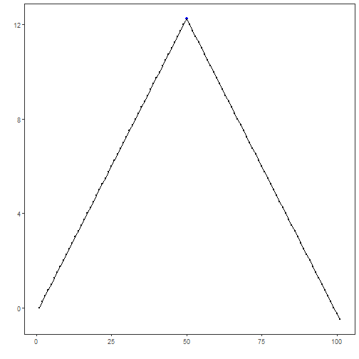
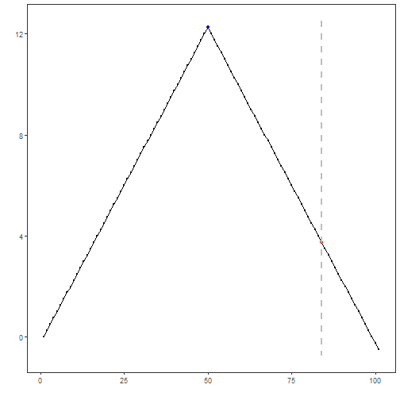

## Objective

This tutorial introduces change-point detection with `hcp_amoc()`. The goal is to show how Harbinger handles structural changes, which differ from isolated anomalies because the objective is to locate a transition in the behavior of the series.

## Method at a glance

`hcp_amoc()` searches for a single most significant change point. This is a good first method for learning because it is simple, focused, and works well as an entry point before more complex segmentation techniques.

## What you will do

- load a change-point dataset
- run a single-change detector
- inspect the detected location
- plot the result against the labeled event

## Walkthrough


``` r
library(harbinger)
```


``` r
data(examples_changepoints)
dataset <- examples_changepoints$simple
head(dataset)
```

```
##   serie event
## 1  0.00 FALSE
## 2  0.25 FALSE
## 3  0.50 FALSE
## 4  0.75 FALSE
## 5  1.00 FALSE
## 6  1.25 FALSE
```


``` r
# Plot the original series with the known change point
har_plot(harbinger(), dataset$serie, event = dataset$event)
```




``` r
# Configure and run the AMOC detector
model <- hcp_amoc()
detection <- detect(model, dataset$serie)
detection
```

```
##     idx event        type
## 1     1 FALSE            
## 2     2 FALSE            
## 3     3 FALSE            
## 4     4 FALSE            
## 5     5 FALSE            
## 6     6 FALSE            
## 7     7 FALSE            
## 8     8 FALSE            
## 9     9 FALSE            
## 10   10 FALSE            
## 11   11 FALSE            
## 12   12 FALSE            
## 13   13 FALSE            
## 14   14 FALSE            
## 15   15 FALSE            
## 16   16 FALSE            
## 17   17 FALSE            
## 18   18 FALSE            
## 19   19 FALSE            
## 20   20 FALSE            
## 21   21 FALSE            
## 22   22 FALSE            
## 23   23 FALSE            
## 24   24 FALSE            
## 25   25 FALSE            
## 26   26 FALSE            
## 27   27 FALSE            
## 28   28 FALSE            
## 29   29 FALSE            
## 30   30 FALSE            
## 31   31 FALSE            
## 32   32 FALSE            
## 33   33 FALSE            
## 34   34 FALSE            
## 35   35 FALSE            
## 36   36 FALSE            
## 37   37 FALSE            
## 38   38 FALSE            
## 39   39 FALSE            
## 40   40 FALSE            
## 41   41 FALSE            
## 42   42 FALSE            
## 43   43 FALSE            
## 44   44 FALSE            
## 45   45 FALSE            
## 46   46 FALSE            
## 47   47 FALSE            
## 48   48 FALSE            
## 49   49 FALSE            
## 50   50 FALSE            
## 51   51 FALSE            
## 52   52 FALSE            
## 53   53 FALSE            
## 54   54 FALSE            
## 55   55 FALSE            
## 56   56 FALSE            
## 57   57 FALSE            
## 58   58 FALSE            
## 59   59 FALSE            
## 60   60 FALSE            
## 61   61 FALSE            
## 62   62 FALSE            
## 63   63 FALSE            
## 64   64 FALSE            
## 65   65 FALSE            
## 66   66 FALSE            
## 67   67 FALSE            
## 68   68 FALSE            
## 69   69 FALSE            
## 70   70 FALSE            
## 71   71 FALSE            
## 72   72 FALSE            
## 73   73 FALSE            
## 74   74 FALSE            
## 75   75 FALSE            
## 76   76 FALSE            
## 77   77 FALSE            
## 78   78 FALSE            
## 79   79 FALSE            
## 80   80 FALSE            
## 81   81 FALSE            
## 82   82 FALSE            
## 83   83 FALSE            
## 84   84  TRUE changepoint
## 85   85 FALSE            
## 86   86 FALSE            
## 87   87 FALSE            
## 88   88 FALSE            
## 89   89 FALSE            
## 90   90 FALSE            
## 91   91 FALSE            
## 92   92 FALSE            
## 93   93 FALSE            
## 94   94 FALSE            
## 95   95 FALSE            
## 96   96 FALSE            
## 97   97 FALSE            
## 98   98 FALSE            
## 99   99 FALSE            
## 100 100 FALSE            
## 101 101 FALSE
```


``` r
# Plot detections against the labeled event
har_plot(model, dataset$serie, detection, dataset$event)
```



## References

- Killick, R., Eckley, I. A. changepoint: An R Package for Changepoint Analysis. Journal of Statistical Software, 58(3), 2014.
