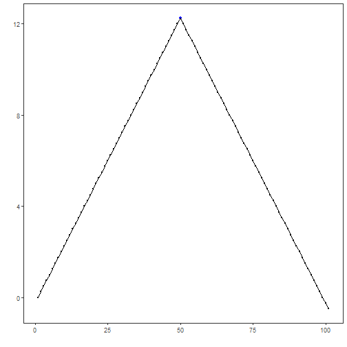
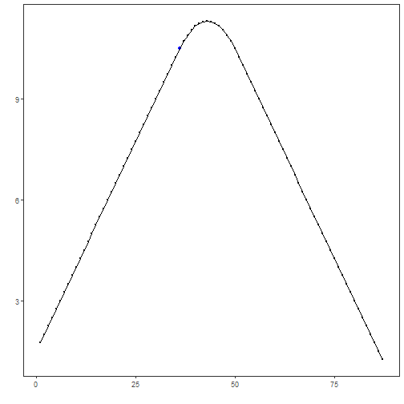

## Objective

This tutorial shows how `mas()` can be used as a transformation before a modeling step. The goal is to understand how smoothing removes part of the local variation and exposes broader movement patterns in the series.

## Method at a glance

`mas()` computes a simple moving average. A short window keeps more local detail, while a larger window produces a smoother signal. This is useful before visual inspection, feature extraction, or downstream detection.

## What you will do

- load a time series
- compute moving averages with two window sizes
- compare the original and transformed versions
- interpret the effect of the smoothing window

## Walkthrough


``` r
library(harbinger)
```


``` r
data(examples_changepoints)
dataset <- examples_changepoints$simple
```


``` r
# Original signal
har_plot(harbinger(), dataset$serie, event = dataset$event)
```




``` r
# Two smoothing levels
ma_5 <- mas(dataset$serie, order = 5)
ma_15 <- mas(dataset$serie, order = 15)
```


``` r
# Plot the smoother with a smaller window
har_plot(harbinger(), as.numeric(ma_5), event = dataset$event[5:length(dataset$event)])
```


``` r
# Plot the smoother with a larger window
har_plot(harbinger(), as.numeric(ma_15), event = dataset$event[15:length(dataset$event)])
```



## References

- Shumway, R. H., Stoffer, D. S. Time Series Analysis and Its Applications. Springer.
