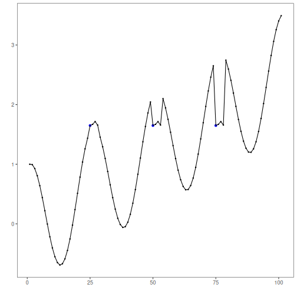

## Tutorial 10 - Motifs and Discords

The guided path closes with repeated-pattern analysis. Harbinger is not limited to anomaly and change-point detection; it also supports motif and discord workflows over time-series subsequences.

This first contact uses a symbolic motif detector so the reader can connect the earlier transformation tutorials with a downstream pattern-discovery task.

The technique presented here is motif discovery: instead of asking which points are abnormal, it asks which subsequences recur with similar shape. In symbolic methods such as `hmo_sax()`, that comparison is done over symbolic representations rather than raw numeric values.

Load the packages and the example series.

``` r
library(daltoolbox)
library(harbinger)

data(examples_motifs)
dataset <- examples_motifs$simple
```

Plot the series before looking for repeated subsequences.

``` r
har_plot(harbinger(), dataset$serie, event = dataset$event)
```


Configure the symbolic motif detector, fit it, and inspect the detections.

``` r
model <- hmo_sax(8, 15, 3)
model <- fit(model, dataset$serie)
detection <- detect(model, dataset$serie)
head(detection)
```

```
##   idx event type seq seqlen
## 1   1 FALSE       NA     15
## 2   2 FALSE       NA     15
## 3   3 FALSE       NA     15
## 4   4 FALSE       NA     15
## 5   5 FALSE       NA     15
## 6   6 FALSE       NA     15
```

Plot the motif-oriented result.

``` r
har_plot(model, dataset$serie, detection, dataset$event)
```



## References

- Lin, J., Keogh, E., Lonardi, S., Chiu, B. (2007). A symbolic representation of time series, with implications for streaming algorithms. Data Mining and Knowledge Discovery, 15, 107-144.
- Ogasawara, E., Salles, R., Porto, F., Pacitti, E. Event Detection in Time Series. Springer, 2025. doi:10.1007/978-3-031-75941-3
