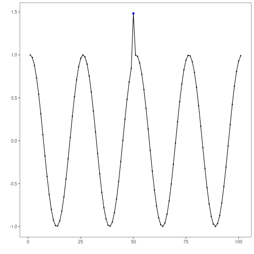
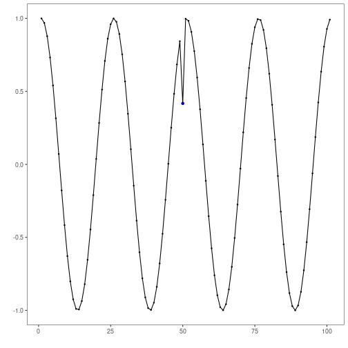
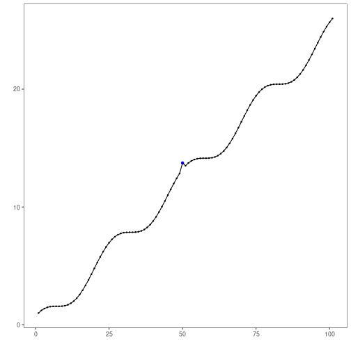
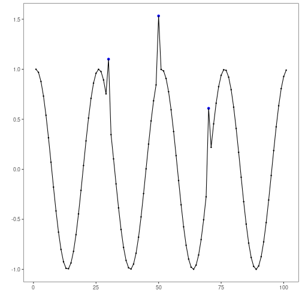
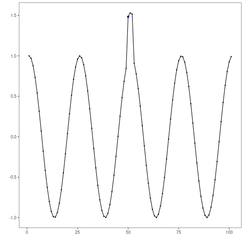
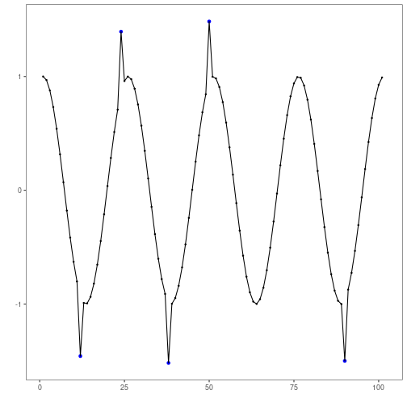
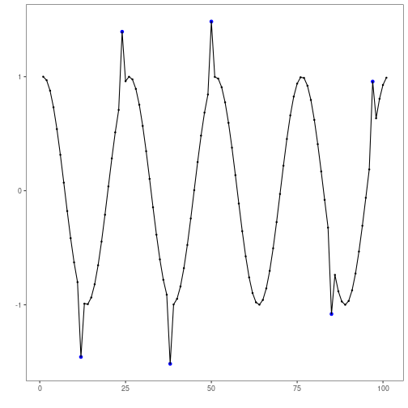
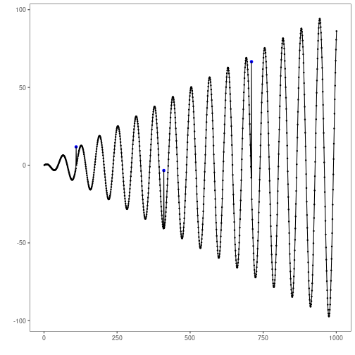
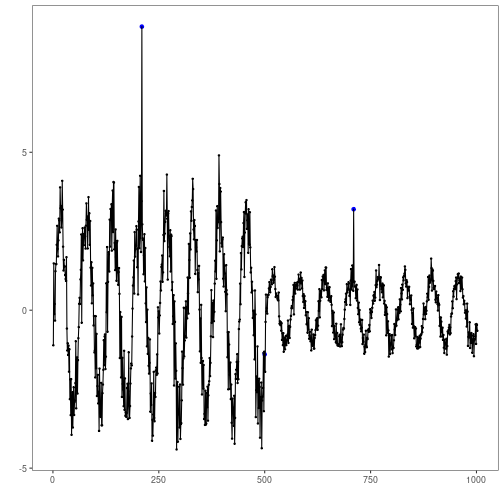
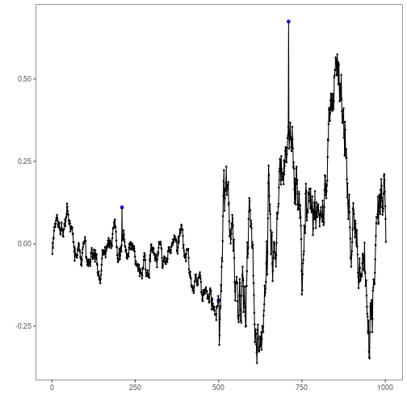

```r
# Harbinger Package
# version 1.0.787


#loading Harbinger
library(daltoolbox)
library(harbinger) 
```


```r
#loading the example database
data(examples_anomalies)
model <- harbinger()
```


```r
#Using the simple time series 
dataset <- examples_anomalies$simple
model <- fit(model, dataset$serie)
detection <- detect(model, dataset$serie)
grf <- har_plot(model, dataset$serie, detection, dataset$event)
plot(grf)
```




```r
#Using the contextual time series
dataset <- examples_anomalies$contextual
model <- fit(model, dataset$serie)
detection <- detect(model, dataset$serie)
grf <- har_plot(model, dataset$serie, detection, dataset$event)
plot(grf)
```




```r
#Using the trend time series
dataset <- examples_anomalies$trend
model <- fit(model, dataset$serie)
detection <- detect(model, dataset$serie)
grf <- har_plot(model, dataset$serie, detection, dataset$event)
plot(grf)
```




```r
#Using the multiple-event time series 
dataset <- examples_anomalies$multiple
model <- fit(model, dataset$serie)
detection <- detect(model, dataset$serie)
grf <- har_plot(model, dataset$serie, detection, dataset$event)
plot(grf)
```




```r
#Using the sequence time series 
dataset <- examples_anomalies$sequence
model <- fit(model, dataset$serie)
detection <- detect(model, dataset$serie)
grf <- har_plot(model, dataset$serie, detection, dataset$event)
plot(grf)
```




```r
#Using the train-test (tt) time series
dataset <- examples_anomalies$tt
model <- fit(model, dataset$serie)
detection <- detect(model, dataset$serie)
grf <- har_plot(model, dataset$serie, detection, dataset$event)
plot(grf)
```

```
## Warning: Removed 1 rows containing missing values (`geom_point()`).
```

```
## Warning: Removed 1 row containing missing values (`geom_line()`).
```




```r
#Using the train-test warped (tt_warped) time series
dataset <- examples_anomalies$tt_warped
model <- fit(model, dataset$serie)
detection <- detect(model, dataset$serie)
grf <- har_plot(model, dataset$serie, detection, dataset$event)
plot(grf)
```




```r
#Using the increasing_amplitude time series
dataset <- examples_anomalies$increasing_amplitude
model <- fit(model, dataset$serie)
detection <- detect(model, dataset$serie)
grf <- har_plot(model, dataset$serie, detection, dataset$event)
plot(grf)
```




```r
#Using the decreasing_amplitude time series
dataset <- examples_anomalies$decreasing_amplitude
model <- fit(model, dataset$serie)
detection <- detect(model, dataset$serie)
grf <- har_plot(model, dataset$serie, detection, dataset$event)
plot(grf)
```




```r
#Using the volatile time series
dataset <- examples_anomalies$volatile
model <- fit(model, dataset$serie)
detection <- detect(model, dataset$serie)
grf <- har_plot(model, dataset$serie, detection, dataset$event)
plot(grf)
```



