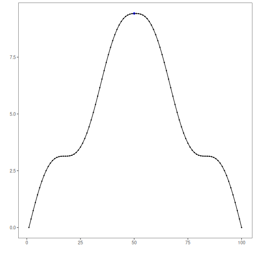

``` r
# Installing Harbinger
#install.packages"harbinger")
```


``` r
# Loading Harbinger
library(daltoolbox)
library(harbinger) 
```


``` r
# loading the example database
data(examples_changepoints)
model <- harbinger()
```


``` r
# Using the simple time series 
dataset <- examples_changepoints$simple
model <- fit(model, dataset$serie)
detection <- detect(model, dataset$serie)
har_plot(model, dataset$serie, detection, dataset$event)
```


``` r
# Using the sinusoidal time series
dataset <- examples_changepoints$sinusoidal
model <- fit(model, dataset$serie)
detection <- detect(model, dataset$serie)
har_plot(model, dataset$serie, detection, dataset$event)
```




``` r
# Using the incremental time series
dataset <- examples_changepoints$incremental
model <- fit(model, dataset$serie)
detection <- detect(model, dataset$serie)
har_plot(model, dataset$serie, detection, dataset$event)
```


``` r
# Using the abrupt time series 
dataset <- examples_changepoints$abrupt
model <- fit(model, dataset$serie)
detection <- detect(model, dataset$serie)
har_plot(model, dataset$serie, detection, dataset$event)
```

```
## Don't know how to automatically pick scale for object of type <ts>. Defaulting to continuous.
```


``` r
# Using the volatility time series
dataset <- examples_changepoints$volatility
model <- fit(model, dataset$serie)
detection <- detect(model, dataset$serie)
har_plot(model, dataset$serie, detection, dataset$event)
```

```
## Don't know how to automatically pick scale for object of type <ts>. Defaulting to continuous.
```


``` r
# Using the increasing_amplitude time series
dataset <- examples_changepoints$increasing_amplitude
model <- fit(model, dataset$serie)
detection <- detect(model, dataset$serie)
har_plot(model, dataset$serie, detection, dataset$event)
```


``` r
# Using the complex time series
dataset <- examples_changepoints$complex
model <- fit(model, dataset$serie)
detection <- detect(model, dataset$serie)
har_plot(model, dataset$serie, detection, dataset$event)
```


