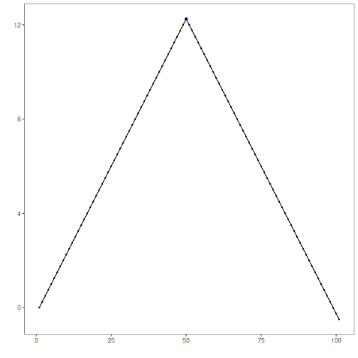
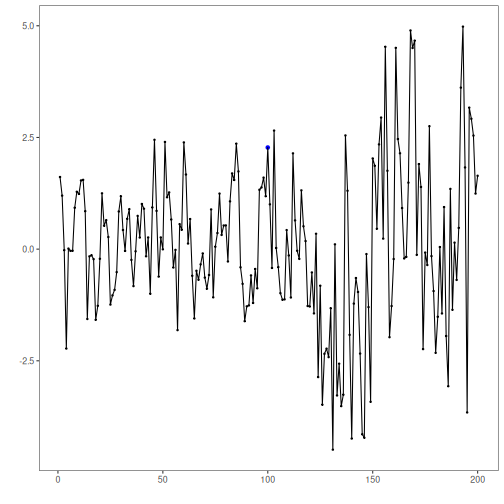

Overview and objectives: This notebook illustrates typical change-point scenarios (single break, multiple breaks, variance/volatility shifts) and how Harbinger visualizes detected change locations. We use the unified pipeline to fit, detect, and plot across datasets, highlighting when classic (AMOC/BinSeg/PELT) or regression-based (GFT/Chow) approaches are appropriate.


``` r
# Install Harbinger (if needed)
#install.packages("harbinger")
```


``` r
# Load required packages
library(daltoolbox)
library(harbinger) 
```


``` r
# Load change-point example datasets and create a base object
data(examples_changepoints)
model <- harbinger()
```


``` r
# Simple change point
dataset <- examples_changepoints$simple
model <- fit(model, dataset$serie)
detection <- detect(model, dataset$serie)
har_plot(model, dataset$serie, detection, dataset$event)
```




``` r
# Sinusoidal pattern with regime shift
dataset <- examples_changepoints$sinusoidal
model <- fit(model, dataset$serie)
detection <- detect(model, dataset$serie)
har_plot(model, dataset$serie, detection, dataset$event)
```


``` r
# Incremental trend changes
dataset <- examples_changepoints$incremental
model <- fit(model, dataset$serie)
detection <- detect(model, dataset$serie)
har_plot(model, dataset$serie, detection, dataset$event)
```


``` r
# Abrupt level shift
dataset <- examples_changepoints$abrupt
model <- fit(model, dataset$serie)
detection <- detect(model, dataset$serie)
har_plot(model, dataset$serie, detection, dataset$event)
```

```
## Don't know how to automatically pick scale for object of type <ts>. Defaulting to continuous.
```


``` r
# Volatility (variance) change
dataset <- examples_changepoints$volatility
model <- fit(model, dataset$serie)
detection <- detect(model, dataset$serie)
har_plot(model, dataset$serie, detection, dataset$event)
```

```
## Don't know how to automatically pick scale for object of type <ts>. Defaulting to continuous.
```




``` r
# Increasing amplitude
dataset <- examples_changepoints$increasing_amplitude
model <- fit(model, dataset$serie)
detection <- detect(model, dataset$serie)
har_plot(model, dataset$serie, detection, dataset$event)
```


``` r
# Complex multi-regime series
dataset <- examples_changepoints$complex
model <- fit(model, dataset$serie)
detection <- detect(model, dataset$serie)
har_plot(model, dataset$serie, detection, dataset$event)
```


References

- Hinkley, D. V. (1970). Inference about the change-point in a sequence of random variables. Biometrika, 57(1), 1–17.
- Killick, R., Fearnhead, P., Eckley, I. A. (2012). Optimal detection of changepoints with a linear computational cost. JASA, 107(500), 1590–1598.
- Zeileis, A., Leisch, F., Kleiber, C., Hornik, K. (2002). strucchange: An R package for testing for structural change in linear regression models. JSS, 7(2). doi:10.18637/jss.v007.i02
