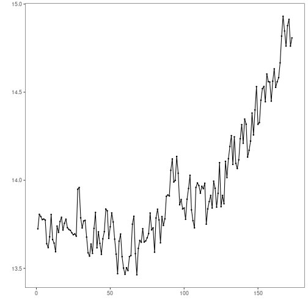
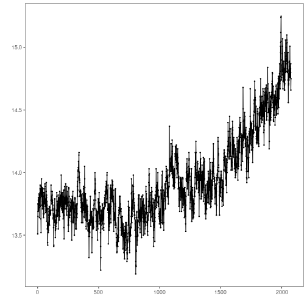
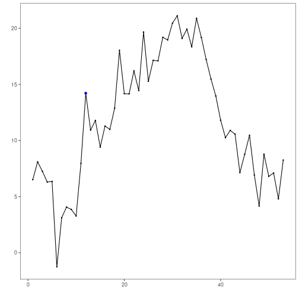
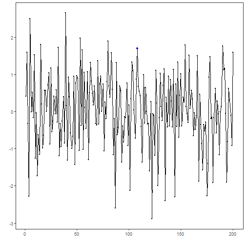
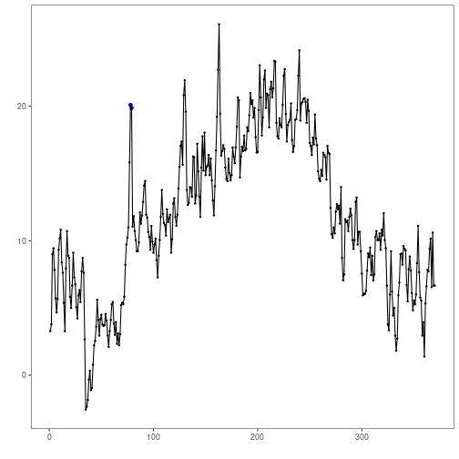
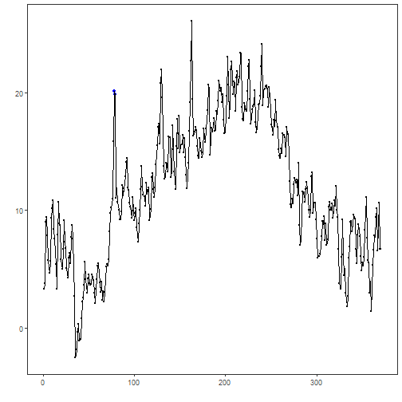

``` r
# Installing Harbinger
install.packages("harbinger")
```

```

```


``` r
# Loading Harbinger
library(daltoolbox)
library(harbinger) 
```


``` r
# loading the example database
data(examples_harbinger)
model <- harbinger()
```


``` r
# Using the nonstationarity time series 
dataset <- examples_harbinger$nonstationarity
model <- fit(model, dataset$serie)
detection <- detect(model, dataset$serie)
har_plot(model, dataset$serie, detection, dataset$event)
```




``` r
# Using the global temperature (yearly) time series
dataset <- examples_harbinger$global_temperature_yearly
model <- fit(model, dataset$serie)
detection <- detect(model, dataset$serie)
har_plot(model, dataset$serie, detection, dataset$event)
```




``` r
# Using the global temperature (monthly) time series
dataset <- examples_harbinger$global_temperature_monthly
model <- fit(model, dataset$serie)
detection <- detect(model, dataset$serie)
har_plot(model, dataset$serie, detection, dataset$event)
```


``` r
# Using the multidimensional time series 
dataset <- examples_harbinger$multidimensional
model <- fit(model, dataset$serie)
detection <- detect(model, dataset$serie)
har_plot(model, dataset$serie, detection, dataset$event)
```



``` r
model <- fit(model, dataset$x)
detection <- detect(model, dataset$x)
har_plot(model, dataset$x, detection, dataset$event)
```




``` r
# Using the Seattle weekly temperature time series
dataset <- examples_harbinger$seattle_week
model <- fit(model, dataset$serie)
detection <- detect(model, dataset$serie)
har_plot(model, dataset$serie, detection, dataset$event)
```




``` r
# Using the Seattle daily temperature time series
dataset <- examples_harbinger$seattle_daily
model <- fit(model, dataset$serie)
detection <- detect(model, dataset$serie)
har_plot(model, dataset$serie, detection, dataset$event)
```



