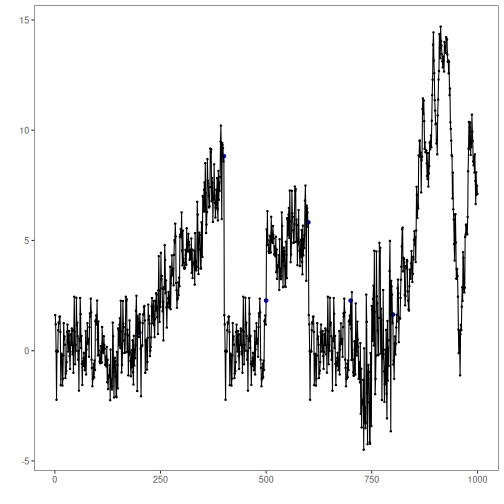

Overview and objectives: This notebook provides quick end‑to‑end demonstrations of the default `harbinger()` pipeline across diverse datasets (nonstationarity, global temperature monthly/yearly, multivariate, and weather). For each dataset we: fit the default pipeline, run detection, and plot detections over the series. The goal is to illustrate Harbinger’s unified interface for anomalies, change points, and motifs, and how it builds on DAL Toolbox models.


``` r
# Install Harbinger (only once, if needed)
#install.packages("harbinger")
```


``` r
# Load required packages
library(daltoolbox)
library(harbinger) 
```


``` r
# Load example datasets bundled with harbinger
data(examples_harbinger)
model <- harbinger()
```


``` r
# Example: nonstationarity time series
dataset <- examples_harbinger$nonstationarity
model <- fit(model, dataset$serie)
detection <- detect(model, dataset$serie)
har_plot(model, dataset$serie, detection, dataset$event)
```




``` r
# Example: global temperature (yearly)
dataset <- examples_harbinger$global_temperature_yearly
model <- fit(model, dataset$serie)
detection <- detect(model, dataset$serie)
har_plot(model, dataset$serie, detection, dataset$event)
```


``` r
# Example: global temperature (monthly)
dataset <- examples_harbinger$global_temperature_monthly
model <- fit(model, dataset$serie)
detection <- detect(model, dataset$serie)
har_plot(model, dataset$serie, detection, dataset$event)
```


``` r
# Example: multidimensional time series
dataset <- examples_harbinger$multidimensional
model <- fit(model, dataset$serie)
detection <- detect(model, dataset$serie)
har_plot(model, dataset$serie, detection, dataset$event)
```


``` r
model <- fit(model, dataset$x)
detection <- detect(model, dataset$x)
har_plot(model, dataset$x, detection, dataset$event)
```


``` r
# Example: Seattle weekly temperature time series
dataset <- examples_harbinger$seattle_week
model <- fit(model, dataset$serie)
detection <- detect(model, dataset$serie)
har_plot(model, dataset$serie, detection, dataset$event)
```


``` r
# Example: Seattle daily temperature time series
dataset <- examples_harbinger$seattle_daily
model <- fit(model, dataset$serie)
detection <- detect(model, dataset$serie)
har_plot(model, dataset$serie, detection, dataset$event)
```


References
- Ogasawara, E., Salles, R., Porto, F., Pacitti, E. Event Detection in Time Series. Springer, 2025. doi:10.1007/978-3-031-75941-3
- DAL Toolbox documentation: https://cefet-rj-dal.github.io/daltoolbox/

