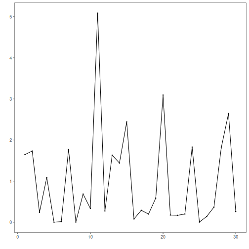

Overview and objectives: This notebook demonstrates Harbinger utility distance functions for summarizing residual magnitudes (L1 and L2) and plotting results for quick inspection. L1 emphasizes robustness to outliers; L2 emphasizes larger deviations. These aggregations feed subsequent thresholding/outlier rules in the detection pipeline.


``` r
# Install Harbinger (if needed)
#install.packages("harbinger")
```


``` r
# Load required packages
library(daltoolbox)
library(harbinger) 
```


``` r
# Instantiate utilities
hutils <- harutils()
```


``` r
# Generate synthetic residuals
values <- rnorm(30, mean = 0, sd = 1)
```


``` r
# L1 aggregation of residual magnitude
v1 <- hutils$har_distance_l1(values)
har_plot(harbinger(), v1)
```


``` r
# L2 aggregation of residual magnitude
v2 <- hutils$har_distance_l2(values)
har_plot(harbinger(), v2)
```



References

- Tukey, J. W. (1977). Exploratory Data Analysis. Addison‑Wesley. (IQR/boxplot heuristics underpin some thresholding rules)
- Shewhart, W. A. (1931). Economic Control of Quality of Manufactured Product. D. Van Nostrand. (three‑sigma rule)
