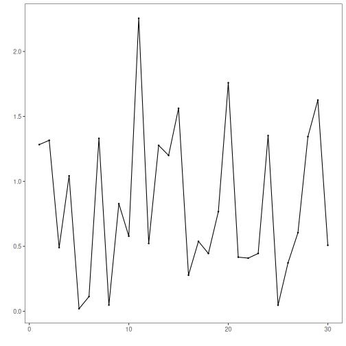

This notebook demonstrates Harbinger utility distance functions for summarizing residual magnitudes (L1 and L2) and plotting results for quick inspection.


``` r
# Install Harbinger (if needed)
#install.packages("harbinger")
```


``` r
# Load required packages
library(daltoolbox)
library(harbinger) 
```


``` r
# Instantiate utilities
hutils <- harutils()
```


``` r
# Generate synthetic residuals
values <- rnorm(30, mean = 0, sd = 1)
```


``` r
# L1 aggregation of residual magnitude
v1 <- hutils$har_distance_l1(values)
har_plot(harbinger(), v1)
```



``` r
# L2 aggregation of residual magnitude
v2 <- hutils$har_distance_l2(values)
har_plot(harbinger(), v2)
```


