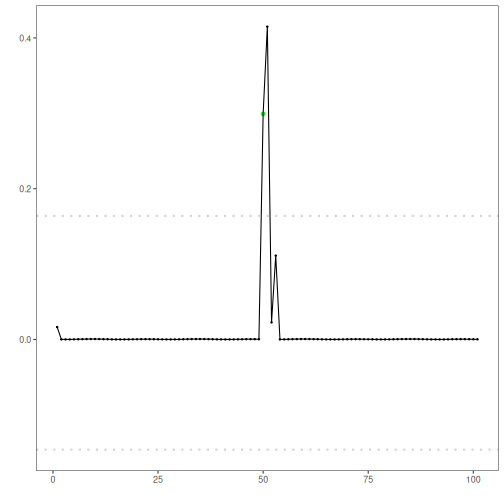
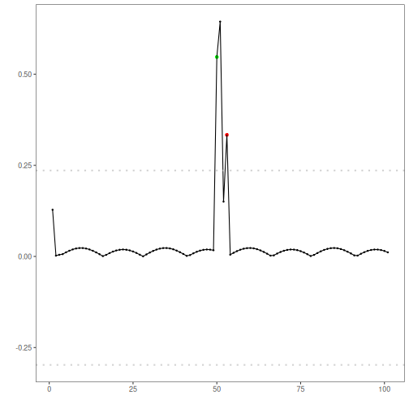
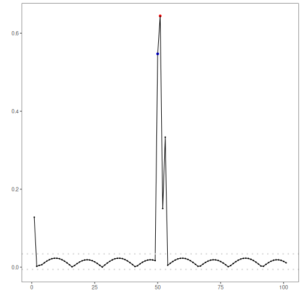

``` r
# Installing Harbinger
#install.packages"harbinger")
```


``` r
# Loading Harbinger
library(daltoolbox)
library(harbinger) 
```


``` r
# class harutils
  hutils <- harutils()
```


``` r
# loading the example database
data(examples_anomalies)
# Using the simple time series 
dataset <- examples_anomalies$simple
har_plot(harbinger(), dataset$serie)
```


``` r
# establishing arima method 
  model <- hanr_arima()
  # using default hutils$har_outliers_gaussian
  # using default hutils$har_distance_l2
  # fitting the model
  model <- fit(model, dataset$serie)
# making detections
  detection <- detect(model, dataset$serie)
  res <- attr(detection, "res")
  
  har_plot(model, attr(detection, "res"), detection, dataset$event, yline = attr(detection, "threshold"))
```




``` r
  model <- hanr_arima()
  model$har_outliers <- hutils$har_outliers_boxplot
# fitting the model
  model <- fit(model, dataset$serie)
# making detections
  detection <- detect(model, dataset$serie)
  res <- attr(detection, "res")
  
  har_plot(model, attr(detection, "res"), detection, dataset$event, yline = attr(detection, "threshold"))
```


``` r
  model <- hanr_arima()
  model$har_outliers <- hutils$har_outliers_ratio
# fitting the model
  model <- fit(model, dataset$serie)
# making detections
  detection <- detect(model, dataset$serie)
  res <- attr(detection, "res")
  
  har_plot(model, attr(detection, "res"), detection, dataset$event, yline = attr(detection, "threshold"))  
```


``` r
  model <- hanr_arima()
  model$har_distance <- hutils$har_distance_l1
# fitting the model
  model <- fit(model, dataset$serie)
# making detections
  detection <- detect(model, dataset$serie)
  res <- attr(detection, "res")
  
  har_plot(model, attr(detection, "res"), detection, dataset$event, yline = attr(detection, "threshold"))
```


``` r
  model <- hanr_arima()
  model$har_distance <- hutils$har_distance_l1
  model$har_outliers <- hutils$har_outliers_boxplot
# fitting the model
  model <- fit(model, dataset$serie)
# making detections
  detection <- detect(model, dataset$serie)
  res <- attr(detection, "res")
  
  har_plot(model, attr(detection, "res"), detection, dataset$event, yline = attr(detection, "threshold"))
```


``` r
  model <- hanr_arima()
  model$har_distance <- hutils$har_distance_l1
  model$har_outliers <- hutils$har_outliers_ratio
# fitting the model
  model <- fit(model, dataset$serie)
# making detections
  detection <- detect(model, dataset$serie)
  res <- attr(detection, "res")
  
  har_plot(model, attr(detection, "res"), detection, dataset$event, yline = attr(detection, "threshold"))
```



``` r
  model <- hanr_arima()
  model$har_distance <- hutils$har_distance_l1
  model$har_outliers <- hutils$har_outliers_boxplot
  model$har_outliers_checks <- hutils$har_outliers_checks_highgroup  
# fitting the model
  model <- fit(model, dataset$serie)
# making detections
  detection <- detect(model, dataset$serie)
  res <- attr(detection, "res")
  
  har_plot(model, attr(detection, "res"), detection, dataset$event, yline = attr(detection, "threshold"))
```


