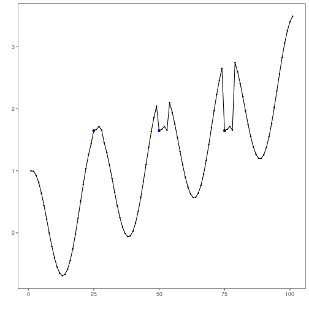
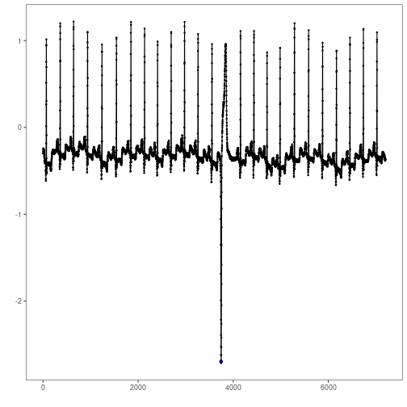
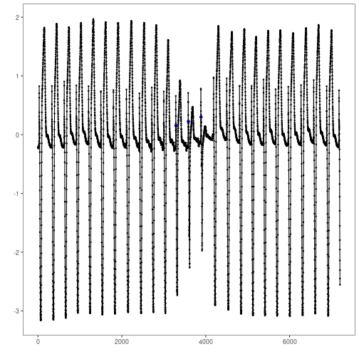

``` r
# Harbinger Package
# version 1.1.707


#loading Harbinger
library(daltoolbox)
library(harbinger) 
```


``` r
#loading the example database
data(examples_motifs)
model <- harbinger()
```


``` r
#Using the simple time series 
dataset <- examples_motifs$simple
model <- fit(model, dataset$serie)
detection <- detect(model, dataset$serie)
grf <- har_plot(model, dataset$serie, detection, dataset$event)
plot(grf)
```




``` r
#Using the sample of mitdb 100 time series 
dataset <- examples_motifs$mitdb100
model <- fit(model, dataset$serie)
detection <- detect(model, dataset$serie)
grf <- har_plot(model, dataset$serie, detection, dataset$event)
plot(grf)
```




``` r
#Using the sample of mitdb 102 time series 
dataset <- examples_motifs$mitdb102
model <- fit(model, dataset$serie)
detection <- detect(model, dataset$serie)
grf <- har_plot(model, dataset$serie, detection, dataset$event)
plot(grf)
```



