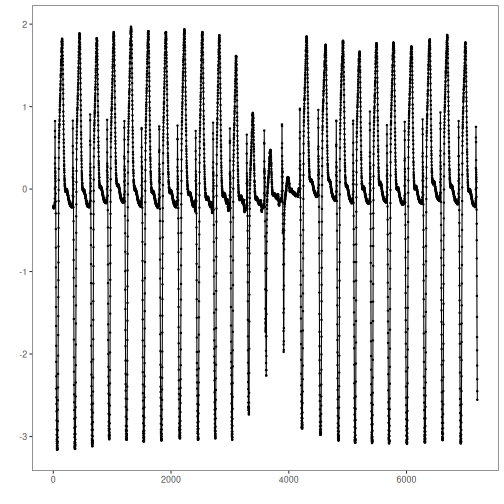
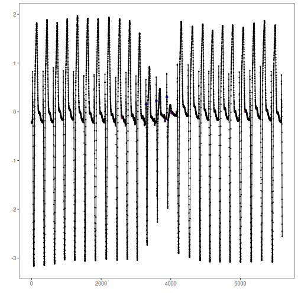

``` r
# Installing Harbinger
#install.packages"harbinger")
```


``` r
# Loading Harbinger
library(daltoolbox)
library(harbinger) 
```


``` r
# loading the example database
data(examples_motifs)
```


``` r
# Using the simple time series
dataset <- examples_motifs$mitdb102
head(dataset)
```

```
##         serie event symbol
## 102992 -0.215 FALSE      N
## 102993 -0.210 FALSE      N
## 102994 -0.215 FALSE      N
## 102995 -0.230 FALSE      N
## 102996 -0.220 FALSE      N
## 102997 -0.200 FALSE      N
```


``` r
# ploting the time series
har_plot(harbinger(), dataset$serie)
```




``` r
# establishing the method  
model <- hdis_mp(mode = "stomp", w = 25, qtd = 10)
```


``` r
# fitting the model
  model <- fit(model, dataset$serie)
```


``` r
# making detections
  suppressMessages(detection <- detect(model, dataset$serie))
```


``` r
# filtering detected events
  print(detection |> dplyr::filter(event==TRUE))
```

```
##    idx event  type seq seqlen
## 1 2602  TRUE motif   1     25
## 2 3844  TRUE motif   1     25
## 3 4017  TRUE motif   1     25
## 4 6135  TRUE motif   1     25
```


``` r
# evaluating the detections
  evaluation <- evaluate(model, detection$event, dataset$event)
  print(evaluation$confMatrix)
```

```
##           event      
## detection TRUE  FALSE
## TRUE      0     4    
## FALSE     3     7195
```


``` r
# plotting the results
  har_plot(model, dataset$serie, detection, dataset$event)
```



