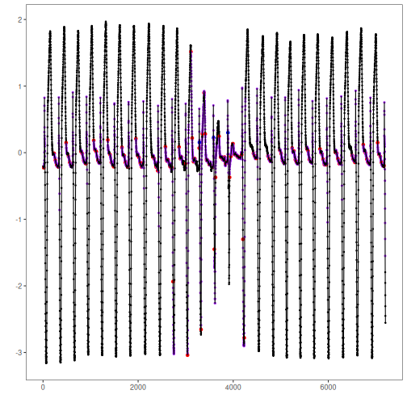

``` r
# Installing Harbinger
install.packages("harbinger")
```


``` r
# Loading Harbinger
library(daltoolbox)
library(harbinger) 
```


``` r
# loading the example database
data(examples_motifs)
```


``` r
# Using the simple time series
dataset <- examples_motifs$mitdb102
head(dataset)
```

```
##         serie event symbol
## 102992 -0.215 FALSE      N
## 102993 -0.210 FALSE      N
## 102994 -0.215 FALSE      N
## 102995 -0.230 FALSE      N
## 102996 -0.220 FALSE      N
## 102997 -0.200 FALSE      N
```


``` r
# ploting the time series
har_plot(harbinger(), dataset$serie)
```


``` r
# establishing the method  
  model <- hdis_sax(26, 25)
```


``` r
# fitting the model
  model <- fit(model, dataset$serie)
```


``` r
# making detections
  detection <- detect(model, dataset$serie)
```


``` r
# filtering detected events
  print(detection |> dplyr::filter(event==TRUE))
```

```
##      idx event  type                       seq seqlen
## 1     16  TRUE motif EEEFEEEEGGJOSUUUTSSSRRQPM     25
## 2    234  TRUE motif ONNNMNMMMLLLLLLLKLKKKJJJJ     25
## 3    260  TRUE motif JIIIJIIHHHHIHGGGGGGGFFGGF     25
## 4    287  TRUE motif FFGFFEFFFFEFEFFFFEEEEEEEE     25
## 5    322  TRUE motif EEFFFFGKRTUUTSSRRQQOKEDDD     25
## 6    486  TRUE motif RRRQQQQPPOOOPOOONOOOONNOO     25
## 7    536  TRUE motif MLLLMKLKLKKKKJJJKJJJHIIIH     25
## 8    563  TRUE motif HHHHFGGGGFFFFFGFFFFFFFEEE     25
## 9    612  TRUE motif FFFEEFFGFGHMRTVUTSSSRRQPN     25
## 10   801  TRUE motif OOPPPPOPPPPOOOOPOOOOOOOON     25
## 11   827  TRUE motif NONNMMMNMMLLLMLLKKLKKJKJJ     25
## 12   857  TRUE motif JJJIHIIJIIHHHIIHHHHHIHGGG     25
## 13   903  TRUE motif GGHIIIHKOSTVUTSSSSRRQPKED     25
## 14  1066  TRUE motif RRRRRRQRQQQQQQQQQPPQQQPPP     25
## 15  1096  TRUE motif PPPQPPPQQQPPPPPPPOOPPPOOO     25
## 16  1122  TRUE motif OOONMNNNNLLMMMLLKLLLKJJKK     25
## 17  1157  TRUE motif JJIIHIIIIIHHIIIHHHIIIHGHH     25
## 18  1190  TRUE motif HHGHHHHHGIIJJLQTUUTTSSSRR     25
## 19  1362  TRUE motif SRRRQQQQQPPPPPPOOPPOONOOO     25
## 20  1410  TRUE motif NNNMLMMMLLLLLLKKKKKKJIIJJ     25
## 21  1437  TRUE motif HIIIIHGGIHHGGGGGGGFGGGGFF     25
## 22  1486  TRUE motif EFFFFFGGGHIJPTUUTSSSSSRQO     25
## 23  1660  TRUE motif QQQQPOOOOONMNNNNNMNNNNNMN     25
## 24  1709  TRUE motif MMMLLLLLKKJKJKJJIIJJJIHHH     25
## 25  1735  TRUE motif HHGGGHHFGFGGGFFFFFFEFFFFF     25
## 26  1786  TRUE motif EFFFFEFGIJLQTUUTSSSRRRQOK     25
## 27  1953  TRUE motif SSRRRRQQQQQPPOPOOONNNNNNM     25
## 28  1995  TRUE motif MNNONMMNNNNNMMNNNMLLLMLLK     25
## 29  2021  TRUE motif LLKKJJJKJJIIJIIIHHHIHHGGG     25
## 30  2047  TRUE motif GGFFGGFFFFFFFFFFFFFEEEFFF     25
## 31  2074  TRUE motif EFFFFEFFEEEEEFFFFFGGHHHGH     25
## 32  2100  TRUE motif HGFFGHKOSTUTTSRRQQPOMIEDD     25
## 33  2313  TRUE motif LLMNMLLMMMMLLLMMMLLLLLLKK     25
## 34  2339  TRUE motif KKKJJJJJJIIIIIIIGHGHHGFFG     25
## 35  2379  TRUE motif EEEFFEEEFGGGFGGHHGFFFFFEE     25
## 36  2411  TRUE motif EEEEEIQTUUTSRRRQPOLHDDDDD     25
## 37  2574  TRUE motif QQQPOOONMMMMLLKKKKKKJJJJJ     25
## 38  2605  TRUE motif IIIIJIJIIJJJJJJKKKKKJJKKK     25
## 39  2633  TRUE motif JIJJIIJIIIHHIIHGGGGHFFFFF     25
## 40  2673  TRUE motif EEFFGFFFGGGGFFFFFEEEEEEEE     25
## 41  2708  TRUE motif EEGNSUUTSSRRRQPOKEDDDDDCC     25
## 42  2734  TRUE motif CCCCCBBBBBBBBBAAAAAAAABBB     25
## 43  2862  TRUE motif QQPPOOONNMMNMMKLKLLKLKKKK     25
## 44  2888  TRUE motif KKKLKLKKKKLLLLLLMMMLLLLLL     25
## 45  2914  TRUE motif LMLLLKKKKKJJJJJIIHHIIHGGH     25
## 46  2996  TRUE motif GLRTUTSSRRRQQPNKEDDDDDCCC     25
## 47  3039  TRUE motif AAABBBBBCCCCCDDDDHORSSSTT     25
## 48  3111  TRUE motif XXXXXXWWWWWVVVUUUUTTTTTSS     25
## 49  3137  TRUE motif SRRRQPPPOONNMMLLKKKKKKIJJ     25
## 50  3165  TRUE motif IIJJJIIIJJJJIIJKKKJKKKKKK     25
## 51  3193  TRUE motif KKJJKKJIJJJJIHHHIIHGGGGGH     25
## 52  3284  TRUE motif QTUTSSRRQQQPNKFDDDDDDCCCC     25
## 53  3324  TRUE motif BBBCCCDDDDDDEGJMOPQRRRRSS     25
## 54  3352  TRUE motif SSSSSSTTTTTTTTTTTTTUUUUUU     25
## 55  3386  TRUE motif VVVVVVVVVVVUUUUUUUTTTTTTS     25
## 56  3412  TRUE motif SSSSRRQQPPONNNMMLKKKKKJJJ     25
## 57  3440  TRUE motif JIJJJKJJKJKJJJJJKJJIJKJJI     25
## 58  3466  TRUE motif JJJJIIHIIIHHIIIIHGGGHGGFH     25
## 59  3501  TRUE motif FFFGFGFFFGFFFGGGHGGHIIHHG     25
## 60  3574  TRUE motif EFFFGIMSTUTSSSSRRRRQPLEDD     25
## 61  3602  TRUE motif CCCCCCCCCCCCCCCCCCCCDDDDD     25
## 62  3628  TRUE motif DDEFHIIKMMMNNOPPPPQQQQQQR     25
## 63  3704  TRUE motif SSSRRRRQQQQPPOONNNMMLMLLL     25
## 64  3741  TRUE motif LMMMMLLLMMLLLLMMMLKKLLLKK     25
## 65  3777  TRUE motif KLLLKJJKKKKKKKKKJJJJJJJIJ     25
## 66  3816  TRUE motif LLLKKKJJIIIIHHGFFFFFFFGIH     25
## 67  3843  TRUE motif GHIIHHGHIIIIHIIIIIHHIIIHH     25
## 68  3874  TRUE motif IJJJJJLNRTUUTTSSSSSSRQNGD     25
## 69  3924  TRUE motif DDEEEFFGGHIJIJJJKKLLKLLMM     25
## 70  3950  TRUE motif MNNNNNNOOPPPPPPPQQQQQQRRQ     25
## 71  3996  TRUE motif RRRQRQQQQQQQQPPPOOOOONNNN     25
## 72  4035  TRUE motif NNOONNNOOONNNNONNNNNNNNMM     25
## 73  4065  TRUE motif NNNNNMLMNMMMMMNMMMMMMMMML     25
## 74  4101  TRUE motif LLMMMLLLLLLKKLLMLKKLLLLKK     25
## 75  4127  TRUE motif LLLLKLLLLLKKLLLLKLLLLKLLL     25
## 76  4153  TRUE motif LKKLLLLLLMNNNNNNOOOONOOOO     25
## 77  4179  TRUE motif NNOOOOQSUVVUTSSSRROJEDDDD     25
## 78  4205  TRUE motif DCCCCCCCBBBBBBBBBBBBBBBBB     25
## 79  4232  TRUE motif BBBBCCCCCDDDDDDJPRSTTUUUU     25
## 80  4426  TRUE motif OOONNMNNNNMMNNNNMMMMMMLLL     25
## 81  4452  TRUE motif MMLLLLLLKKLLLLKLLLLLKLKLL     25
## 82  4491  TRUE motif KLLMMNORTVVUTTTSSSSRRPLED     25
## 83  4731  TRUE motif MMMMMLLLLLLKKKKKKKKKKKKJJ     25
## 84  4757  TRUE motif KJJJJKKJJIJJKJJIIJJIIIIIJ     25
## 85  4789  TRUE motif IIIJJIIIIIJJKKNRTUUTSSSSR     25
## 86  4982  TRUE motif PPPPPPPPPPPPPOOPPOOOOOOON     25
## 87  5008  TRUE motif NNONMMMMMLLKLLLLKKKKKKJJJ     25
## 88  5037  TRUE motif JJJJIIIIJIIHIIIIHHHIIHHHG     25
## 89  5076  TRUE motif HHGGGHGHGGHIJLQTUUTSSRRQN     25
## 90  5240  TRUE motif QQQQQPOPOPPOOOPPOOOOOPOPP     25
## 91  5278  TRUE motif PPOOONOOONNNNNNMMLLMLLKKL     25
## 92  5307  TRUE motif JKKKJIIJJIIIIIJIIHHIIHHHG     25
## 93  5333  TRUE motif IHHGGHHHHHGHHHHGGGHHHGGHH     25
## 94  5364  TRUE motif HGGGHHIIIJLQTUVUTSSSRRRQN     25
## 95  5549  TRUE motif QQQQQQQQQPQQQQQQQQQPQPPPP     25
## 96  5575  TRUE motif POOOOOONNNNNMMMMMMLLLLLLK     25
## 97  5601  TRUE motif KKKKJJJJKJJJIIJIIIIIIIIIH     25
## 98  5651  TRUE motif IHHGHHIIHHIIKNRTUUTSSRRQP     25
## 99  5826  TRUE motif QPPOOPOOOOOOOOOOOOOOOOOOO     25
## 100 5865  TRUE motif NOOONNMNNMMMLLLLLKKKKKKJJ     25
## 101 5891  TRUE motif KJJIIIJJIIHHIIHGGHIHGGGHH     25
## 102 5919  TRUE motif FGHGGFFGGGGFFGGGGGFGGGGGF     25
## 103 5959  TRUE motif FGGGIJKPSUUTTSSRRPLGDDDDD     25
## 104 6152  TRUE motif OOOPPOPOOPPPPOPPOOOOOOOON     25
## 105 6178  TRUE motif OOONMNNNNLMLMLLLKKKLKKJJJ     25
## 106 6204  TRUE motif KJIJJJJJIIIJIIHHHIHHHGHHH     25
## 107 6230  TRUE motif GGGHHHGGHHHGGGHHHHGGHHGGG     25
## 108 6264  TRUE motif HHHIKMRTUVUTSSSSRRQPLFDDD     25
## 109 6501  TRUE motif MNMMLLLMMMKKKKLKKKJKKKJJJ     25
## 110 6527  TRUE motif KKKJJKKJJIIJJJIJJJKJIIIIJ     25
## 111 6560  TRUE motif HIJJJIIJJKLMQTUVUTSSSRRPM     25
## 112 6736  TRUE motif RRQQQQQQQPPPPPPPPPPPPPOPP     25
## 113 6783  TRUE motif OOPONNNNNNMMMNNNMMLLLLKKK     25
## 114 6812  TRUE motif KKKKKJIIIJJIHIIIJHHIIIIHH     25
## 115 6838  TRUE motif HIHHGGIHHHGGHHHGGHGHHGFGH     25
## 116 6869  TRUE motif HGGFFGGGGFHJMQTUUUTSSRRQO     25
## 117 7038  TRUE motif RRQQQPPPOOOOONNNNONNNNNON     25
## 118 7069  TRUE motif NNNOONNNNONONMMNNNMMMMMLL     25
## 119 7095  TRUE motif LMLLKKKKKKJJJJJJIHHIHHGGG     25
## 120 7121  TRUE motif HGGFGGGGFFFGFFFEFFGGFFFFF     25
## 121 7172  TRUE motif FGHJOSUUTSSSRRRQOKEDDDDDC     25
```


``` r
# evaluating the detections
  evaluation <- evaluate(model, detection$event, dataset$event)
  print(evaluation$confMatrix)
```

```
##           event      
## detection TRUE  FALSE
## TRUE      0     121  
## FALSE     3     7078
```


``` r
# plotting the results
  har_plot(model, dataset$serie, detection, dataset$event)
```



